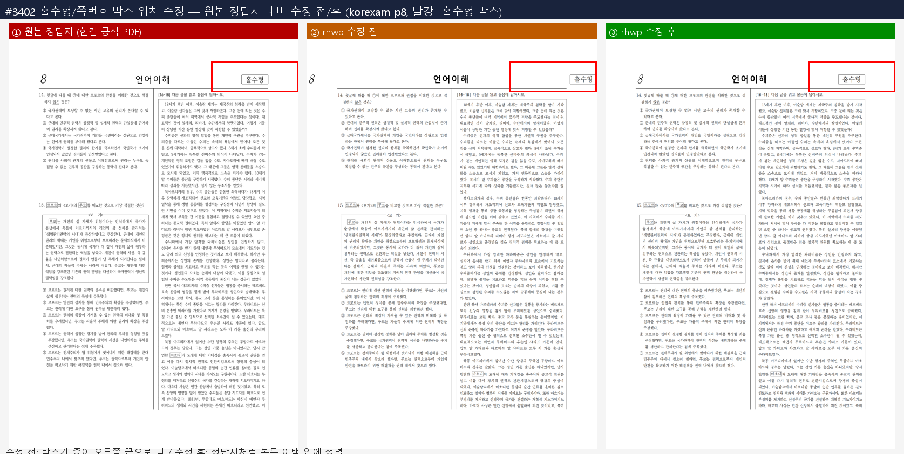

# 버그 헌팅 playbook — 실사례 여정 기반 탑다운

> 제안 이슈: #3398 (후속판 #3556 — 판정 함정 4종·한 사이클 완주 기록).
> 로드맵 축은 #2659 (후속판 #3555). 실행 진입점: [Claude bug-hunter 에이전트](../../.claude/agents/bug-hunter.md),
> [Codex bug-hunter Skill](../../.agents/skills/bug-hunter/SKILL.md).

## 왜 이 방식인가

버그는 끝이 없다. 무작위·상향식으로 쫓으면 표면적이 무한히 넓어져 바닥을 못 본다. 반면
**"실제 사용자가 처음부터 끝까지 겪는 여정"을 구현하며 정답지와 대조**하면, 유한한 시간에
사용자 가치가 큰 결함부터 위에서 아래로 훑을 수 있다.

단위 테스트·퍼즈는 "코드가 안 죽는가"를 본다. 그러나 실사용 실패는 대부분 **"죽지 않았지만
틀렸다"**의 영역이다 — 성공을 보고하고도 값이 유실되고(#3380), exit 0 이면서 총량을
은폐하고(#3353), 산출은 됐지만 렌더가 깨진다(#3355·#3385). 이건 여정을 끝까지 밟고 진짜
정답과 대조할 때만 드러난다.

기록값·종료 코드·JSON 계약처럼 결정적인 항목은 기계 검증으로 판정한다. 한컴 기준 PDF
텍스트층과 SVG `<text>`의 **쪽별 문자 멀티셋 대조**는 공백·순서·NFC 차이를 정규화해
소실·과잉·치환 후보를 찾는 보조 기계 판정이다. 폰트 대체가 픽셀 diff 전체를 흔들어도
쪽번호·채움점 소실, 숨김 대상의 과잉 출력, PUA 치환은 문자 수 차이로 드러날 수 있다.
다만 PDF가 글자를 path로 그렸거나 텍스트층 매핑이 손상된 경우도 후보로 잡히므로 단독 최종
판정으로 쓰지 않는다. 픽셀 diff·sweep도 시각 후보 검출과 무회귀 근거이며,
[시각 검증 거버넌스](verification/visual_verification_governance.md)에 따라 최종 시각 판정은
작업지시자/maintainer가 한다. 한컴 출력물은 도구·버전·출력 경로·폰트에 따라 달라질 수 있으므로
해당 환경과 provenance를 기록한 비교 기준으로 쓰고 보편적 절대 오라클로 간주하지 않는다.

## 판정 함정 — 여정보다 먼저 의심할 것

여정을 아무리 잘 밟아도 **판정이 틀리면 결과가 뒤집힌다.** 아래 넷은 전부 실제로 밟은
함정이고, 각각 오보·헛수고·잘못된 수정으로 이어졌다.

### 1. "오라클이 통과했다"는 무손실의 증거가 아니다

각 오라클은 **자기가 보는 축에서만** 참이다. `--verify` 는 IR 을 대조하므로 IR 이 같으면
통과한다. 그런데 **IR 에 없는 것**(원본 XML 구조, ZIP 엔트리, 한컴이 쓴 `<hp:switch>` 래퍼)은
IR 대조로 영원히 잡히지 않는다.

`--verify` · `--verify-pages` 가 4/4 통과한 문서에서 `tabItem` 이 정확히 절반으로 사라진
사례(#3551)가 그렇다. 잡아낸 것은 **ZIP 엔트리 바이트 대조**였고, 단서는 `header.xml` 이
서로 다른 세 문서에서 **정확히 같은 바이트 수(6,737B)만큼** 줄어든 것이었다 — 상수 블록이
통째로 빠질 때 나오는 신호다.

> **규칙**: 왕복 여정에서는 IR 오라클 통과 여부와 **무관하게** 엔트리 목록·엔트리별 크기·
> 태그 개수를 대조한다. 크기 차이가 여러 문서에서 **동일 상수**로 나오면 구조 소실을 의심한다.
>
> **규칙(추가)**: 엔트리 대조는 **개수가 아니라 이름 집합**으로 한다. 총량 지표는 추가와
> 소실이 서로를 지운다 — `samples/한셀OLE.hwpx` 는 `Preview/PrvImage.png` 가 새로 추가되면서
> 77,828B 짜리 `BinData/ole1.ole` 소실을 상쇄해 **엔트리 수가 12 → 12 로 같다**(#3557).

**코퍼스 규모로 확인된 사실이다.** 같은 3단 대조를 `samples/` HWPX 전수 77건에 돌린 결과,
`--verify` 는 **74/74(100%) 통과**인데 구조까지 무손실인 문서는 **4/74(5.4%)** 였다. 즉
"무손실 왕복" 이라는 한 단어가 자[尺]에 따라 100% 와 5.4% 를 동시에 가리킨다.

다만 검출 94.6% 를 그대로 "손실" 이라고 쓰면 함정 3번을 밟는다. 태그별로 표본을 검증하면
`hp:fwSpace`(996건)·`hp:nbSpace`(579건)·`hp:t`(425건)는 **정규화**이고(전각공백 U+2007 이
619→619 로 보존, 표본 2/3 은 추출 텍스트 바이트 동일), **확정 데이터 손실은 엔트리 소실
4문서**였다. 검출과 판정을 나누는 것까지가 이 축의 사용법이다.

### 2. 상신 전에 `devel` 을 먼저 확인한다

2026-07-29 자 전수 재검증에서 열려 있던 이슈 53건 중 **17건이 이미 고쳐져 있었다.** 이슈가
안 닫힌 것뿐이었다. 재현 없이 "아직 유효하다"고 쓰면 백로그가 실제보다 부풀고, 최악은
이미 있는 코드를 다시 짜는 것이다.

과거 PR 이 `CLOSED` 여도 반려가 아닐 수 있다 — base 충돌로 닫힌 뒤 리베이스본이 메인테이너
배치 PR 에 cherry-pick 되어 반영된 사례가 있다(#2927/#2943 → #3205).

> **규칙**: 이슈를 재확인하거나 수정에 착수하기 전에 **현재 `devel` 코드**에서 결함이
> 살아 있는지 파일:라인으로 확인한다. 커밋 메시지 검색만으로 판단하지 않는다.

### 3. 표본 1건을 전체로 일반화하지 않는다

"한컴은 margin 에 halving 을 하지 않는다"고 단정했다가 정정했다(#3368). 근거로 삼은 패턴은
**한 파일의 21쌍**뿐이었고, 실제로 한컴 저장본 262개 전량을 세어 보니 반감 관계가
**16,248쌍**이었다.

> **규칙**: 포맷 계약을 주장할 때는 코퍼스 전량을 세고 **반례 수까지** 함께 적는다.
> "N건 중 M건" 이 없는 계약 주장은 아직 가설이다.

### 4. 가설은 구현해서 기각한다 — 음성 결과도 결과다

#3518(페이지 수 64→65)에서 provenance 가드를 원인으로 지목하고 수정안까지 제시했지만,
**구현해서 돌려 보니 증상이 그대로였다.** 마커는 정상 기록되는데도 페이지 수는 변하지
않았고, 계보 복원까지 해도 같았다. 되돌리고 `--verify` 로 IR 차이를 뽑자 진짜 원인이
나왔다 — `char_shapes` 시작 위치가 전부 −2 로 밀려 있었다.

> **규칙**: 증상(페이지 수·크기)이 아니라 **IR 차이**를 먼저 확보한다. `--verify-pages` 가
> exit 4 로 먼저 끊기면 `--verify` 로 우회한다. 고치지 못한 가설은 근거와 함께 이슈에 남긴다 —
> 다음 사람이 같은 길을 다시 파지 않는다.

## 예시 구조 (매 여정 4단)

```
### 예시 N — <여정 이름>
- **문제 정의**: 이 여정에서 사용자/에이전트가 하려는 것, 정답의 기준
- **예시(실물)**: 대상 문서·명령·데이터 (재현 가능한 것만)
- **흐름**: 발굴 → 분석 → 실행 → 정답지 대조 → 판정, 각 단계의 명령
- **방식(무엇을 찾나)**: 이 여정이 드러내는 결함의 종류, 기계 판정 방법
→ **발견**: #이슈들
```

새 여정을 밟을 때마다 예시를 여기 1건 추가한다. 이 문서가 곧 **"이 도구로 실제 무엇을
어디까지 할 수 있고, 어디서 깨지는가"의 지도**가 된다.

---

## 예시 1 — 정부 실공고 양식 채움 (K-Startup)

- **문제 정의**: 에이전트가 지금 모집 중인 실공고의 공식 양식을 받아 신청서를 작성한다.
  정답 기준 = 값이 정확한 칸에 들어가고, 배치·서식이 원본과 같으며, 제출 요건(예: "검정
  글씨로 작성")을 만족한다.
- **예시(실물)**: K-Startup "방산 특화 창업중심대학" 사업계획서 양식(hwp, 누름틀 0·표 39).
  완전 가상 데이터((주)시연용가상기업, 사업자번호 전부 0)로 채움. **실제 접수는 하지
  않는다** — 가상 데이터로 실존 프로그램 접수는 허위 신청이고 로그인·실명인증은 자동화 밖.
  "제출 직전 완성 파일"까지가 정당한 경계.
- **흐름**:
  ```bash
  rhwp info --json 양식.hwp          # 12쪽
  rhwp fields --json 양식.hwp        # 누름틀 0
  rhwp export-tables --json 양식.hwp # 표 39 → "표 양식이니 set-cell 대상" 판정
  rhwp edit set-cell 양식.hwp --table 5 --row 0 --col 1 --text "..." -o 작성본.hwp --json
  rhwp export-tables --json 작성본.hwp   # 재독으로 기록값 대조 (기계 판정)
  rhwp export-pdf 작성본.hwp -o 제출용.pdf
  ```
- **방식(무엇을 찾나)**: "누름틀이 없는 실물 양식을 채울 수단이 있나?"(없으면 격차),
  채운 값의 스타일이 제출 요건과 맞나, 재독 대조 100% 인가, 체크박스 같은 비-텍스트 요소를
  다룰 수 있나.
- → **발견**: #3381(set-cell 부재 — 표 양식 채움 불가) · #3391(값이 파란 안내문 스타일
  상속 → 검정 요건 위반) · #3395(체크박스는 글머리표라 텍스트 편집 밖) · #3358(잘못된
  입력 침묵 유실).

## 예시 2 — 한컴 출력 PDF(비교 기준) 페이지별 대규모 대조

- **문제 정의**: rhwp 렌더가 기록된 한컴 출력 기준과 같은가. 비교 기준 = 해당 환경에서
  출력한 PDF와 페이지별로 배치·내용·강조가 일치.
- **예시(실물)**: `samples/` 원본과 `pdf/`의 버전 표기 한컴 기준 PDF 쌍(업무계획 35쪽·
  수학 20쪽·법학적성시험 언어이해 15쪽 A3). `samples/` 동반 PDF만 있는 등록 쌍은 도구·버전·
  provenance를 별도 확인하기 전에는 참고 자료로만 쓴다.
- **흐름**: `tools/fidelity_compare`(#3389)로 한컴 PDF ↔ rhwp export-svg 를 페이지별 나란히
  시트 + 픽셀 diff% 랭킹으로 만들고, 같은 실행의 `text-report.tsv`에서 PDF 텍스트층 ↔
  SVG `<text>` 문자 멀티셋 차이를 확인한다. 픽셀 상위 쪽과 문자 소실·과잉 쪽을 합쳐 후보를
  좁힌 뒤 사람이 감사한다. 저장소 트리를 깨끗하게 유지해야 하면 `--out-dir`로 외부 경로를 쓴다.
  ```bash
  python tools/fidelity_compare/fidelity_compare.py plan 0 34 \
    --out-dir /tmp/rhwp-fidelity-plan
  sort -t $'\t' -k2,2nr -k3,3nr /tmp/rhwp-fidelity-plan/text-report.tsv | head
  ```
- **방식(무엇을 찾나)**: diff% 상위 페이지에서 비교 기준과 다른 지점. 단계별(10→전수→고난도
  A3·수식)로 올려 한계를 탐색. diff% 는 절대값이 아니라 **랭킹 + 사람 감사**용(자간 미세차가
  픽셀로 누적됨). `reference_only`은 소실, `svg_only`은 과잉, 같은 쪽의 양쪽 차이는 치환
  후보로 분류한다. 문자 순서와 공백을 무시하므로 배치·줄바꿈은 픽셀/시각 대조로 확인한다.
- → **발견**: #3385(한컴 PUA 원문자가 CharOverlap 문맥에서 tofu) · #3382(제어문자를
  이스케이프 없이 방출 → 불법 XML) · #3389(하네스 자체를 상시 게이트로).

## 예시 3 — 법정 서식 생성 (기안문)

- **문제 정의**: 공무원 1순위 산출물인 기안문을 CLI 로 만들 수 있나. 정답 기준 = 편람의
  법정 서식(별지 제1·2호)과 배치·요소가 일치.
- **예시(실물)**: 편람의 별지 제1호서식(일반기안문)·제2호서식(간이기안문, 결재란 표)을
  정답지로 렌더 → 표준 서식 제작 → `edit fill-fields` 로 채움.
- **흐름**: 정답지 렌더(`export-svg`) → 서식 제작 → `info`/`fields`/`export-svg` 자기검증
  루프 → 채움 → 정답지와 나란히 비교 시트.
- **방식(무엇을 찾나)**: 생성 경로가 표(결재란)·항목체계·두문/결문을 표현하나. 채운
  문서가 정답지와 글자 겹침 없이 같은가.
- → **발견**: #3372(ingest 스키마에 표·항목체계·두문결문 부재 → 기안문 생성 격차) ·
  #3375(빈 누름틀 안내문이 인쇄 프로필에도 출력).

## 예시 4 — 형식 변환·무손실 라운드트립

- **문제 정의**: HWP↔HWPX 변환이 무손실인가. 정답 기준 = 변환 후 IR·렌더가 원본과 동일
  (한컴이 깨지지 않는 수준).
- **예시(실물)**: `samples/` 실문서를 `export-hwpx --verify` / `ir-diff --json` 로 왕복 검증.
- **흐름**: `export-hwpx 원본 변환본 --verify --verify-pages` → `ir-diff 변환본 원본 --json`.
  exit 3/4 = 손실.
- **방식(무엇을 찾나)**: exit 코드·ir-diff 카테고리(type/ml 등)로 어긋난 축을 특정. 반복
  왕복 시 값 표류 여부.
- → **발견**: #3367(구역 시작 secd/cold 컨트롤 순서 뒤집힘) · #3368(ParaShape 좌측여백
  왕복 반올림 표류) · #3383(edit 계열이 HWPX 를 HWP5 로 강제 산출 — 형식 미보존).

## 예시 5 — 에이전트 계약 정합 (CLI 자기서술·종료 코드)

- **문제 정의**: 매니페스트(`capabilities`)만 보고 호출하는 에이전트가 지뢰를 밟지 않나.
  정답 기준 = 자기서술이 실제와 일치, 종료 코드·JSON 봉투가 계약대로.
- **예시(실물)**: `capabilities`·`--help`·각 명령의 `--json` 봉투를 실측 대조.
- **흐름**: 인자 순서·미지 옵션·경계값을 넣어 종료 코드(#2707)와 봉투 스키마 확인.
- **방식(무엇을 찾나)**: 자기서술과 실제 가용성 불일치, 파싱 규약 비일관, 절단·유실을
  봉투가 숨기나.
- → **발견**: #3349(옵션 선행 파싱) · #3353(search --limit 총량 은폐) · #3355(ingest
  텍스트 상자) · #3357(릴리스 바이너리 export-png 부재) · #3359(export 계열 파싱) ·
  #3366(thumbnail 계약 밖).

## 예시 6 — 부동 개체의 본문 여백 정합 (법학적성시험 언어이해)

- **문제 정의**: 바탕쪽의 `Para`/`Column` 기준 부동 도형이 기록된 한컴 출력 기준처럼
  **본문 여백**을 기준으로 정렬되는가. 비교 기준 = 법학적성시험 언어이해 8쪽의 머리말
  `홀수형` 상자(우측)와
  페이지번호(좌측)가 종이 물리적 가장자리가 아닌 본문 좌·우 경계에 놓인다.
- **예시(실물)**: 입력은 `samples/21_언어_기출_편집가능본.hwp`
  (SHA-256 `905454045ca2e236839a7cab59750678116d08af3db31dbf846819af355b8d15`), 정답지는
  한컴 출력 `pdf/21_언어_기출_편집가능본-2022.pdf` 8쪽
  (SHA-256 `f2d858d7974393661d91a658e6b384b951114ef52783379f426a963effd97b72`)이다. 기준 PDF의
  메타데이터는 Creator `Hwp 2022 12.0.0.4426`, Producer `Hancom PDF 1.3.0.550`이며 판형은
  A3(841×1190pt)이다. 아래는 같은 쪽의 한컴 기준본·수정 전 rhwp·수정 후 rhwp를 실제 PNG로
  나란히 남긴 검토 근거다.

  

- **흐름**: 한컴 PDF와 rhwp 출력 8쪽을 나란히 대조 → `홀수형`/페이지번호의 수평 기준을
  추적 → `compute_object_position`이 `col_area`를 따르는 것을 확인 →
  `LayoutEngine::build_master_page`의 호출 경로를 확인 → 본문 폭을 가진
  `master_col_area`를 전달하도록 수정 → 해당 머리말 도형의 본문 경계 회귀 테스트와 실제
  3단 비교로 재검증한다.
- **방식(무엇을 찾나)**: 여백 기준 부동 개체가 종이 전체 폭에 붙는지, 특히 바탕쪽
  Shape/Equation이 본문 컬럼 영역 대신 종이 영역을 받는지 본다. 이 사례의 확정 원인은
  `build_master_page`가 `paper_area`를 `col_area`로 전달한 것이었다. 수정은 세로 범위는
  종이 영역으로 유지하되 가로 `x`/`width`는 `body_area`로 제한한다. 다단 이전 전폭 문단이
  원인이라는 초기 추정은 재현·코드 경로 대조에서 배제했다.
- → **발견·수정**: [#3402](https://github.com/edwardkim/rhwp/pull/3402) (바탕쪽
  `Para`/`Column` 부동 개체의 본문 여백 정합, merge commit
  [`823f645`](https://github.com/edwardkim/rhwp/commit/823f6450620a59bafa1e3055d861b1decf13bbbe)).

## 예시 7 — 인터넷 배포 실물 문서 무손실 왕복 (서울시 공개 서식)

> 예시 4 와 같은 "왕복" 여정이지만 **판정 축이 다르다.** 예시 4 의 오라클(`--verify`/
> `ir-diff`)은 이 결함을 통과시킨다. 두 예시는 대체가 아니라 **보완**이다.

- **문제 정의**: `samples/` 가 아니라 **지금 인터넷에 배포 중인** 실물 문서를 받아 왕복해도
  무손실인가. 정답 기준 = 재저장본이 원본과 **구조까지** 같다(값뿐 아니라 한컴이 쓴 XML
  래퍼·ZIP 엔트리 구성).
- **예시(실물)**: 서울시 정보소통광장 공개 결재문서
  [보고서 작성 서식 안내](https://opengov.seoul.go.kr/sanction/11678326) 첨부 4건
  (결재문서 원문 + 표준 보고서 서식 3종, 전부 한컴 저장 HWPX, 12~27KB).
  재현 파일과 전/후 대조표는 `mydocs/report/hwpx_tab_switch_loss/` 에 있다
  ([#3553](https://github.com/edwardkim/rhwp/pull/3553) 로 들어온다 — 이 문서가 먼저
  머지되면 그 PR 이 실린 뒤부터 유효한 경로다).
- **흐름**:
  ```bash
  rhwp info --json 서식.hwpx            # 형식·쪽수·폰트
  rhwp export-tables --json 서식.hwpx   # 표 파악 (중첩 포함)
  rhwp fields --json 서식.hwpx          # 누름틀
  rhwp export-svg 서식.hwpx -o svg/     # 렌더 육안 대조
  rhwp export-hwpx 서식.hwpx out.hwpx --verify --verify-pages   # ← 여기까지 전부 통과
  # 통과해도 멈추지 않는다: ZIP 엔트리를 직접 대조
  python - <<'PY'
  import zipfile
  a, b = zipfile.ZipFile('서식.hwpx'), zipfile.ZipFile('out.hwpx')
  a_names, b_names = set(a.namelist()), set(b.namelist())
  for n in sorted(a_names - b_names):
      print('missing', n)
  for n in sorted(b_names - a_names):
      print('added', n)
  for n in sorted(a_names & b_names):
      if a.getinfo(n).file_size != b.getinfo(n).file_size:
          print('size', n, a.getinfo(n).file_size, '->', b.getinfo(n).file_size)
  PY
  ```
- **방식(무엇을 찾나)**: 엔트리 **소실/추가**, 엔트리별 **크기 변화**, 그리고 크기가 변한
  XML 의 **태그별 개수 차이**. 서로 다른 문서에서 감소분이 **동일 상수**면 상수 블록 소실
  신호다. 여기서는 `hh:tabItem` 이 480→240, 66→33 으로 **정확히 절반**이었고 감소한
  `hp:switch` 수가 탭 switch 쌍 수와 정확히 일치했다.
  값 손실 여부는 별도로 판정한다 — 이 건은 수집한 339쌍 전수에서 `default == case × 2` 가
  성립해 **구조 소실이지 데이터 손실이 아니었다**(과장하지 않는 것이 판정의 일부다).
- → **발견**: [#3551](https://github.com/edwardkim/rhwp/issues/3551)
  (tabPr 의 `<hp:switch>`(HwpUnitChar case) 소실 → `tabItem` 절반) ·
  수정 [#3553](https://github.com/edwardkim/rhwp/pull/3553).
  수정 시 함정: 파서가 `case` 를 우선하므로 switch 만 켜면 홀수 위치가 `101 → 50 → 100` 으로
  잘린다(#3368 과 같은 계약) — 직렬화기와 파서를 **함께** 고쳐야 한다.

---

## 여정 카탈로그 (다음 후보, 사용자 가치 순)

- 실물 표 양식 **전 항목** 채움(46칸 규모) — 부분이 아닌 완결 (진행 중)
- 공고 검색 → 근거 조항 위치 → 해당 쪽만 렌더 (RAG 인용)
- 대량 아카이브 대장화·조문 DB화 (batch 축) — 격차 #3407(봉투에 제목 필드 부재)
- 시행문·공고문·회의록 법정 서식 생성
- 개인정보 탐지 → 마스킹(치환) 파이프라인
- **인터넷 배포 실물 문서 수집 → 왕복 바이트 대조** (예시 7 확장) — 기관·연도를 넓혀
  구조 소실 축을 전수로. `samples/` 는 이미 고쳐진 문서에 치우쳐 있어 새 결함이 덜 나온다.
- 편집 3종(fill-fields/replace-text/set-cell)의 **형식 보존** 전수 — 격차 #3383

각 여정을 밟으면 위 4단 예시로 이 문서에 추가하고, 발견 격차를 이슈화한다.

## 이 문서를 쓰는 순서 (요약)

1. **판정 함정 4개**를 먼저 읽는다 — 여정 설계보다 판정 설계가 먼저다.
2. 여정을 고른다. `samples/` 보다 **지금 배포 중인 실물**이 새 결함을 더 많이 낸다.
3. 여정을 CLI 로 끝까지 밟는다. **통과해도 멈추지 않는다** — 그 오라클이 안 보는 축을 하나
   더 댄다(바이트·태그 개수·재독 대조).
4. 격차를 이슈로 낼 때 **재현 명령·실측 표·반례 수**를 함께 적는다. 값 손실이 아니면
   아니라고 쓴다.
5. 수정 PR 에는 **같은 실물로 전/후 실측 표**를 붙인다. 그것이 이 문서의 다음 예시가 된다.
