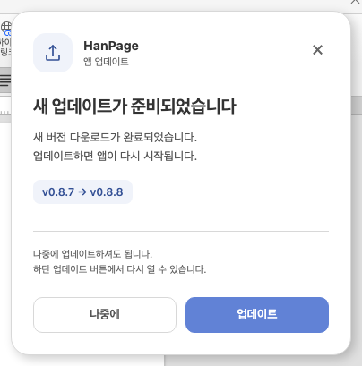
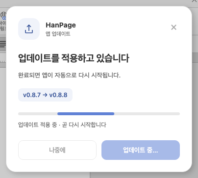

# PR #115 리뷰 — Desktop 업데이트 안내 개선과 0.8.8 배포

## 최종 판정

**승인.** 구현·로컬 검증·독립 경로 검토와 code candidate의 전체 CI를 대조했고, 배포를 막는 결함을 발견하지 않았다. 최신 문서 trailing head `17f4c805`의 31 checks 완료(11 success / 20 skipped), Build & Test success, CLEAN과 exact head 일치를 확인한 뒤 정상 squash merge했다. 사용자는 2026-10-02 “응 배포하자”로 PR·병합·Desktop 배포를 승인했다.

## 접수 정보

| 항목 | 값 |
| --- | --- |
| PR·작성자·base | [#115](https://github.com/paldyn/HanPage/pull/115) / enxec / paldyn/HanPage devel |
| 고정 base | `71f327f2ffdbc20bc3b8926d136ead049caeeb68` |
| 최종 로컬 source 후보 | `9d8d93cdcc8baba3c9ad47d25050df819b9feeca` |
| 전체 CI 후보 | `096aab64db7f6578405b21d8612b8d4a02eadd04` — 이후 source 동일, 증적만 추가 |
| CI가 검사한 merge | `07051e9c5d42d53e02fc21e730a8bf6e03f0ca8f` |
| 관련 이슈 | [#59](https://github.com/paldyn/HanPage/issues/59) 참조만; 기존 CLOSED, 신규 close 없음 |
| 경로 | collaborator self-merge; reviewer 지정과 관리자 우회 없음 |
| 작성 시점 | code candidate 32 checks 완료, 실패·대기 0; live merge 상태는 병합 직전 다시 확인 |

`collaborator_self_merge`, `intake_and_review`, `review_template`, `local_validation` 4.3, `review_only_fast_pass`, `post_merge`, 대형 변경의 `rework_and_exceptions`를 읽었다. 최종 diff의 큰 부분은 PNG와 의미 검증 결과이며, 원문·압축 로그 36개는 동일 hash로 ignored output에 옮겼다. 엔진 변경을 포함한 새 upstream 변경을 이번 배포에 추가하지 않았다.

신규 공개 Issue 등록은 자동 승인 검토가 배포와 별도 게시 승인 부족을 이유로 거절해 실행하지 않았다. 기존 관련 이슈를 참조하는 방식으로 승인된 배포를 진행한다.

## 변경과 실제 호출 경로

- 앱 테마 카드와 `업데이트`·`나중에` 버튼, 하단 재진입 버튼을 추가했다. macOS 기존 업데이트 메뉴와 저장 확인 경로를 재사용해 기능 충돌을 발견하지 않았다.
- Native의 같은 Mutex가 상태와 받은 파일을 관리한다. 확인 시작 → 청크 누산 → 파일 확인 → Ready → 원자적 Applying → blocking worker를 추적했다. 적용 오류는 파일을 Ready로 복구해 재다운로드 없이 재시도할 수 있다.
- 이벤트 구독 후 snapshot을 받고 새 이벤트를 덮어쓰지 않도록 방어한다. 적용 중 늦은 이벤트를 무시하고, 실제 문서 저장 확인 뒤 입력·메뉴·외부 파일 열기를 막는다. 오류 시 입력과 받은 파일을 복원한다.
- 다운로드 크기가 알려지면 실제 퍼센트·용량, 알 수 없으면 움직이는 막대·받은 용량, 확인·적용 단계에서는 움직이는 막대를 표시한다. 안내는 “하단 업데이트 버튼에서 다시 열 수 있습니다.”로 정리하고 문장 끝에 줄을 나눈다.
- updater SDK 2.10.1의 실제 소스로 finish callback → 서명 검증 → Ready 순서와 Mac 설치 worker의 main-thread 전달을 대조했다. API 이름만으로 동일 경로라고 판단하지 않았다.

구현 주장·적용/비적용 경계·source hash·수정 전후 검사는 [구현 기록](../../working/desktop_update_ui_20261002.md), [문구와 개행 검증](../../working/desktop_update_ui_copy_20261002.md), [0.8.8 로컬 검증](../../working/desktop_release_v088_20261002.md)에 연결한다. Desktop 5파일의 6버전 필드만 0.8.8로 올렸고, root 엔진·Studio·npm 버전과 dependency resolution은 base와 동일하다.

## 검증 입력과 결과

| 검증 | 결과·근거 |
| --- | --- |
| Studio 테스트·빌드 | 1,834 PASS / 2 SKIP / 0 FAIL, TypeScript·Vite 통과. 최종 source가 같은 완료 근거 재사용 |
| 실제 브라우저 | 최종 0.8.8 source에서 55 PASS / 0 FAIL, 새 PNG 12장. 실제 Studio/WASM·문서 입력·직렬화·저장 사용; Tauri IPC·이벤트만 대역 |
| Native 상태 회귀 | 7 PASS. Applying 제거·실패 후 Ready 복구 제거의 두 변이는 컴파일 성공 후 의도한 assertion FAIL |
| Rust 로컬 게이트 | Native/WASM32/workspace lint와 build 완료 근거의 source/test/policy hash 일치. 0.8.8 Desktop fmt·all-target Clippy도 PASS |
| 실제 로컬 앱 | unsigned app bundle PASS; 두 plist 0.8.8·bundle ID·source ICNS·fresh WASM 일치·SW 제외 확인 |
| 사용자 작업 보존 | primary HEAD와 기존 변경 39개 byte/hash 동일. 원본 checkout 전환·reset·stash 없음 |
| 검증 입력 commit | 파일 없는 빈 문서와 production 상태 모듈. 새 HWP/HWPX/PDF fixture를 쓰지 않아 별도 문서 입력 commit 비해당 |
| 조판 규칙·Visual Sweep | 비해당. 조판/페이지/표/기준값 미변경. 앱 UI 증적은 문서 엔진 일치 근거로 세지 않음 |

로컬 명령·환경·hash와 미실행 범위는 위 기존 기록에 보존했다. 호스트 nextest가 없어서 focused Cargo 결과를 로컬 전체 회귀로 세지 않는다. 사용자 앱 설치·재시작과 Windows GUI는 미실행이다.

## 정확한 code candidate CI

[의미 감사 결과](../assets/desktop_v088_release/ci-code-candidate.json)는 candidate/base/tested merge와 실제 workflow·check·분석 결과를 담는다. 원문 Actions 로그는 tracked asset에 포함하지 않았다.

- [CI](https://github.com/paldyn/HanPage/actions/runs/36964899517): Build & Test success. default-feature Archive A/B/C/D success, 예상과 실행 총 10,090건 일치. Lint·fresh WASM Frontend package gates·Native Skia success.
- [CodeQL](https://github.com/paldyn/HanPage/actions/runs/36964899506): JS/TS·Python·Rust Analyze success. 정확한 tested merge의 3개 분석 등록, 오류·경고·결과 0. Rust 완료 전 발생한 GHAS 중간 check는 neutral로 남아 있어 별도로 기록했다.
- [Render Diff](https://github.com/paldyn/HanPage/actions/runs/36964899219): Canvas 3쪽 PASS, 최대 차이 0.01862%; direct PDF gate 3/3 PASS. report-only PDF 4개 경고·0개 오류는 남아 있으며 완전 일치라고 주장하지 않는다.
- [Adapter](https://github.com/paldyn/HanPage/actions/runs/36964899508) 7/7 PASS, [Proptest](https://github.com/paldyn/HanPage/actions/runs/36964899472) 63/63 PASS.
- 총 32 checks: 28 success / 3 정상 skipped / 1 neutral, 실패·대기 0. 이후 문서 trailing 범위는 source/test/fixture/workflow를 포함하지 않으며 최신 head preflight와 최종 aggregate를 별도로 확인한다.

## 시각 증적과 남은 차이

밝은 테마·다크 390px·Windows 안내·준비/확인/적용/실패 상태를 직접 판독했다. 문장 중간 잘림과 카드 넘침이 없고 진행 막대가 표시된다. PR 본문의 exact head raw 이미지 2개가 실제 렌더링된 것도 확인했다. 0.8.7→0.8.8 표시는 상태 이벤트 대역 입력이며, 실제 0.8.7에서 처음 0.8.8을 받는 안내는 기존 UI다. 새 UI는 설치 후 적용된다.

## Merge 후 contributor PR comment 계획

본인 PR이며 별도 GitHub comment 전송 지시는 없어 추가 댓글을 게시하지 않는다. 검토 기록은 PR diff와 본문에, 배포 완료는 Release와 운영 증적에 보존한다. 문서 엔진 Visual Sweep 비해당이므로 contributor 출력 비교 comment도 비해당이다.

정상 squash merge 뒤 exact merge SHA·Issue #59 상태·duration refresh 성공 또는 보류를 확인한다. 이미 PR에 review·오늘할일이 포함되므로 별도 기록 PR을 만들지 않는다. 배포 뒤에만 확정되는 Release ID·공개 시각·서명/공증·public latest 검증은 승인된 docs/assets 운영 기록으로 보완한다.

## 배포·복구·정리 조건

exact merge SHA에 `hanpage-desktop-v0.8.8` 태그를 생성한다. 양 플랫폼 성공·6개 자산·4개 플랫폼 manifest·기존 공개키의 두 updater 서명과 변조 거부·Mac codesign/Gatekeeper/stapler·로고·DMG 확인 후 초안을 공개한다. 공개 전 기존 0.8.7 latest를 유지한다. 실패 시 태그 이동·secret/권한 변경 없이 동일 source의 실패 job을 복구한다.

실제 공개 endpoint와 검증된 manifest가 바이트 동일한지 확인한 뒤 완료를 보고한다. 사용자 primary 39개 변경·공유 `target/pr-review`·다른 작업 산출물을 보존한다. 소유 임시 branch/output은 안전 조건 확인 후 정리하며, managed worktree가 pinned task 보호로 archive 불가하면 우회하지 않고 유지 사유를 기록한다.

## 병합·실제 배포 완료

- 정상 병합 SHA `27c0632e59241828f8b274998320b5aadc4ef743`, merge 시각 2026-10-02 13:56:49 KST. [최신 trailing CI](../assets/desktop_v088_release/ci-review-tail.json)의 동일 PR·candidate 재사용과 [postmerge 감사](../assets/desktop_v088_release/ci-postmerge.json)를 확인했다. duration workflow는 success이나 검증된 측정 자료 부족으로 data branch 갱신을 보류했다. source CI 재실행 없음, 관련 Issue #59 CLOSED 유지.
- [Desktop Release](https://github.com/paldyn/HanPage/actions/runs/36966794272) 양 플랫폼 success, exact merge SHA의 태그 `hanpage-desktop-v0.8.8`. [workflow·공증 근거](../assets/desktop_v088_release/desktop-v088-release-workflow.json)에서 Mac Accepted submission `4236279f-f7f6-43db-8c82-a64b934eed69`을 확인했다.
- [초안 자산 6개](../assets/desktop_v088_release/desktop-v088-draft-inventory.json)의 실제 크기와 모든 API SHA-256 digest 일치. [두 updater 서명](../assets/desktop_v088_release/desktop-v088-updater-signatures.json)은 기존 공개키로 검증했고 각각 한 바이트 변조를 거부했다. 4개 플랫폼 manifest alias 정합.
- [Mac app archive](../assets/desktop_v088_release/desktop-v088-macos-bundle.json)와 [DMG 내부 앱](../assets/desktop_v088_release/desktop-v088-dmg.json)의 두 버전 0.8.8·arm64·source ICNS·Developer ID 팀·엄격한 codesign·공증·stapler 통과. DMG 무결성·읽기 전용 마운트와 해제도 확인했다. [Windows outer PE 아이콘](../assets/desktop_v088_release/desktop-v088-windows-icon.json)의 전체 그룹·7개 source 프레임 일치, 오류 0.
- [공개 Release](https://github.com/paldyn/HanPage/releases/tag/hanpage-desktop-v0.8.8), ID401555774, 공개 시각 2026-10-02 14:19:19 KST. [공개 확인](../assets/desktop_v088_release/desktop-v088-public-verification.json)에서 GitHub latest·6개 digest·source SHA·익명 앱 endpoint의 0.8.8 manifest가 검증 초안과 바이트 동일함을 확인했다.
- 사용자 앱 설치·실행·재시작과 Windows GUI/내부 NSIS app·uninstaller 검사 미실행. 첫 0.8.7→0.8.8 안내는 기존 UI이며 새 UI는 설치 이후 적용된다. 사용자 primary의 기존 39개 변경과 공유 target을 보존한다.

## 실제 정리 결과

[정리 기록](../assets/desktop_v088_release/cleanup.json)에 실제 실행 결과를 보존했다. 이번 작업의 local UI branch, ignored `output/pr-review/desktop088`, 두 node_modules symlink와 hash 확인한 generated pkg를 제거했다. 영구 검증 자료는 devel의 tracked assets에 보존했다. primary의 기존 39개 byte/hash와 HEAD를 다시 확인했고 공유 `target/pr-review`와 다른 검토 산출물은 유지했다.

managed worktree `/Users/lwm/.codex/worktrees/upstream-sync-final-20261001/HanPage`는 app `archive_worktree`가 “This worktree is protected by a pinned task or workspace.”를 반환해 **유지**했다. pin 해제·직접 filesystem 제거로 보호를 우회하지 않았다. `paldyn/HanPage:codex/desktop-update-ui-20261002` remote branch는 canonical fork 예외와 원본 사용자 dirty 작업 보존 조건에 따라 삭제를 시도하지 않았다. 로컬 devel은 원본 checkout 전환 없이 CAS로 최종 origin/devel에 맞췄다.
