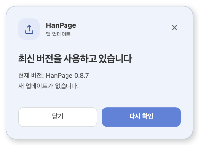

# PR #116 리뷰 — 업데이트 안내 중앙 배치와 Desktop 0.8.9 배포

## 최종 판정

**승인.** 후보 구현·동일 source의107개 실제 UI 검사·0.8.9 로컬 bundle과 독립 호출경로 검토에서 배포 차단 결함을 발견하지 않았다. code candidate의 실제 전체 CI 성공은 아래 semantic 감사에 연결한다. merge 전 조건은 최신 문서 trailing head CI·MERGEABLE/CLEAN·exact head 재확인이다. 사용자는2026-10-02 “응 배포하자”로 PR·정상 병합·배포를 승인했다.

## 접수 정보

| 항목 | 값 |
| --- | --- |
| PR·작성자·base | [#116](https://github.com/paldyn/HanPage/pull/116) / enxec / paldyn/HanPage devel |
| 고정 base | `52aeb4be36728109758c56b749c7946122f04d29` |
| 로컬 제품/버전·CI 후보 | `fd1034984020684e5238c25599fc647f051b1f50` / `4561a2a0b2603eaae74a4b848f6621451cf19bf5`(source동일·검증증적 추가) |
| 관련 이슈 | [#59](https://github.com/paldyn/HanPage/issues/59) 참조만; 기존 CLOSED, 신규 close 없음 |
| 경로 | collaborator self-merge·reviewer지정 없음·관리자 우회 없음 |
| 규모 | 5979 additions/53 deletions, 대부분 PNG·semantic 결과·과거/현재검증 기록. 대형 변경 별도 독립 source review와 merge-tree 확인 수행 |

## 변경·구현 주장과 검증 범위

`receiveStatus→render`는 background card를 열지 않는다. statusbar click/파일command/macOS menu→`handleManualUpdateCheck`만 상세를 열며 snapshot/event 경합을 eventCount로 보호한다. file menu는 registry canExecute로 applying을 차단한다. 중앙 fixed50%/translate·dvh/overflow·6테마표면색은 실제 DOM 크기/scroll/contrast로 검사했다. `upToDate`는닫기/footer숨김, 다른상태는나중에/footer복귀를 실제 retry IPC까지 검사했다.

`beforeApply→canReplaceCurrentDocument→confirmSaveBeforeReplacingDocument→saveCurrentDocument`의 saved 뒤에만 applying/inert/input guard/IPC가 시작된다. Native Rust update state/bridge·engine·key·endpoint·logo·dependencyresolution은 base동일이다. PALDYN은About KO/EN와Cargoauthors/Tauripublisher에 반영했고 MIT/EdwardKim과 기술URL/identifier를 보존했다. Desktop6버전만0.8.9, root/Studio/npm버전은불변이다.

독립 agent2명이 source/메타데이터·검증경로를 대조했다. [UI107검사](../../working/desktop_update_quiet_brand_20261002.md), [배포 후보 결과·한계](../../working/desktop_release_v089_20261002.md), [실제 추가107결과](../assets/desktop_v089_release/browser-results.json), [unsigned localbundle](../assets/desktop_v089_release/local-bundle.json)를 연결한다. Studio1834PASS/2SKIP은 최종동일source 완료근거를 재사용했고0.8.9 Desktop fmt/Clippyalltargets/TypeScript/Vite/bundle은 새로 완료했다.

원본 runner 추가2회는CDN FontFace5000ms timeout후canvas준비에서 setup실패했다. 동일CDN WOFFbytes 로컬전달 wrapper에서107PASS/0FAIL/예외0을 확인했고 assertions/제품source는바꾸지 않았다. [font hash·정확한 wrapper·진단 한계](../assets/desktop_v089_release/font-delivery-diagnostic.json)를 명시한다. CDN지연/fallback·Native GUI/About·Windows설치·구형WebView는미검증이다. 실제 설치 앱의 첫 안내는 기존UI이고0.8.9설치후 새UI가 적용된다.

## 실제 CI

codecandidate `4561a2a0`의[semantic감사](../assets/desktop_v089_release/ci-code-candidate.json)는 exact PR/source/base/testedmerge와5workflow·checks·job·preflight·실제 결과를 보존한다. CI36972737552/CodeQL36972737024/Render36972736747/Adapter36972737059/Proptest36972737100은 no-green-code-candidate 또는 fail-closed:unclassified-path로 Full 실행했다. 문서 trailing은 source/test/workflow/fixture없이single-parent이며 latest aggregate와실제reuse판정을별도로 확인한다.

## 조판·시각 증적·검증 입력

조판공통원칙(측정/배치/분할/LineSeg/기준값)은비해당: 문서engine·page-visiblegeometry·baseline변경 없음. 파일없는빈문서를 실제 편집·저장했으며HWP/HWPX/PDFfixture는사용하지않아 별도검증입력commit 비해당이다. UI screenshot은 한컴문서출력일치근거로세지 않는다. 밝은/다크카드·최신버전·390px·짧은높이·saveoverlay를 직접열어 중앙배치/표면구분/닫기/도달가능버튼을 판독했고최저textcontrast4.6387:1을 확인했다.

PR본문대표2PNG는 finalhead repository/SHA로고정해 실제Markdownimage로표시하고브라우저naturalWidth로확인한다. trackedasset/bundle의상태0.8.7/0.8.8은Tauri대역입력이다.

## Merge 후 contributor PR comment 계획

본인PR이며 별도댓글 전송 지시가 없어 추가댓글을 게시하지 않는다. 검토는PRdiff/본문, 공개완료는Release·docs/assets운영기록에 보존한다. 문서VisualSweep비해당이므로contributor문서출력댓글도비해당이다. 정상mergeSHA·Issue59CLOSED·duration refresh완료또는보류를 확인하고공유cache/userprimary39/설치app을 보존한다.

## 배포·복구·정리

exactmergeSHA의hanpage-desktop-v0.8.9tag로 Mac/Windows 초안을빌드한다.6asset/API digest·4platform manifest·기존공개키payload/globalsignature/변조거부·Mac strictcodesign/Team8L78W6D8XF/Gatekeeper/stapler/DMG·sourceicons확인뒤 공개한다. 공개전0.8.8latest유지, 실패job은동일source에서복구하고tag/key/secrets를바꾸지 않는다. 이증거와공개시각은배포뒤mydocs만 운영기록으로보완한다.

protectedworktree의actualarchive결과를 확인하고보호면유지사유를 기록한다. contributorforkbranch·dirtyprimary·사용자/다른도구소유branch·sharedtarget/pr-review는자동삭제대상이 아니다. 소유output·링크·임시bundle은증거보존과사용중프로세스확인뒤 정리한다.
