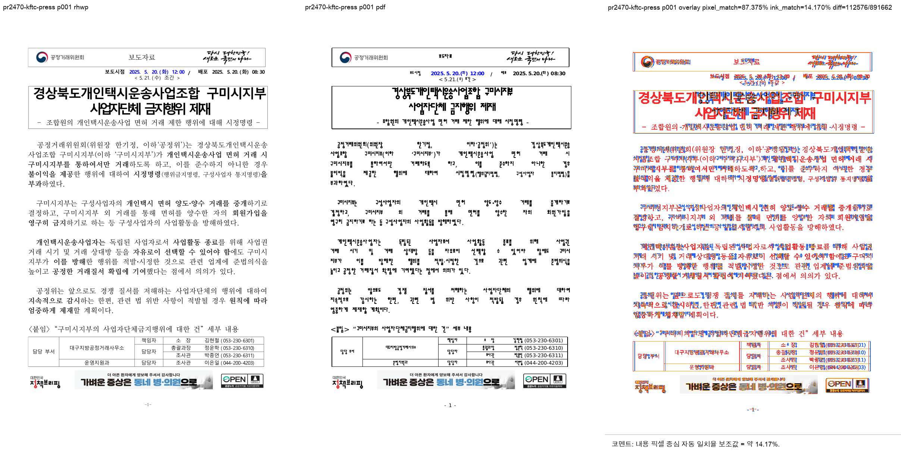
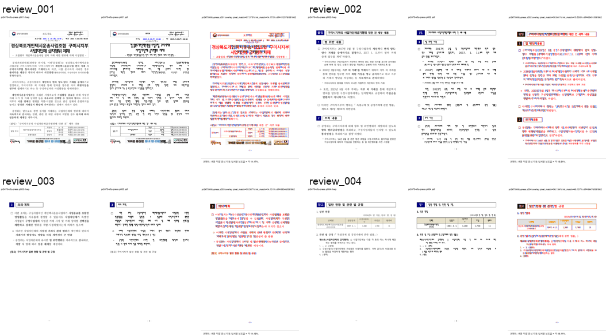

# PR #2470 검토 - 마스킹 생성기 stale 재래핑 보정

## 메타

| 항목 | 값 |
| --- | --- |
| 원 PR | [#2470](https://github.com/edwardkim/rhwp/pull/2470) |
| 작성자 | @planet6897 |
| base / 검토 head | `devel` / `50547027de2734669b934aef8ae11cabb3432c13` |
| 체리픽 순서 | 1, 2 (`10c66944`, `50547027`) |
| 충돌 | 없음 |
| 검토 시점 원 PR 상태 | `BEHIND`; 기존 head CI 전체 성공 |

## 변경 및 판단

- 마스킹으로 축소된 셀 내용에 과거 host line-height 또는 저장된 줄 수가 남아 표 높이와
  본문 흐름을 과도하게 밀어내는 두 경우를 좁은 조건으로 다시 조판한다.
- `samples/issue2373/156689818_kftc_press.hwpx`와 4쪽 페이지 수 핀을 함께 추가해
  기존 #2373 보도자료 페이지 수를 보호한다.
- renderer/layout/typeset 변경이므로 visual sweep 대상으로 판정했다.

## 검증

- `CARGO_INCREMENTAL=0 cargo test --profile release-test --test issue_2373_tac_host_press_pin`: 1/1 통과
- `CARGO_INCREMENTAL=0 cargo test --profile release-test --test issue_2279_layout_oracles`: 4/4 통과
- `wasm-pack build --target web --out-dir pkg`: 통과
- `CARGO_INCREMENTAL=0 cargo build`: 통과
- HWP 2020 MCP 기준 PDF 생성:
  - 원본: `samples/issue2373/156689818_kftc_press.hwpx`
  - 원본 SHA-256: `f84d5ab47795b9933eef405d9ef611055cdd00091f4b03903398e543b471a2cd`
  - 기준 PDF: `pdf/issue2373/156689818_kftc_press-2020.pdf`
  - PDF SHA-256: `3f52c644f8d303529e217b6697d73e2e42cbd6d9ae782f8326debe1162812953`
  - MCP job: `fbf0e7cc-e77f-4f5b-bc25-e0831110396a`; `run_status=0`, `validation=ok`, 4쪽
- visual sweep:
  - 임시 산출물: `target/visual-sweep-pr2470/pr2470-kftc-press/`
  - SVG/PDF: 4쪽 / 4쪽, 자동 후보 0/4
  - pixel match: 평균 92.43410%, 최저 87.37459%(p1)
  - visual accuracy proxy: 평균 22.97900%, 최저 14.13108%(p3)
  - 사람이 review/compare/overlay를 확인했다. 차이는 주로 한컴 PDF와 로컬 font/glyph
    rendering 차이이며, 쪽 경계, 표/문단 순서, 잘림 후보는 발견되지 않았다.

## 리스크와 권고

- PR 본문에 언급한 `36382471`, `36341511` 원본 오라클은 현재 저장소 샘플로 직접 재실행할
  수 없다. 새 범위 핀과 HWP 2020 기준 4쪽 sweep은 통과했지만, 두 원본을 장기 재현 샘플로
  추가하는 보완은 권고한다.
- 현재 head는 `devel`보다 뒤처져 있으므로 merge 전 최신 `devel` 위 재체리픽 또는 head update와
  새 CI가 필요하다.
- 위 조건을 충족하면 **수용 가능**이다.
