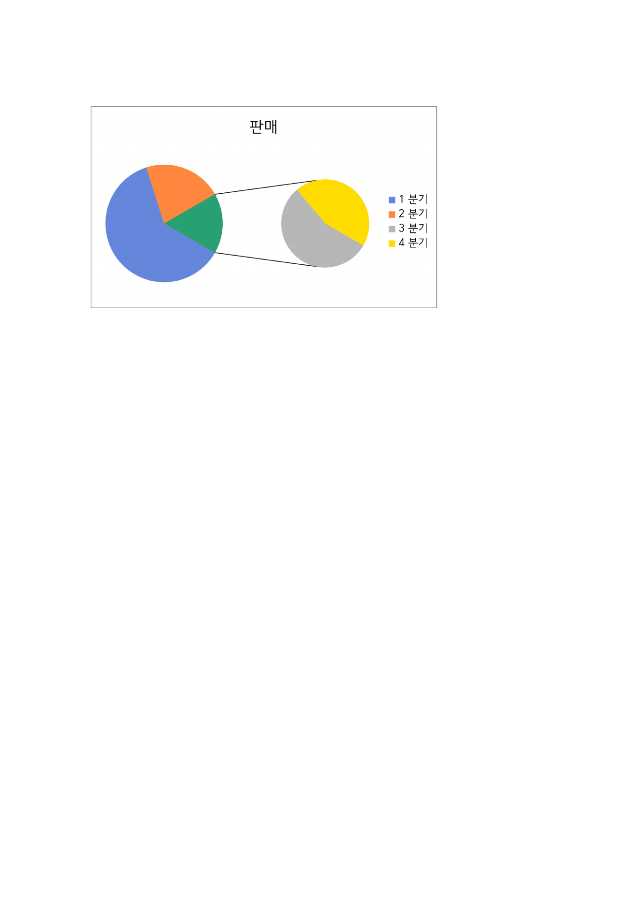
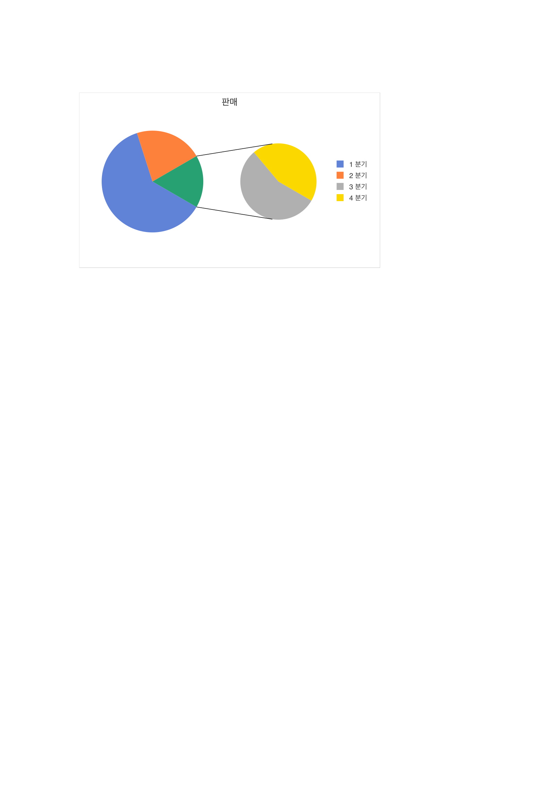
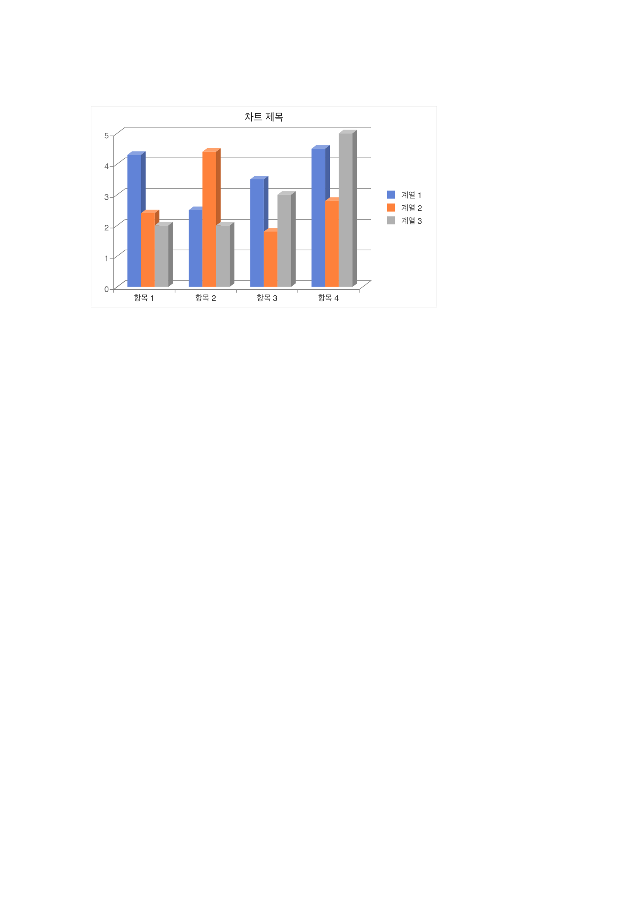
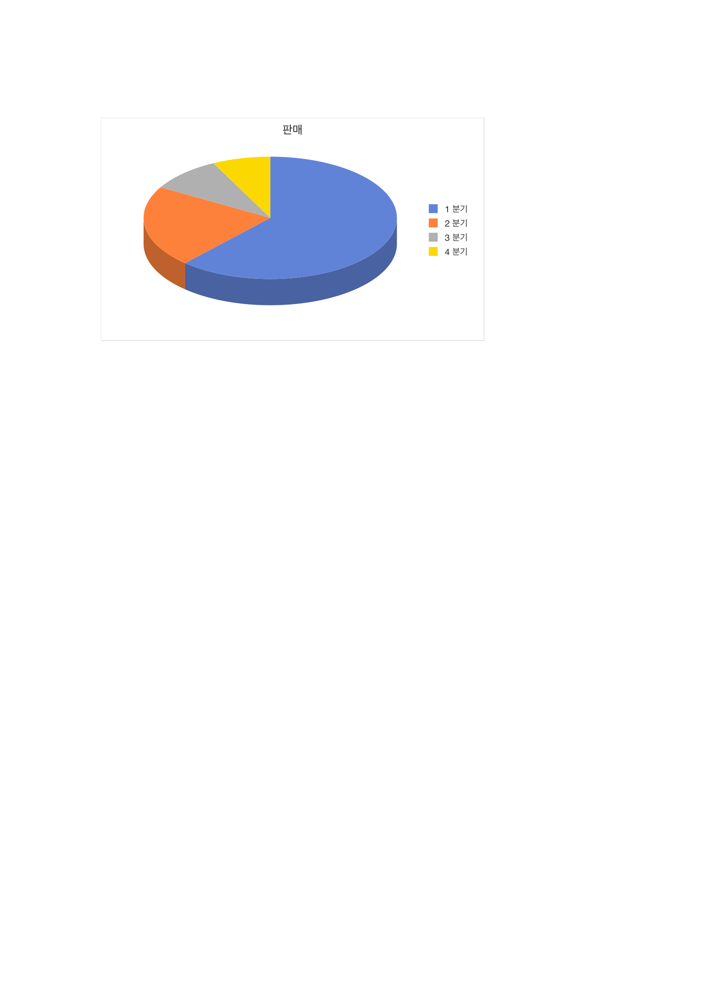

# PR #2500 검토 - C2b 3D 입체·ofPie 보조 플롯 (#2278)

| 항목 | 내용 |
|---|---|
| PR | [#2500](https://github.com/edwardkim/rhwp/pull/2500) |
| 작성자 / base | [@johndoekim](https://github.com/johndoekim) / `devel` |
| 관련 이슈 | [#2278](https://github.com/edwardkim/rhwp/issues/2278), [#1431](https://github.com/edwardkim/rhwp/issues/1431) Track C |
| 검토 기준 | 원 source head `c2a65d70e47e5c5564a4d6f882d77cb6ea527cc7` 및 RawSvg 차트 첫 렌더 메인터너 보정. 최종 merge 전 최신 PR head CI를 다시 확인한다. |
| 검토자 | [@jangster77](https://github.com/jangster77) |
| 최종 판단 | **merge 수용** - C2b 코퍼스 렌더와 메인터너 Canvas2D 회귀 보정을 확인했다. `dPt` explosion과 비-`pos` `splitType`은 별도 후속 보완으로 추적한다. |

## 변경 범위

- OOXML 차트의 `view3D`, `bar3DChart`, `pie3DChart`, `ofPieChart`, 계열 `explosion`을 파싱하고 SVG 렌더 경로를 추가한다.
- 기본 팔레트의 다섯 번째 색을 한컴 2022 ofPie 결합 슬라이스 실측색으로 변경한다.
- 3D 막대 네 종류, 3D 원형, 원형대원형과 원형대가로막대형을 회귀 테스트로 추가한다.
- 구현 계획·작업 기록·최종 보고서를 함께 추가한다.

## 렌더 검증

원 source head를 최신 `devel`에 커밋 없이 병합해 확인했다. 제공된 코퍼스의 3D 막대, 3D 원형, 기본 ofPie(`splitPos` 없음)는 모두 placeholder 없이 렌더됐고, 원형대원형은 HWP 2022 기준 PDF와 동일한 보조 플롯 구조 및 팔레트 순서를 보였다.

**HWP 2022 기준 - 원형대원형**

**rhwp PR #2500 - 원형대원형**

**rhwp PR #2500 - 3차원 묶은 세로 막대**

**rhwp PR #2500 - 3차원 원형**

## 검증

- `git diff --check upstream/devel...upstream/pr/2500` 통과.
- `CARGO_INCREMENTAL=0 cargo test --profile release-test --test issue_2278_chart_3d_ofpie` 통과: 3 passed.
- 기존 차트 회귀 20건 통과: `issue_1431_scatter`, `issue_1453_chart_3d_ofpie_routing`, `issue_1882_chart_style_gaps`, `issue_2129_line_stacked`, `issue_2277_*`.
- `CARGO_INCREMENTAL=0 cargo test --profile release-test --tests` 실행 완료. 로컬 도구의 장기 실행 출력은 집계 행을 보존하지 않았으므로 성공 판정은 아래 원격 전체 shard 결과로 교차 확인했다.
- `CARGO_INCREMENTAL=0 cargo clippy --all-targets -- -D warnings` 통과.
- `wasm-pack build --target web --out-dir pkg` 통과.
- 원 source head의 GitHub CI, CodeQL, Canvas visual diff, Native Skia, 기본 테스트 8개 shard 모두 성공.
- 메인터너 보정 뒤 `samples/chart/원형/원형대원형.hwp`를 Canvas2D headless Chrome으로 직접 열어 1페이지 차트 렌더를 확인했다. `RawSvg` 차트가 첫 렌더에서 이미지 디코드를 시작하도록 보정해 빈 선택 상자만 남는 회귀를 막는다.
- 작업지시자가 IAB에서 같은 차트의 정상 로드를 시각 확인했다.
- `rhwp-studio/e2e/issue-1456-chart-rerender.test.mjs --mode=headless` 통과: 두 차트의 첫 로드 렌더와 교체 로드 시 캐시 미재사용을 확인했다.

## 후속 보완 요청

### P1 - `c:dPt/c:explosion`이 계열 전체 explosion으로 승격된다

[`parser.rs:423`](https://github.com/edwardkim/rhwp/blob/c2a65d70e47e5c5564d6f882d77cb6ea527cc7/src/ooxml_chart/parser.rs#L423)는 현재 태그가 `<c:ser>`의 직접 자식인지 `<c:dPt>` 내부인지 구분하지 않고 `c:explosion`을 `OoxmlSeries::explosion`에 저장한다. 그러나 [Open XML `DataPoint.Explosion`](https://learn.microsoft.com/en-us/dotnet/api/documentformat.openxml.drawing.charts.datapoint.explosion?view=openxml-3.0.1)은 특정 데이터 포인트를 원형 중심에서 이동하는 속성이다. 이어 [`renderer.rs:1143`](https://github.com/edwardkim/rhwp/blob/c2a65d70e47e5c5564d6f882d77cb6ea527cc7/src/ooxml_chart/renderer.rs#L1143)는 이 값을 모든 슬라이스에 일괄 적용한다.

즉 단일 슬라이스만 쪼갠 정상 OOXML은 전 슬라이스가 쪼개진 원형으로 렌더된다. PR의 `test_parse_pie_explosion`은 계열 직접 자식만 검사하고 `dPt` 중첩 사례를 막지 못한다.

후속 보완:

- `dPt` 문맥을 추적해 계열 explosion과 분리한다.
- 점별 explosion을 구현하거나, 미지원인 동안에는 적어도 `dPt` 값을 계열 전체에 승격하지 않고 무시한다.
- `<c:dPt><c:idx .../><c:explosion .../></c:dPt>` 회귀 fixture와 렌더 assertion을 추가한다.

### P1 - `splitType`을 무시한 채 모든 `splitPos`를 "마지막 N개"로 해석한다

[`parser.rs:349`](https://github.com/edwardkim/rhwp/blob/c2a65d70e47e5c5564d6f882d77cb6ea527cc7/src/ooxml_chart/parser.rs#L349)는 `c:splitPos`만 저장하고 `c:splitType`은 전혀 파싱하지 않는다. [`renderer.rs:1192`](https://github.com/edwardkim/rhwp/blob/c2a65d70e47e5c5564d6f882d77cb6ea527cc7/src/ooxml_chart/renderer.rs#L1192)는 저장된 수를 반올림한 뒤 보조 플롯으로 보낼 마지막 카테고리 수로 사용한다.

[Open XML `ofPieChart`](https://learn.microsoft.com/en-us/dotnet/api/documentformat.openxml.drawing.charts.ofpiechart?view=openxml-3.0.1)은 `splitType`이 `splitPos`와 `custSplit`의 적용 방식을 결정한다고 명시한다. 따라서 `val`, `percent`, `custom` 분할 문서의 `splitPos`를 개수로 처리하면 잘못된 항목이 보조 플롯으로 이동한다. PR 계획 문서의 "범위 외이므로 기본 last-k" 설명은 미지원 기능을 무시하는 것이 아니라 의미를 바꾸는 현재 동작을 정당화하지 못한다.

후속 보완:

- `splitType`을 IR로 파싱하고 `pos`일 때만 현재 count 방식의 `splitPos`를 적용한다.
- `val`/`percent`/`custom`을 구현하기 전에는 해당 형태를 일반 원형으로 안전하게 폴백하거나, 원본의 기본 정책을 보존하는 경로를 둔다.
- `pos`, `val`, `percent`, `custom` fixture를 각각 추가해 보조 플롯 항목 선택을 검증한다.

### P2 - 3D 막대의 실제 지원 범위를 PR 설명과 테스트에 명시해야 한다

[`renderer.rs:63`](https://github.com/edwardkim/rhwp/blob/c2a65d70e47e5c5564d6f882d77cb6ea527cc7/src/ooxml_chart/renderer.rs#L63)는 `rAngAx=0` 막대를 동일 시어 투영으로 근사한다고 적고, [`shear_proj`](https://github.com/edwardkim/rhwp/blob/c2a65d70e47e5c5564d6f882d77cb6ea527cc7/src/ooxml_chart/renderer.rs#L76)는 `perspective`, `hPercent`, 음수 회전 성분을 실제 3D 카메라로 반영하지 않는다. 제공 코퍼스의 `rAngAx=1` 범위에서는 검증됐지만, PR의 view3D 일반 지원 표현은 범위를 넓게 읽힐 수 있다.

이는 현재 merge 차단 사유가 아니라 문서·테스트의 범위 정정 항목이다. `rAngAx=1` 코퍼스 한정 근사임을 PR 본문과 테스트 주석에 명시하고, 다른 view3D 조합은 후속으로 분리하는 편이 정확하다.

## 결론

제공된 한컴 2022 코퍼스에 대한 3D/ofPie 외형 개선과 회귀 방어는 확인했다. `samples/chart/원형/원형대원형.hwp`의 Canvas2D 공백 회귀는 메인터너 보정으로 첫 렌더 이미지 디코드를 보장했고, 실제 브라우저와 RawSvg 차트 E2E로 확인했다.

따라서 이 변경은 **merge 수용**한다. P1의 점별 explosion 및 `splitType=val|percent|custom`, P2의 view3D 지원 범위 명시는 현재 코퍼스 범위를 넓히기 위한 후속 보완으로 별도 코멘트로 요청한다. 최종 merge 조건은 최신 PR head의 GitHub Actions 성공과 작업지시자 승인이다.

## 후속 코멘트 초안

핵심 3D/ofPie 코퍼스 렌더와 Canvas2D 차트 공백 회귀 보정을 확인해 이번 변경은 수용합니다.

다만 OOXML 일반화 범위를 넓히는 후속 작업으로, `c:dPt/c:explosion`을 계열 전체 explosion으로 승격하지 않도록 점별 모델을 분리하고, `splitType=val|percent|custom`은 `pos`와 구분해 처리하거나 안전한 폴백과 회귀 fixture를 추가해 주세요. 또한 3D 막대의 현재 `view3D` 근사 지원 범위도 테스트 주석이나 문서에 명시해 주시면 좋겠습니다.
