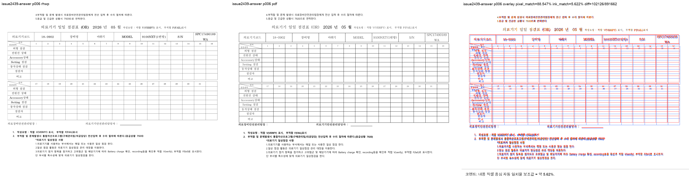
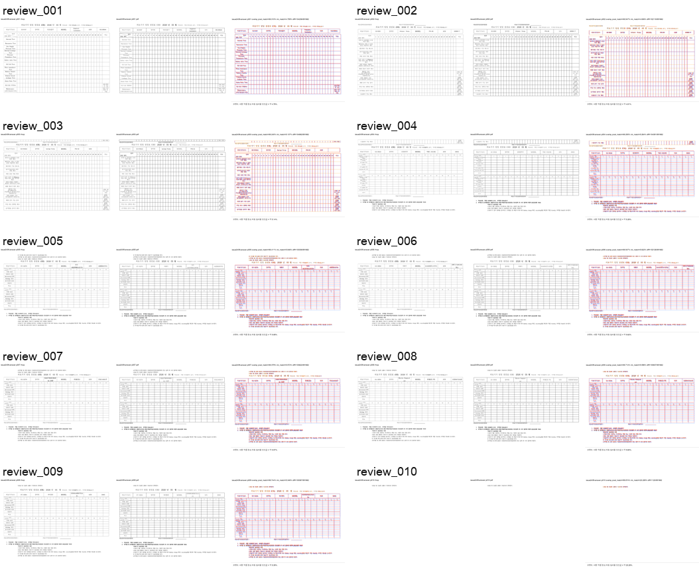

# PR #2512 검토 - HWP 반복 표 헤더 격자와 페이지 흐름 정합

## 메타

| 항목 | 값 |
| --- | --- |
| PR | [#2512](https://github.com/edwardkim/rhwp/pull/2512) |
| 관련 이슈 | [#2439](https://github.com/edwardkim/rhwp/issues/2439) |
| 작성자 | @postmelee |
| base | `devel` |
| 검토 기준 코드 head | `9e4799f08fa9e4919d02ff5525697f57366c9751` |
| 규모 | 코드 head 기준 28 files, +2866/-107, 12 commits |
| 문서 작성 시점 참고 상태 | ready, `MERGEABLE` / `BEHIND`; 기존 code head CI 성공 |

`draft`, `mergeable`, head SHA, CI 상태는 변동값이다. 최종 merge 전 최신 PR head와
GitHub Actions 상태를 다시 확인한다.

## 관련 이슈와 변경 범위

이슈 #2439는 native HWP5 문서의 반복 표가 페이지를 나눌 때 6쪽에서 반복 행 라벨과
표 경계가 겹치고 `LAYOUT_OVERFLOW`가 발생하는 문제다. 정상 한컴 2024 출력은 가로 A4
10쪽이며, 각 표 조각의 행 높이·반복 헤더·뒤따르는 본문 흐름이 유지되어야 한다.

PR은 다음 범위를 수정한다.

- native HWP5 provenance를 별도 layout compatibility profile로 전달해 HWPX/HWP3 및
  생성 문서에 보정이 퍼지지 않도록 한다.
- 표의 지배적 기본 격자, 전체 폭이 다른 outlier 행, 총폭을 보존한 local resize 행을
  구분해 반복 헤더와 본문 행의 세로 경계를 일관되게 계산한다.
- positive vertical offset을 가진 빈 host `RowBreak` 표의 painted bottom, 저장된 line
  advance, 다음 plain paragraph의 one-shot fit을 같은 좁은 구조 조건으로 처리한다.
- 분할 표 조각의 상·하단 여백과 최초 vertical offset을 분리하고, 마지막 조각 이후의
  본문 흐름에 host tail/offset이 중복 적용되지 않게 한다.
- `tests/issue_2439.rs`에 실제 `PartialTable` 연속 조각과 마지막 조각 아래 본문 배치를
  고정하는 분할 통합 테스트를 추가한다.

검토 결과 native HWP5 조건과 빈 host·단일 `RowBreak` 표·positive offset·다음 plain
paragraph 조건이 함께 적용되어, 일반 표와 다른 입력 형식으로의 동작 확산은 제한돼 있다.
코드 차원의 merge 차단 finding은 발견하지 않았다.

## 로컬 검증

최신 `upstream/devel` (`31c3b851e4acf196a1ee84e6807ff1e2a3ac5439`) 위에 PR code
head를 병합한 결과 트리에서 확인했다.

- 최신 `devel` 병합 시뮬레이션: 충돌 없음
- 최신 `devel`의 8개 신규 커밋과 PR 변경 파일: 직접 경로 중복 없음
- `git diff --cached --check`: 통과
- `cargo fmt --all -- --check`: 통과
- `cargo test --test issue_2439`: 4/4 통과
- `cargo test --profile release-test --test issue_2439`: 4/4 통과
- `cargo test --lib`: 2435 passed, 7 ignored, 0 failed

검토 기준 code head의 GitHub Actions에서는 preflight, lint(fmt/clippy/WASM check),
CodeQL, Native Skia, Canvas visual diff, default-feature tests 8개 shard, Build & Test가
모두 성공했다. 이 review·asset 보정 커밋 이후 최신 head CI는 작업지시자가 직접 확인한다.

## 재현 원본과 기준 PDF

- 이슈 첨부 ZIP:
  `https://github.com/user-attachments/files/29073886/default.zip`
- 보존 원본 HWP:
  `samples/issue2439/issue2439_repeat_table_overlap.hwp`
- 원본 HWP SHA-256:
  `674eabe66ea0ba783ad2cd398519c9893ba94956a22d9cb94b084db00d4d2c3d`
- 기준 PDF: 사용자가 한컴 2024에서 가로 방향으로 인쇄한
  `Microsoft: Print To PDF` 결과, A4 landscape 10쪽
- 보존 기준 PDF:
  `pdf/issue2439/issue2439_hancom2024_landscape.pdf`
- 기준 PDF SHA-256:
  `f36a747c5f848d90e755abe2e730d932429a324fad9b7e822964934cd8f8eca4`

## 시각 검증

- 임시 visual sweep:
  `/private/tmp/rhwp-issue2439-sweep-stage7-final2-20260720/issue2439-answer/`
- rhwp SVG / render tree / 기준 PDF: 10 / 10 / 10쪽
- 비교 페이지: 10쪽
- `LAYOUT_OVERFLOW`: 없음
- 자동 후보: 0/10
- pixel match: 평균 89.60574%, 최저 88.23971%
- 내용 픽셀 중심 자동 일치율 보조값: 평균 6.80340%, 최저 4.60630%
- 사람 확인: 핵심 6쪽을 포함한 1~10쪽에서 반복 헤더·행 라벨·표 경계 중첩,
  쪽 누락, 마지막 안내문 누락을 발견하지 않았다. 글꼴 rasterization 차이는 이번 PR의
  merge blocker로 보지 않았다.
- 안정 자산:
  - `mydocs/pr/assets/pr_2512/pr_2512_issue2439_visual_review_p006.png`
  - `mydocs/pr/assets/pr_2512/pr_2512_issue2439_visual_review_contact_sheet.png`

## 리스크와 권고

- 추가한 분할 통합 테스트는 합성 native HWP5 문서로 정확한 `PartialTable` 분기와 후속
  흐름을 고정한다. 실제 제보 문서의 장기 재현은 위 원본 HWP·기준 PDF·시각 자산으로
  보완한다.
- 별도 `pr_2512_review_impl.md`는 만들지 않는다. 남은 절차가 review/asset 보정 커밋,
  최신 head CI 확인, 작업지시자의 명시적 merge 승인으로 단순하기 때문이다.
- 최신 `devel` 반영과 review·검증 자산 보존이 끝난 PR head의 CI가 통과하고 작업지시자가
  merge를 승인하면 **수용 가능**이다.
