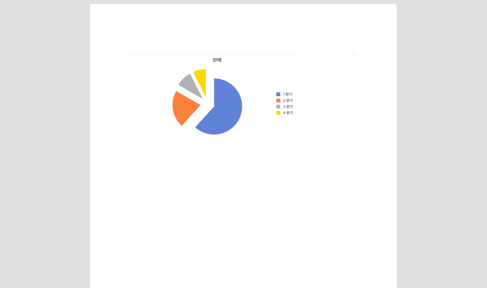

# PR #2654 검토 기록

| 항목 | 내용 |
|---|---|
| PR | [#2654](https://github.com/edwardkim/rhwp/pull/2654) |
| 작성자 / base | jangster77 / `devel` |
| 관련 이슈 | [#2635](https://github.com/edwardkim/rhwp/issues/2635) |
| 범위 | Studio 순수 RawSvg 첫 화면 재렌더, headless 회귀 E2E, PR #2508 mailmap 후속 정정 |
| 최신 기준 | `bc0c09f80` 위 rebase, 충돌 없음 |
| CI 스냅샷 | 문서 작성 시점 preflight 성공, 본 CI·CodeQL·Render Diff 실행 중. merge 전 최신 head 결과 재확인 필요 |

## 변경 검토

- 순수 `RawSvg`에는 embedded `data:image/...;base64`가 없어 일반 이미지 prefetch 완료 신호를 만들지 못한다.
  따라서 `f32a99856` 이후 1500ms fallback에서만 재렌더되던 것이 #2635의 직접 원인이다.
- `PageRenderer`는 RawSvg가 있는 페이지에만 `0/32/96/240ms` 조기 재렌더를 예약한다. 일반 raster 이미지의
  decode prefetch와 1500ms 안전망은 바꾸지 않아 기존 완료 신호·실패 안전망을 유지한다.
- [PR #2508의 인라인 정정](https://github.com/edwardkim/rhwp/pull/2508#discussion_r3611951113)에 따라
  `lpaiu-cs`의 잘못된 noreply canonical을 제거했다. raw author 이력은 실이메일 40건과 이름 표기만 다른
  2건이므로 실이메일 canonical 한 줄이 맞다.

## 시각 검증

`samples/chart/원형/쪼개진원형.hwp`를 helper의 기본 1500ms 안정화 대기 없이 headless Chrome에서 열었다.
초기 기준은 800ms까지 유채색 픽셀 0%, 1500ms에 1.3101%였다. 변경 후 400ms 캡처의 유채색 픽셀 비율은
1.664%이며 제목·범례·4개 차트 조각이 모두 보인다.

## 검증

- `npm test`: 456 passed, 0 failed
- `npm run build`: 성공. 기존 Vite chunk-size 경고 외 오류 없음
- `npm run e2e:manifest-check`: 73개 추적 E2E와 73개 MANIFEST 행 일치
- `node e2e/issue-2635-rawsvg-first-paint.test.mjs --mode=headless`: 400ms first-paint 통과
- `git check-mailmap`, `git shortlog`: `lpaiu-cs <lpaiu.cs@gmail.com>` 42건 통합 확인

## 권고

변경은 #2635의 원인과 직접 대응하고, 첫 화면 시각 회귀도 자동화했다. 최신 PR head의 CI·CodeQL·Render Diff가
성공하고 작업지시자 merge 승인이 있으면 수용 가능하다.
