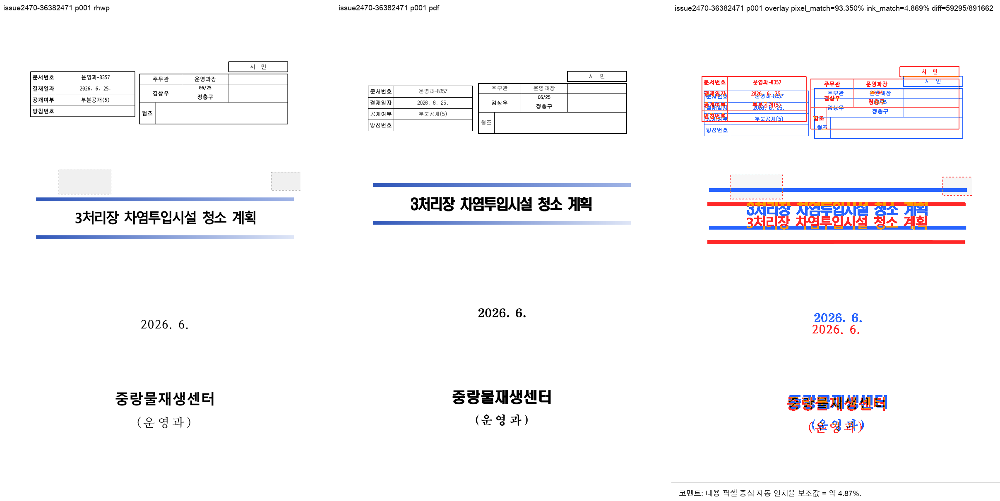
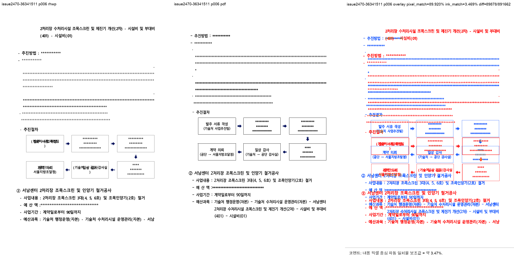

# PR #2663 검토 기록

| 항목 | 내용 |
|---|---|
| PR | [#2663](https://github.com/edwardkim/rhwp/pull/2663) |
| 작성자 / base | [@planet6897](https://github.com/planet6897) / `devel` |
| 관련 | closed [PR #2470](https://github.com/edwardkim/rhwp/pull/2470), 잔여 [#2279](https://github.com/edwardkim/rhwp/issues/2279) |
| 원 commit / 누적 적용 | `1a59bb3a` / `ef813b27c` (충돌 없음, 선행 의존 없음) |
| 범위 | 마스킹 HWPX 2건, Hancom 2022 PDF 2건, page-pin 회귀 테스트 |
| 처리 경로 | collaborator 누적 통합 검토. merge 전 최신 원 PR 상태와 CI 재확인 필요 |

## 검증

- `36382471_masked.hwpx`는 RHWP와 기준 PDF가 모두 2쪽이고 visual sweep 자동 구조 후보가 0/2였다.
- `36341511_masked.hwpx`는 RHWP 9쪽, Hancom PDF 8쪽이며 6쪽에서 line-order와 column drift 후보가
  검출됐다. 원 PR이 현재값 9쪽을 명시적으로 pin하고 [#2279](https://github.com/edwardkim/rhwp/issues/2279)
  잔여로 분리한 사실과 일치한다.
- focused `issue_2470_masking_page_pins` 2/2, 전체 release-test integration, clippy가 성공했다.

## 시각 검증

| 입력 | RHWP / 기준 PDF | 자동 후보 | pixel match | visual accuracy proxy | 판단 |
|---|---:|---:|---:|---:|---|
| `36382471_masked` p1 | 2 / 2쪽 | 0 | 94.59822% | 4.86924% | 구조 후보 없음 |
| `36341511_masked` p6 | 9 / 8쪽 | 4 | 87.93678% | 3.46909% | 기존 9↔8쪽 잔여 확인 |

## 권고

이 PR은 #2470의 기존 수정이 아니라 재현 입력·Hancom 기준 PDF·현재 페이지 핀을 보존하는 범위다.
따라서 36341511의 9↔8쪽 차이는 merge blocker가 아니지만, [#2279](https://github.com/edwardkim/rhwp/issues/2279)는
close하지 않는다. 최신 head CI와 작업지시자 승인이 충족되면 통합 PR로 merge 가능하다.
