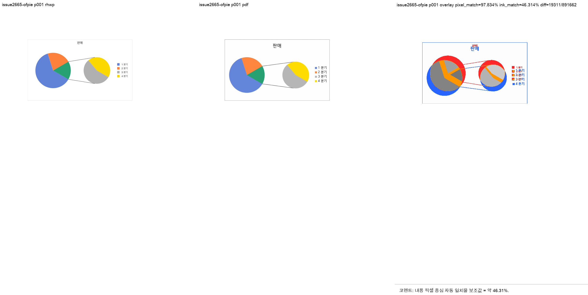
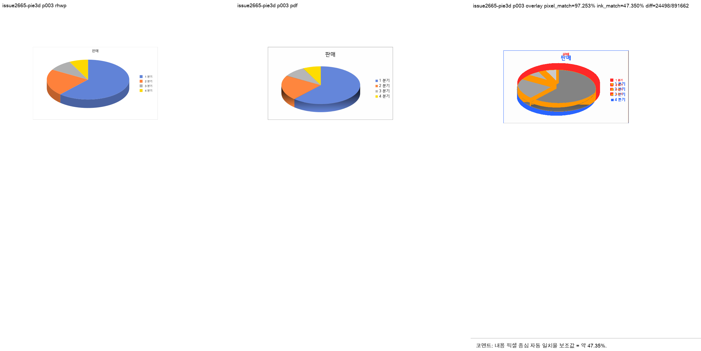

# PR #2665 검토 기록

| 항목 | 내용 |
|---|---|
| PR | [#2665](https://github.com/edwardkim/rhwp/pull/2665) |
| 작성자 / base | [@planet6897](https://github.com/planet6897) / `devel` |
| 관련 | merged [PR #2500](https://github.com/edwardkim/rhwp/pull/2500) |
| 원 commit / 누적 적용 | `bb69f86e` / `bf8fbb73f` (충돌 없음, 선행 [PR #2500](https://github.com/edwardkim/rhwp/pull/2500)) |
| 범위 | OOXML 차트의 `dPt` explosion 문맥 차단, `splitType` 해석 게이트, 3D 범위 주석 |
| 처리 경로 | collaborator 누적 통합 검토. merge 전 최신 원 PR 상태와 CI 재확인 필요 |

## 변경과 검증

- 점별 `c:dPt/c:explosion`이 계열 전체 explosion으로 승격되지 않도록 하고, `splitPos` count 해석을
  `Auto`/`Pos`에만 적용한다. `Val`/`Percent`/`Cust`는 기본 정책으로 안전하게 폴백한다.
- `cargo test --lib ooxml_chart` 137/137, 전체 release-test integration, clippy가 성공했다.
- 원형대원형과 3차원원형의 첫 비교 페이지는 visual sweep 자동 후보 0이었다.

## 시각 검증

| 입력 | 자동 후보 | pixel match | visual accuracy proxy | 판단 |
|---|---:|---:|---:|---|
| 원형대원형 | 0 | 88.44347% | 46.31359% | 보조 플롯 구조 후보 없음 |
| 3차원원형 | 0 | 90.05704% | 47.35010% | 대표 3D 형태 구조 후보 없음 |

## 권고

`rAngAx=1` 코퍼스 한정 3D 근사와 폰트/축 fidelity 차이는 원 PR이 명시한 범위 밖이다. 이번 보정은
점별 explosion 오해석과 `splitType` count 오독을 막는 데 한정되며, 현 검증에서 merge blocker는 없다.
최신 head CI와 작업지시자 승인이 충족되면 통합 PR로 merge 가능하다.
