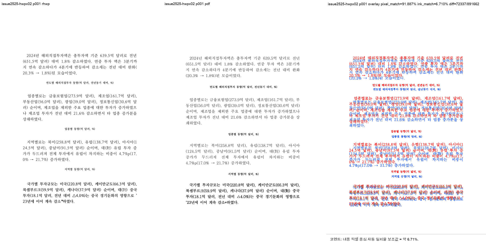

# PR #2669 검토 기록

| 항목 | 내용 |
|---|---|
| PR | [#2669](https://github.com/edwardkim/rhwp/pull/2669) |
| 작성자 / base | [@planet6897](https://github.com/planet6897) / `devel` |
| 관련 이슈 | [#2525](https://github.com/edwardkim/rhwp/issues/2525) |
| 원 commit / 누적 적용 | `e5bbe896` / `ae103d96d` (충돌 없음, 선행 의존 없음) |
| 범위 | 비마스킹 과밀 단일-lineseg 문단을 내폭 1.8배 초과 시 재래핑 |
| 처리 경로 | collaborator 누적 통합 검토. merge 전 최신 원 PR 상태와 CI 재확인 필요 |

## 변경과 검증

- 저장 line 추정 폭이 내폭의 1.8배를 초과할 때 fresh reflow하도록 하여 숫자 advance가 0.297em으로
  압축되며 글리프가 겹치던 경로를 해소한다.
- focused `issue_2525_single_lineseg_rewrap`, 전체 release-test integration, clippy, fresh WASM build가
  성공했다.
- `hwpx-02` p1은 자동 구조 후보 0이고 과밀 글리프가 보이지 않는다.

## 시각 검증

| 입력 | RHWP / 기준 PDF | 자동 후보 | pixel match | visual accuracy proxy | 판단 |
|---|---:|---:|---:|---:|---|
| `hwpx-02` p1 | 7 / 5쪽 | 0 | 91.79657% | 6.71009% | 이번 수정의 글리프 과밀은 없음 |

## 권고

원 PR이 밝힌 대로 문서 전체 쪽수는 수정 전 6쪽, 수정 후 7쪽으로 Hancom 5쪽과 여전히 다르다. 이는
이번 글리프 겹침 해소와 별개인 기존 페이지네이션 fidelity이며 [#2525](https://github.com/edwardkim/rhwp/issues/2525)는
open으로 유지한다. 통제셋과 전체 회귀에서 추가 변화가 없으므로, 최신 head CI와 작업지시자 승인이 충족되면
통합 PR로 merge 가능하다.
