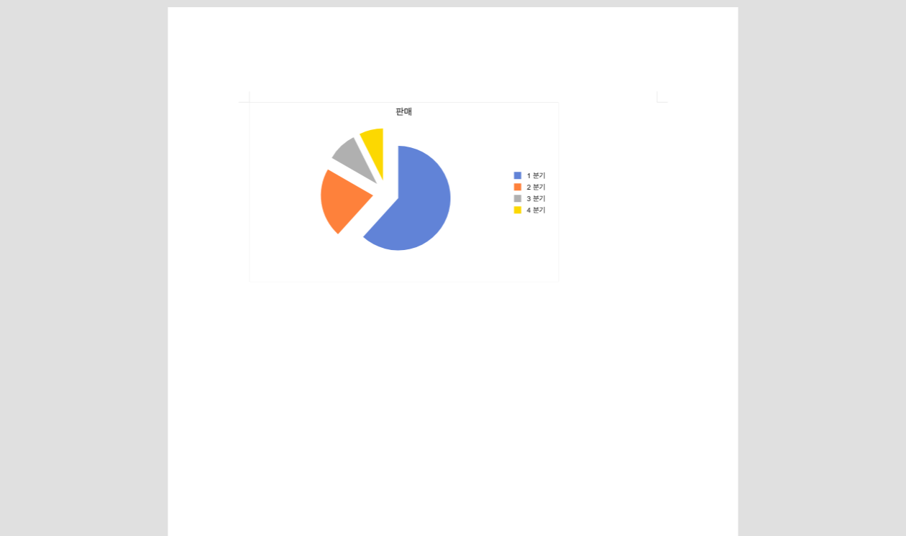

# PR #2680 검토 기록

| 항목 | 내용 |
|---|---|
| PR | [#2680](https://github.com/edwardkim/rhwp/pull/2680) |
| 작성자 / base | [@jangster77](https://github.com/jangster77) / `devel` |
| 선행 PR | [#2654](https://github.com/edwardkim/rhwp/pull/2654) |
| 참고 PR | [#2522](https://github.com/edwardkim/rhwp/pull/2522) |
| 범위 | Canvas2D에서 순수 `rawSvg` 차트/OLE 미리보기의 SVG data URL 프리페치와 bbox 계약 회귀 테스트 |
| reviewer | [@edwardkim](https://github.com/edwardkim) 요청 완료 |
| 최종 판단 | 최신 head의 GitHub Actions가 성공하면 수용 가능 |

## 변경과 중복 판단

[#2654](https://github.com/edwardkim/rhwp/pull/2654)는 순수 `rawSvg`가 있는 페이지를 `0/32/96/240ms`에
조기 재렌더해 1500ms 안전망까지 차트가 비어 보이던 문제를 줄였다. 이 PR은 그 변경을 포함한 최신 `devel` 위에
[#2522](https://github.com/edwardkim/rhwp/pull/2522)의 별도 보완만 이식한다.

최신 `devel` rebase 중 [#2635](https://github.com/edwardkim/rhwp/issues/2635)의 upstream fallback도 확인했다.
이는 프리페치 URL이 전혀 없을 때 즉시 완료해 기존 조기 재렌더를 쓰게 하는 경로다. 충돌 해소에서는 이 fallback을
유지하고, 순수 SVG URL을 만들 수 있을 때는 그 URL의 실제 로드 완료를 기다리도록 #2680의 프리페치를 앞에
결합했다.

순수 `rawSvg`에는 내부 `data:image/...` URL이 없어 기존 raster 정규식 프리페치가 이미지 완료 신호를 만들지
못한다. 따라서 Rust `wrap_svg_fragment`와 같은 SVG data URL을 만들어 브라우저 이미지 캐시를 먼저 채우고,
기존 지연 재렌더가 로드 완료 이미지를 그리도록 한다. 내부 raster data URL을 가진 `rawSvg`는 이미 기존 경로가
처리하므로 중복 프리페치하지 않는다.

Studio의 `getPageLayerTree` bbox 계약은 `x/y/width/height`다. 구형 `getPageRenderTree` JSON의 `w/h`와
혼동하지 않도록 실제 LayerTree 형태를 넣은 회귀 테스트를 추가했다. [#2522](https://github.com/edwardkim/rhwp/pull/2522)의
필드명은 수정 대상이 아니며, 이 PR에서는 테스트 가능하도록 URL 변환을 작은 전용 모듈로 분리했다. 기여자 작업
로그와 PNG는 이식하지 않았다.

## 시각 검증

`samples/chart/원형/쪼개진원형.hwp`를 helper의 기본 1500ms 안정화 대기 없이 headless Chrome에서 열었다.
400ms 시점에 제목, 범례, 네 개의 차트 조각이 모두 보이고 유채색 픽셀 비율은 `1.664%`였다.

- 임시 E2E 산출물: `output/e2e/issue-2635/rawsvg-first-paint.png`
- 보존 asset: `mydocs/pr/assets/pr_2680/rawsvg-first-paint-400ms.png`
- SHA-256: `1f11c3c97c4774aeaab7d4c30f24d84a1bcd796cae2849601c76eb383f572e92`

## 검증

- `cd rhwp-studio && node --test tests/render-backend.test.ts`: 46 passed, 0 failed
- `cd rhwp-studio && npm test`: 466 passed, 0 failed
- `cd rhwp-studio && npm run build`: 성공. 기존 Vite chunk-size 경고 외 오류 없음
- `cd rhwp-studio && node e2e/issue-2635-rawsvg-first-paint.test.mjs --mode=headless`: 400ms first-paint 통과
- `git diff --check`: 통과

## Merge 및 후속 처리

현재 PR head의 CI, CodeQL, Render Diff가 모두 성공하면 merge한다. 이 PR은 새로운 이슈를 close하지 않는다.
merge 후 [#2522](https://github.com/edwardkim/rhwp/pull/2522)에 [#2680](https://github.com/edwardkim/rhwp/pull/2680)가
동일 보완을 최신 `devel` 위에서 대체했다는 코멘트를 남기고 원 PR을 close한다.
