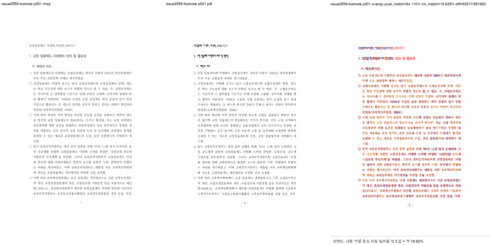
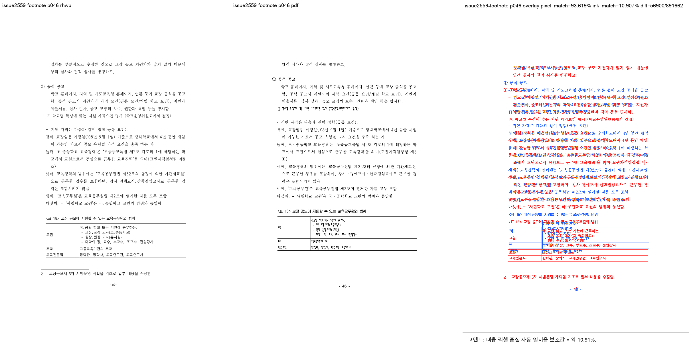
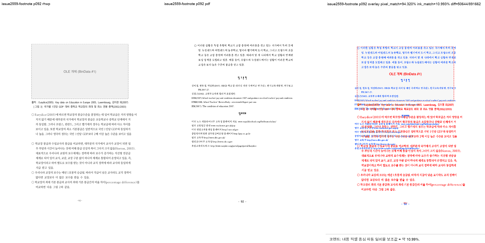

# PR #2702 검토 기록

| 항목 | 내용 |
|---|---|
| PR | [#2702](https://github.com/edwardkim/rhwp/pull/2702) |
| 작성자 / base | [@jangster77](https://github.com/jangster77) / `devel` |
| reviewer | [@edwardkim](https://github.com/edwardkim) 요청 완료 |
| 관련 변경 | [PR #2627](https://github.com/edwardkim/rhwp/pull/2627), [PR #2655](https://github.com/edwardkim/rhwp/pull/2655), merged [PR #2561](https://github.com/edwardkim/rhwp/pull/2561) |
| 관련 이슈 | [#2559](https://github.com/edwardkim/rhwp/issues/2559), closed [#2551](https://github.com/edwardkim/rhwp/issues/2551), 후속 [#2668](https://github.com/edwardkim/rhwp/issues/2668) |
| 범위 | 빈 꼬리말 밴드의 각주 회수, `dump-pages` 오류 처리 보완, r17 서베이 보고서의 재현성 한계 명시, 검증 PDF/샘플 |
| 처리 경로 | collaborator self PR. 코드와 review 기록·시각 자산·오늘할일을 같은 PR에 포함하는 workflow 옵션 1 |

## 메인터너 통합 판단

[PR #2627](https://github.com/edwardkim/rhwp/pull/2627)의 핵심은 각주가 있는 문서에서 빈 꼬리말 밴드를
본문과 경쟁시키지 않는 것이다. 최신 `devel`의 typeset 경로에 적용할 때는 다음 범위로 제한했다.

- 현재 구역에 어떤 조건부 꼬리말도 정의되어 있지 않을 때만 `footer_area.height`를 각주 회수 밴드로 사용한다.
- 각주가 밴드를 넘는 높이만 본문 가용 높이에서 차감한다.
- 꼬리말이 존재하는 구역과 각주가 없는 문서는 종전 경로를 유지한다.

대표 HWP는 수정 전 rhwp 98쪽에서 94쪽으로 줄었다. HWP 2020 MCP 기준 PDF는 92쪽이므로, 이 PR은
완전한 쪽수 정합을 주장하지 않는다. 남은 +2쪽과 knife-edge 8건은 [#2668](https://github.com/edwardkim/rhwp/issues/2668)의
페이지 단위 각주-밴드 배분 재설계에서 처리한다. 따라서 [#2559](https://github.com/edwardkim/rhwp/issues/2559)는 open으로 유지한다.

[PR #2655](https://github.com/edwardkim/rhwp/pull/2655)의 `dump-pages` 범위 검사 본체는 이미
[PR #2552](https://github.com/edwardkim/rhwp/pull/2552)로 반영돼 있다. 이 PR은 중복하지 않고, 남아 있던
잘못된 값/사용한 옵션명 표기와 미지 옵션의 파일 I/O 전 중단만 보완했다. [#2551](https://github.com/edwardkim/rhwp/issues/2551)은
closed 상태여서 closing keyword를 사용하지 않는다.

merged [PR #2561](https://github.com/edwardkim/rhwp/pull/2561)의 r17 보고서는 원 수치를 유지한다. 다만
aggregate·이동표·실행 manifest·바이너리 지문이 보존되지 않아, 문서의 수치를 독립 재현이나 현행 merge 근거로 사용할 수 없음을 명시했다.

## 검증

- `CARGO_INCREMENTAL=0 cargo test --profile release-test --tests`: 성공
- `CARGO_INCREMENTAL=0 cargo clippy --all-targets -- -D warnings`: 성공
- 리베이스 후 focused 회귀: `dump_pages_cli` 3개, [#1733](https://github.com/edwardkim/rhwp/issues/1733) 2개,
  [#2559](https://github.com/edwardkim/rhwp/issues/2559) 1개 성공
- `cargo fmt --check`, `git diff --check`: 성공
- HWP 2020 MCP 기준 PDF: `pdf/issue2559/1341000_research_report_footnotes-2020-print.pdf`, A4 92쪽,
  SHA-256 `ec7cebed92cf114da486eb4f8b4cbefa0739243e037d9a09ceebc433063e7e5e`

## 시각 검증

`samples/issue2559/1341000_research_report_footnotes.hwp`를 HWP 2020 MCP PDF와 대조했다. rhwp는 94쪽,
기준 PDF는 92쪽이어서 1·46·92쪽 검증은 clipping·frame·순서 문제를 찾는 구조 검증으로만 사용했다.
글꼴 fidelity 또는 완전한 한컴 레이아웃 동등성 판정 근거가 아니다.

| 페이지 | 자동 구조 후보 | pixel match | visual accuracy proxy | 판단 |
|---:|---:|---:|---:|---|
| 1 | 0 | 94.11021% | 18.62497% | clipping·frame·순서 후보 없음 |
| 46 | 0 | 93.61866% | 10.90721% | clipping·frame·순서 후보 없음 |
| 92 | 0 | 94.32027% | 10.99316% | clipping·frame·순서 후보 없음 |

대표 visual sweep:

render-tree에는 p82 2.5px, p86 14.3px/23.5px `LAYOUT_OVERFLOW` 진단 후보가 남는다. 해당 rhwp 페이지를
직접 확인했을 때 페이지 밖 잘림은 보이지 않았다. 다만 92/94쪽 불일치 때문에 PDF 같은 번호 페이지와의
정확한 대응 비교는 할 수 없으므로, 이를 해소됐다고 주장하지 않고 [#2668](https://github.com/edwardkim/rhwp/issues/2668)의
잔여 진단으로 남긴다.

## 권고

로컬 검증에서 머지 보류 사유는 없다. 최신 head의 GitHub Actions가 통과하면 merge 가능하다.
merge 뒤 [PR #2627](https://github.com/edwardkim/rhwp/pull/2627)과 [PR #2655](https://github.com/edwardkim/rhwp/pull/2655)는
대체 PR 안내와 함께 close하고, [#2559](https://github.com/edwardkim/rhwp/issues/2559)는 [#2668](https://github.com/edwardkim/rhwp/issues/2668)와
연결해 open으로 유지한다.
