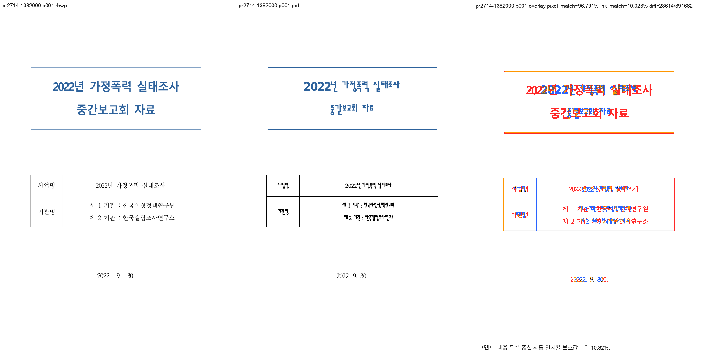
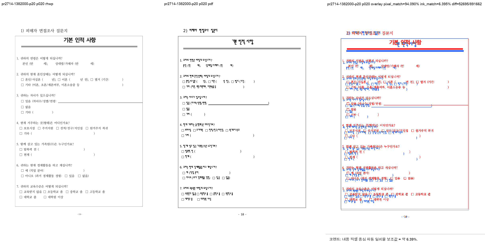
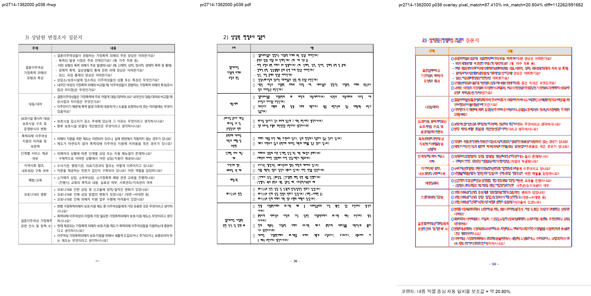
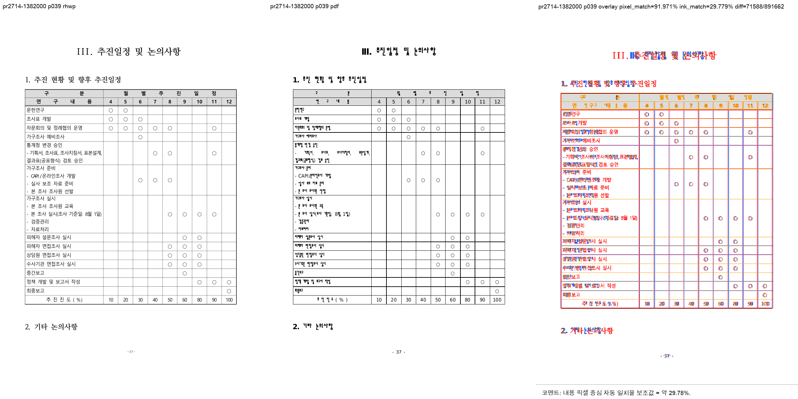

# PR #2714 검토 기록

| 항목 | 내용 |
|---|---|
| PR | [#2714](https://github.com/edwardkim/rhwp/pull/2714) |
| 작성자 / base | [@planet6897](https://github.com/planet6897) / `devel` |
| reviewer | [@jangster77](https://github.com/jangster77) |
| 관련 이슈 | [#2430](https://github.com/edwardkim/rhwp/issues/2430), [#2559](https://github.com/edwardkim/rhwp/issues/2559), [#2006](https://github.com/edwardkim/rhwp/issues/2006) |
| 범위 | 셀의 저장 `ls1` 재래핑 발동 임계를 `내폭 x 1.05`에서 `내폭 x 1.8`로 좁히고, 대표 HWP 회귀와 기존 페이지 핀을 갱신 |
| 처리 경로 | 원 코드 PR merge 후 검증 기록, 기준 PDF, visual asset, 오늘할일을 별도 문서 PR로 남기는 workflow 옵션 2 |
| 원 PR merge | 2026-07-21, [`e66d796`](https://github.com/edwardkim/rhwp/commit/e66d7960cf3facb94f9c43cf58f9db404d9d3f0a) |

## 검토 결론

`recompose_stored_single_line_if_overflowing`는 저장된 line segment가 한 개뿐인 셀 문단을
재래핑할지 결정한다. 기존 `x 1.05`는 측정 폭과 실제 렌더 패딩 차이로 살짝 넓게 측정된 정상 셀까지
재래핑해 표의 행 높이와 페이지 수를 불필요하게 늘렸다. `x 1.8`은 실제로 심하게 넘친 부실 저장만
재래핑하므로 [#2291](https://github.com/edwardkim/rhwp/issues/2291)의 긴 단일 lineseg 절단 방지는 유지하면서
[#2430](https://github.com/edwardkim/rhwp/issues/2430)의 대표 표 과다분할을 해소한다.

대표 `samples/task2430/1382000_domestic_violence_survey.hwp`는 `upstream/devel`에서 40쪽이었고,
PR head에서는 39쪽이다. HWP 2020 MCP Print 기준 PDF도 39쪽이므로 페이지 수가 정합한다.
[#2559](https://github.com/edwardkim/rhwp/issues/2559) 표본도 94쪽에서 92쪽으로 개선됐고, 기존 HWP 2020
Print 기준 PDF의 92쪽과 정합한다. 따라서 merge 보류 사유는 없다.

[#2430](https://github.com/edwardkim/rhwp/issues/2430)은 다른 원인의 잔여 cohort가 있으므로 자동 close하지 않고
open 상태로 유지한다.

## 검증

- focused 회귀: `issue_2430_cell_rewrap_threshold`, `issue_2291_rowspan_declared_residual`,
  `issue_2287_edu_rowspan_block_fragments`, `issue_2006_1790387_prep_pagination_pin`,
  `issue_2559_footnote_footer_band` 성공
- `CARGO_INCREMENTAL=0 cargo test --profile release-test --tests`: 성공
- `CARGO_INCREMENTAL=0 cargo clippy --all-targets -- -D warnings`: 성공
- `CARGO_INCREMENTAL=0 cargo fmt --check`, `git diff --check`: 성공
- `wasm-pack build --target web --out-dir pkg`: 성공
- 최신 PR head GitHub Actions: CI, CodeQL, Render Diff 전체 성공
- HWP 2020 MCP Print 기준 PDF:
  - `pdf/issue2430/1382000_domestic_violence_survey-2020-print.pdf`: A4 39쪽,
    SHA-256 `5f92d3282c0772cd8fbe72e0fadfa49e2cde8ee7d788b6fbafe51bbd4e59e024`
  - `pdf/issue2559/1341000_research_report_footnotes-2020-print.pdf`: A4 92쪽,
    SHA-256 `ec7cebed92cf114da486eb4f8b4cbefa0739243e037d9a09ceebc433063e7e5e`

## 시각 검증

`samples/task2430/1382000_domestic_violence_survey.hwp`와 HWP 2020 MCP Print PDF를 visual sweep으로
대조했다. 페이지 1, 20, 38, 39에서 frame, tail overflow, 읽기 순서, 표/문단 clipping 자동 후보는 모두
0건이었다. 픽셀·ink 수치는 시스템 글꼴과 Hancom 글꼴 raster 차이가 포함되므로 글꼴 fidelity 판정이 아니라
구조적 회귀 탐지 근거로만 사용했다.

| 페이지 | 자동 구조 후보 | pixel match | visual accuracy proxy | 사람 판정 |
|---:|---:|---:|---:|---|
| 1 | 0 | 96.79094% | 10.32343% | 표/본문 시작 구조 정상 |
| 20 | 0 | 94.09025% | 6.39488% | 표 continuation clipping 후보 없음 |
| 38 | 0 | 87.40980% | 20.80450% | 말미 표 흐름 정상 |
| 39 | 0 | 91.97140% | 29.77920% | 마지막 표와 tail 구조 정상 |

대표 visual sweep:

PR head의 render-tree에는 p20 `PartialTable` 18.9px, p38 `FullParagraph` 19.1px
`LAYOUT_OVERFLOW` 진단이 남는다. 이는 새로 생긴 후보가 아니다. `upstream/devel`에서도 같은 문단 축에
각각 45.3px, 19.1px가 있었고, 본 변경 뒤 대표 표 후보는 45.3px에서 18.9px로 줄었다. p20 sweep도
페이지 밖 frame/tail overflow 후보 0건이어서 본 PR의 merge 보류 사유로 보지 않는다.

## 비차단 후속 보완

`tests/issue_2006_1790387_prep_pagination_pin.rs`의 모듈 머리말은 현재 도달값을 아직 141쪽으로 서술하지만,
실제 assertion과 상세 메시지는 143쪽이다. 실행 결과에는 영향이 없으며 [#2006](https://github.com/edwardkim/rhwp/issues/2006)의
잔여 page fidelity 작업에서 설명을 143쪽으로 정리한다. 이번 PR은 144쪽에서 143쪽으로 바뀐 이유를 테스트
상세 메시지에 이미 기록했으므로, 이 문서 불일치는 merge를 막지 않는다.
