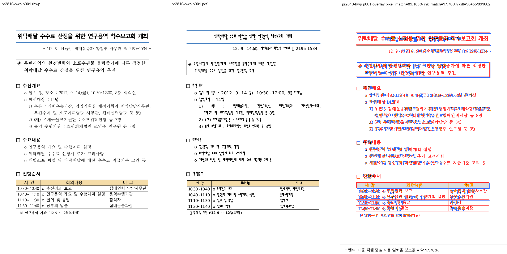
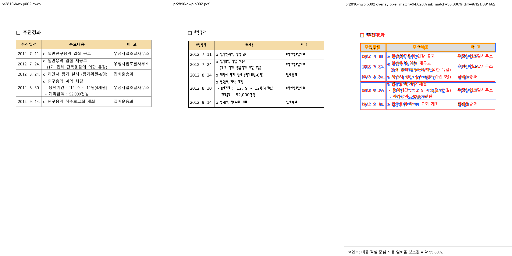
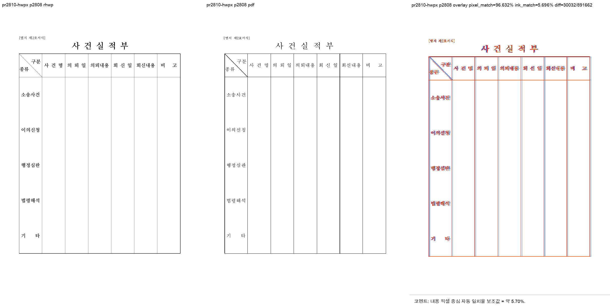

# PR #2810 검토 기록

| 항목 | 내용 |
|---|---|
| PR | [#2810](https://github.com/edwardkim/rhwp/pull/2810) |
| 작성자 / base | [@planet6897](https://github.com/planet6897) / `devel` |
| reviewer | [@jangster77](https://github.com/jangster77) |
| 관련 이슈 | [#2808](https://github.com/edwardkim/rhwp/issues/2808) |
| 범위 | PR #2512의 반복 표 page-local exclusion 정정 뒤 생긴 knife-edge +1 과분할 7건을 구조 판별자 2종으로 회귀시키고, HWP/HWPX 재현 샘플과 IR baseline을 추가 |
| 처리 경로 | collaborator 체리픽 누적 통합 검토. 기여 커밋 `24d4fa2d`, `861ec34a`를 적용하고 원 PR의 `Merge branch 'devel'` 커밋은 제외 |
| 통합 기준 | `upstream/devel` `4775e8c2` 위 체리픽, #2807·#2811과의 충돌 0건 |

## 검토 결론

정정은 넓은 예외를 추가하지 않는다.

- 같은 owner 문단의 post-text exclusion 소비는 TopAndBottom float 표가 둘 이상인 co-anchored stack으로 한정한다. 단일 표 host는 기존 앵커 경로를 유지한다.
- empty-host RowBreak 표의 host line advance는 다음 저장 `vpos`가 host 줄 advance와 정확히 맞는 접힌 ladder에서만 더한다. 표 높이가 이미 다음 `vpos`에 포함된 물리 ladder에서는 이중 계상을 막는다.
- 두 조건은 `layout`과 `typeset`에 같은 의미로 적용됐고, 양성·음성 단위 테스트로 고정됐다.

페이지네이션과 표 배치가 바뀌므로 한글 2020 기준 PDF와 함께 시각 검증을 수행했다. HWP는 2쪽, HWPX는 1쪽(문서 내부 페이지 번호 2808)으로 rhwp와 한글 2020 Print PDF의 쪽수가 각각 일치했다. 표 경계, 행 분할, 마지막 흐름에서 사람 검토상 차단할 기하 회귀는 없었다. 문자 주변의 색 프린지는 macOS 공개 폰트와 한컴 폰트 rasterization 차이로 보이며, 자동 구조 후보와 분리해 판단했다.

## 검증

- `git diff --check`, `cargo fmt --all -- --check`: 성공
- `CARGO_INCREMENTAL=0 cargo test --lib issue2439`: 6 passed
- `CARGO_INCREMENTAL=0 cargo test --profile release-test --test issue_2439`: 4 passed
- `CARGO_INCREMENTAL=0 cargo test --profile release-test --test ir_field_sweep_baseline`: 2 passed
- `CARGO_INCREMENTAL=0 wasm-pack build --target web --out-dir pkg`: 성공
- 최신 원 PR head GitHub Actions: CI, CodeQL, Render Diff 전체 성공

### HWP 2020 MCP Print 기준 PDF

| 원본 | 기준 PDF | 결과 |
|---|---|---|
| `samples/issue2808_report_physical_ladder.hwp` | `pdf/issue2808_report_physical_ladder-2020.pdf` | job `f99c8ba4-9793-46fa-b563-d0b53c41651e`, `run_status=0`, `validation=ok`, A4 2쪽, SHA-256 `b10a07bf3c8b582dddf412e7a1c39dabdde456551c7d5c7ecd1642e071e18377` |
| `samples/issue2808_single_table_form_physical_ladder.hwpx` | `pdf/issue2808_single_table_form_physical_ladder-2020.pdf` | job `475cafe1-28af-4e6f-a8c6-f0c942227e80`, `run_status=0`, `validation=ok`, A4 1쪽, SHA-256 `545cf26ce8fb990ce47c49782748bf87ba91c8a9b8c0c267fdec9a355a73d3b9` |

### 시각 검증

| 샘플 / 페이지 | 자동 구조 후보 | pixel match | visual accuracy proxy | 사람 판정 |
|---|---:|---:|---:|---|
| HWP p1 | 0 | 89.18256% | 17.76016% | 표·본문 시작 구조 정상 |
| HWP p2 | 0 | 94.82752% | 33.79982% | 표·행 분할과 tail 흐름 정상 |
| HWPX p1(내부 2808) | 0 | 96.63191% | 5.69616% | 단일 표 form 기하 정상 |

`visual accuracy proxy`는 내용 픽셀 중심 자동 보조값이며, 한컴 호환성 점수나 사람 판정을 대신하지 않는다.

## 권고

통합 PR의 최신 CI와 작업지시자 승인을 조건으로 수용한다. merge 뒤 [#2808](https://github.com/edwardkim/rhwp/issues/2808)의 close 상태를 확인하고, 기본 브랜치가 `devel`이라 자동 close가 적용되지 않으면 검증 요약을 남겨 수동 close한다.
