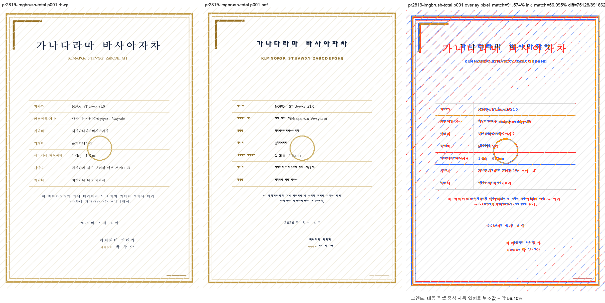

# PR #2819 검토 기록

| 항목 | 내용 |
|---|---|
| PR | [#2819](https://github.com/edwardkim/rhwp/pull/2819) |
| 작성자 / base | [@planet6897](https://github.com/planet6897) / `devel` |
| reviewer | [@jangster77](https://github.com/jangster77) |
| 관련 이슈 | [#2816](https://github.com/edwardkim/rhwp/issues/2816) |
| 범위 | HWPX `imgBrush mode="TOTAL"`을 `FitToSize`와 같은 용지 전체 늘이기 의미로 렌더 |
| 처리 경로 | collaborator 체리픽 통합 검토. 원 커밋 `de2a0db06`를 통합 커밋 `428920bd9`로 적용 |
| 통합 기준 | `upstream/devel` `491e56fcc` 위 체리픽, #2818·#2820과 충돌 0건 |

## 검토 결론

HWPX `TOTAL`은 바이너리 채우기 유형 5와 같은 렌더 의미지만 별도 enum으로 보존돼 기본 원본 크기
경로에 빠지고 있었다. SVG·WebCanvas·Skia에서 늘여 채우는 분기에 `Total`을 포함하는 수정은
직렬화기의 `TOTAL` 라운드트립 표현을 유지하면서 렌더 의미만 통합하므로 적절하다.

원 PR은 Studio CanvasKit 경로를 포함하지 않았다. 메인테이너 보정으로 `ImageFillMode::Total`과
LayerTree `fillMode="total"`을 CanvasKit의 `fitToSize`와 같은 stretch 경로에 포함하고 회귀 테스트를
추가했다. 상세 내용은 `pr_2819_review_impl.md`에 기록한다.

## 검증

- 전체 Rust·Studio·WASM 게이트: `pr_2818_review.md`와 같은 누적 통합 기준으로 모두 성공
- 한글 2020 기준 PDF: `pdf/issue2816/imgbrush_total_page_fill-2020.pdf`, A4 1쪽,
  SHA-256 `f61b85aac12d27ace4e3faef9060cacb6e9e4ae1a51ec4b90b7a6a36255421ef`
- 원본 HWPX SHA-256: `75d28e63f4610c751ea9cc56a41634c3f7a7761b817170a6b84acfa90511237f`
- visual sweep: 1쪽, 자동 구조 후보 0/1, pixel match 91.57439%, 내용 픽셀 보조값 56.09502%
- 작업지시자 WASM 브라우저 검증: 완료

`내용 픽셀 보조값`은 폰트 rasterization 차이를 포함하는 자동 보조 지표이며 사람 판정을 대신하지
않는다. 사람 검토에서 배경 테두리·모서리·대각 장식이 양쪽 모두 용지 전체에 표시된다.

## 권고

메인테이너 CanvasKit 보정을 포함한 통합 PR의 CI 성공을 조건으로 수용한다. merge 뒤 #2816의 close
상태와 review 이미지의 raw URL 렌더링을 확인한다.
