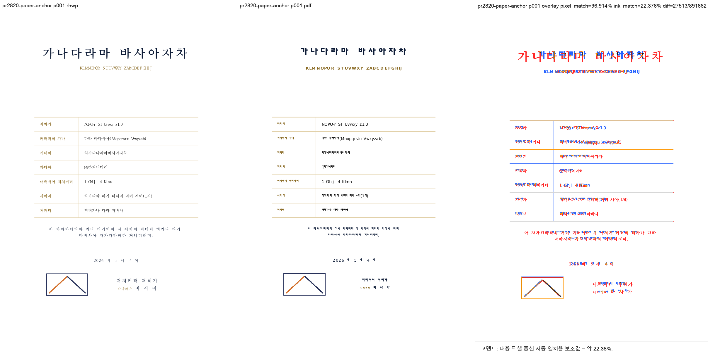

# PR #2820 검토 기록

| 항목 | 내용 |
|---|---|
| PR | [#2820](https://github.com/edwardkim/rhwp/pull/2820) |
| 작성자 / base | [@planet6897](https://github.com/planet6897) / `devel` |
| reviewer | [@jangster77](https://github.com/jangster77) |
| 관련 이슈 | [#2817](https://github.com/edwardkim/rhwp/issues/2817) |
| 범위 | 텍스트 없는 PAPER 앵커 `InFrontOfText` 그림 host 문단의 한 줄 진행량 예약 |
| 처리 경로 | collaborator 체리픽 통합 검토. 원 커밋 `adf692378`을 통합 커밋 `b3fbb6e45`로 적용 |
| 통합 기준 | `upstream/devel` `491e56fcc` 위 체리픽, #2818·#2819와 충돌 0건 |

## 검토 결론

원 수정은 Picture의 `VertRelTo::Paper`만 빠져 있던 비대칭을 해소하고 `InFrontOfText` 조건을
유지한다. 따라서 BehindText 배경 그림에는 발동하지 않으며, 조판이 이미 보존한 1920 HU 한 줄
진행량을 렌더 트리 y 위치에 반영한다.

초기 visual sweep에서 PDF 좌하단 봉투 그림이 rhwp에 보이지 않는 별도 결함을 발견했다. 원 PR의
문단 진행량 수정은 맞았지만 `imgDim` 144000×81000 전체 좌표를 고정 75 HU/px로 해석해 192×108
PNG를 1920×1080 가상 이미지로 만든 crop 경로가 그림의 1/10만 표시했다. 메인테이너가 문서의
`imgDim`을 crop 기준 크기로 전달해 SVG·CanvasKit·WebCanvas·Skia·LayerTree를 함께 보정했다.
상세 내용은 `pr_2820_review_impl.md`에 기록한다.

## 검증

- 전체 Rust·Studio·WASM 게이트: `pr_2818_review.md`와 같은 누적 통합 기준으로 모두 성공
- Native Skia 공식 회귀: lib `skia` 56/56, placeholder integration 2/2, PDF integration 4/4 성공
- 한글 2020 기준 PDF: `pdf/issue2817/paper_anchor_infront_pic-2020.pdf`, A4 1쪽,
  SHA-256 `58c73e47442052f79d3d9bf8ea99acaca472bcabe07cfa89d3576d0274f018af`
- 원본 HWPX SHA-256: `db44a442ff70de950d718e9de63ce40b45be080466afe0d801c46789e055938f`
- visual sweep: 1쪽, 자동 구조 후보 0/1, pixel match 96.91441%, 내용 픽셀 보조값 22.37614%
- 사람 판정: 좌하단 봉투 그림과 뒤따르는 문단의 한 줄 위치가 PDF와 함께 표시됨
- 작업지시자 WASM 브라우저 검증: 완료

## 권고

메인테이너 crop 보정을 포함한 통합 PR의 CI 성공을 조건으로 수용한다. merge 뒤 #2817의 close
상태와 review 이미지의 raw URL 렌더링을 확인한다.
