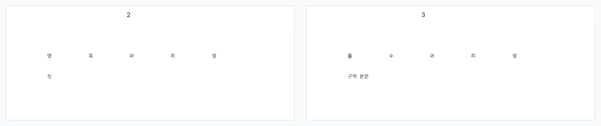

# PR #3240 검토 기록 — 활성 머리말 선택 구체성 통일

## 메타

| 항목 | 값 |
| --- | --- |
| 원 PR | [#3240](https://github.com/edwardkim/rhwp/pull/3240) |
| 작성자 | `lpaiu-cs` |
| 원 head | `37834e6e623f0f1261010764f196a65feebd4d43` |
| base / 상태 | `devel` / `BEHIND` |
| 누적 검토 브랜치 | `review/lpaiu-cs-20260724` (`upstream/devel` `c8611dd84d002d2a776c040387bf21cf270f6448`) |
| 적용 순서 / 로컬 SHA | 4) `4253b1c53` → `e649cc810`, 5) `f5bb1db2` → `cfaae968e` |
| 충돌 | 없음 |

## 변경과 판단

머리말 선택 규칙이 `pagination/engine.rs`, `typeset.rs`, `queries/rendering.rs`에 서로 다르게 구현돼,
홀수/짝수 전용보다 `양 쪽` 머리말이 등장 순서나 구역 간 페이지 번호 carry에 의해 우선되는 결함을
`ActiveHeaderFooter` 공용 선택기로 통일했다. 다구역 보정도 carry 반영 뒤의 최종 쪽 번호로 같은
선택기를 쓰므로, 단일 구역과 다구역 규칙이 일치한다.

초기 커밋의 P2는 `f5bb1db2`에서 구역 보정 경로까지 공용 선택기를 연결해 해결됐다. 이번 누적 브랜치의
#3228은 이 활성 정보를 읽어 진입 대상만 고르므로 두 변경을 함께 적용해도 충돌이 없으며, 표시 결과와
편집 대상 규칙이 같은 정의를 사용한다.

## 시각 검증

위 자산은 앞 구역 1쪽 뒤 두 번째 구역의 2·3쪽을 만든 **코드 생성 regression fixture**를 Native Skia로
렌더한 실제 PNG다. 2쪽에는 `양쪽머리말`, 최종 홀수인 3쪽에는 `홀수머리말`이 표시된다. 즉 지역 페이지
번호와 carry가 엇갈리는 경로에서 전용 머리말이 양쪽 머리말보다 우선함을 화면으로 남겼다. 원본
HWP/HWPX fixture와 HWP 2020 기준 PDF가 없는 합성 fixture이므로 PDF overlay가 아니라
사용자-visible 렌더 출력 자체를 검토 근거로 삼았다.

Windows `win10-ted`의 별도 temporary worktree(누적 head `cfaae968e`)에서
`cargo test --profile release-test --features native-skia --test tmp_visual_pr_3240`를 실행해 p002/p003을
재생성했다. 원본 PNG SHA-256은 각각
`768cefb57315135d156f93f0e1e6a92244eadbec38a5960682efc5d5f0288f70`,
`bd36dcb443b6952389dad6659fd3d1d6d17c95b473aea4484de4e6884051d942`다. 위 검토 자산은 그 Windows
출력의 실제 화면 상단을 나란히 보이도록 만든 안정적 사본이다.

## 독립 검증

| 검증 | 결과 |
| --- | --- |
| `cargo test --profile release-test --test issue_3234_active_hf_specificity` | 4 passed |
| `cargo test --profile release-test --tests` | PASS (`ir_field_sweep_baseline` 포함) |
| Native Skia 공식 3종 | lib 56 passed, #2225 2 passed, direct PDF 4 passed |
| `cargo fmt --check`, `cargo clippy --all-targets -- -D warnings`, `cargo test --doc` | PASS (doc 4 passed, 2 ignored) |
| `wasm-pack build --target web --out-dir pkg` | PASS |
| `rhwp-studio: npx tsc --noEmit`, `npm test` | PASS (636 passed, 0 failed) |

## 최종 권고

**통합 PR 수용 후보.** renderer 변경이므로 Windows 재생성 PNG와 통합 PR의 최신 CI가 모두 성공한 뒤,
작업지시자 승인으로 merge한다.
