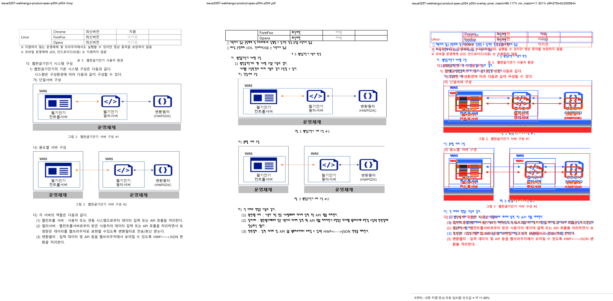

# PR #3265 검토 기록 — #3257 TAC 그림 정렬 · #3259 최근 문서 handle 보존

## 메타

| 항목 | 값 |
|---|---|
| PR | [#3265](https://github.com/edwardkim/rhwp/pull/3265) |
| 작성자 | `jangster77` (repository collaborator) |
| base | `devel` |
| 관련 이슈 | [#3257](https://github.com/edwardkim/rhwp/issues/3257), [#3259](https://github.com/edwardkim/rhwp/issues/3259) |
| 범위 | renderer TAC 정렬 폭, Studio Finder 드롭 handle 전달, 재현 fixture·HWP 2020 기준 PDF·검증 문서 |
| 문서 작성 시점 참고 | PR 생성 직후. mergeable·CI·head SHA는 merge 전에 최신 상태를 다시 확인한다. |

## 변경과 판단

### #3257 — 4쪽 그림 우측 잘림

문단 끝 위치의 `treat_as_char` 그림은 paint 경로에서는 현재 줄에 방출하면서 정렬 폭 계산에서는
제외하고 있었다. `tac_offsets_for_line_width()`로 실제 방출과 같은 TAC 귀속을 정렬 폭에도 적용했다.
다음 composed line이 같은 문자 위치에서 시작하면 앞 줄에서 제외해 #1219 줄 경계 수식 회귀를 보존한다.

수정 뒤 `pi=75`, `ci=0` 그림은 render tree에서 `x=129.8`, `width=574.1`, right=`703.9`이며,
본문 우측 `718.1`을 넘지 않는다. HWP 2020 PDF 4쪽 144dpi visual sweep은 자동 후보 `0/1`이다.

### #3259 — Finder 드롭 문서 최근 재열기

drop event와 같은 tick에 `DataTransferItem.getAsFileSystemHandle()` Promise를 시작하고, 사용자가
열기를 확인한 뒤에만 handle을 `loadFile`과 기존 `addRecentDoc` 수렴점으로 전달한다. API 미지원,
거부, directory, 선택 파일 불일치는 기존 meta-only 재선택 fallback을 유지한다.

작업지시자가 macOS Finder에서 `A 드롭 → B 열기 → 최근 A 재선택`을 실제로 확인했고, picker나
`핸들 없이 열려` toast 없이 A가 다시 열렸다.

## 사전 검증

| 검증 | 결과 |
|---|---|
| `cargo test --lib trailing_tac_width_tests` | 3 passed |
| `cargo test --lib issue_3257_centered_trailing_picture_uses_full_line_width` | 1 passed |
| `cargo test --test issue_1219_equation_line_hangul_advance --test issue_1285_tac_sequence_right_align` | 3 passed |
| 4쪽 HWP 2020 PDF visual sweep | 144dpi, 자동 후보 0/1 |
| Studio `file-system-access` | 19 passed |
| Studio `npm test` | 568 passed |
| WASM dev build · Studio production build | 통과 |
| `cargo test --profile release-test --tests` (초기) | IR field sweep baseline 신규 행 1건으로 실패 — 아래 분류 후 보강 |
| `CARGO_INCREMENTAL=0 cargo test --profile release-test --tests` (재실행) | exit 0, IR field sweep 2 passed 포함 |
| `CARGO_INCREMENTAL=0 cargo build --release` | 통과 |
| `CARGO_INCREMENTAL=0 cargo test --release --lib` | 2,894 passed, 0 failed, 7 ignored |
| Native Skia 공식 3종 | lib 56 passed, #2225 2 passed, direct PDF 4 passed |
| `cargo fmt --check`, `git diff --check`, `cargo clippy --all-targets -- -D warnings` | 통과 |
| `CARGO_INCREMENTAL=0 cargo test --doc` | 4 passed, 2 ignored |

### IR field sweep baseline 분류

`samples/issue3257/webhangul_product_spec_v1.1.hwp`를 추가하면서 `hwp5rb` 레코드 재생성
경로의 기존 정규화가 새로 관측됐다. 원본 `LIST_HEADER` 폭 참조가 0인 셀 16개를 #1633의
HWP 저장 호환 보정이 `0x0400`으로 기록하므로, 상세 스윕은 각 셀에서 `0 → 1024`를 보인다.
이는 TAC 정렬 수정 전후의 새 발산이 아니며, 기존 코퍼스에도 같은
`list_header_width_ref` baseline 행이 다수 있다. 새 fixture의 관측값 16건을 baseline에
명시했고, 전체 통합 테스트 재실행은 exit 0으로 완료했다.

## 리스크와 최종 권고

- visual sweep의 내용 픽셀 중심 자동 일치율 보조값 `11.30076%`는 폰트 및 기존 전체 줄 위치 차이를
  포함하므로 단독 merge 판단 지표가 아니다. 대상 그림의 bbox와 실제 비교 PNG로 우측 잘림 해소를 확인했다.
- #3259는 지원하지 않는 브라우저에서 재선택 fallback을 의도적으로 유지한다.
- 최종 권고: 로컬 필수 gate는 통과했다. ready 전환 뒤 PR head 최신 GitHub Actions가 통과하면
  #3257·#3259를 함께 merge한다.
