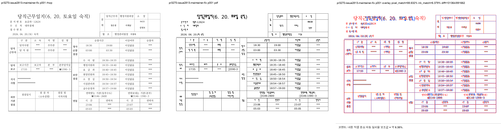
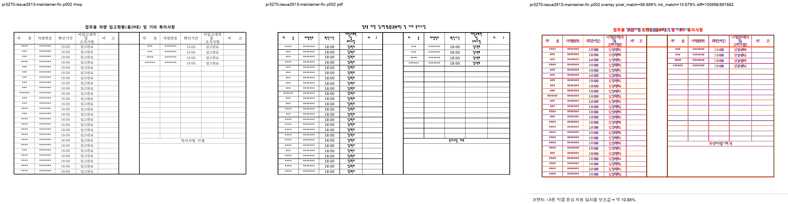

# PR #3270 검토 기록 — #2813 para-float 스택 앵커 줄·과분할

## 메타

| 항목 | 값 |
|---|---|
| PR | [#3270](https://github.com/edwardkim/rhwp/pull/3270) |
| 작성자 | `planet6897` (Jaeook Ryu) |
| base / PR head | `devel` `125411f062eb42e0323af398cc816c62953dbea6` / `0995e7d0485d72a1b48d2fe0202e25ecdf1a49d6` |
| 관련 이슈 | [#2813](https://github.com/edwardkim/rhwp/issues/2813) |
| 규모 | 기여자 3 files, +144/-5 — `typeset.rs`, 회귀 테스트, HWPX fixture; 아래 메인터너 보정 2 files |
| 로컬 검토 브랜치 | `review/planet6897-20260725` (`upstream/devel` `125411f062eb42e0323af398cc816c62953dbea6` 위) |
| 적용 | 원 기능 커밋 `07e81f8719bed62193cd151f7d7b66f32e89db4c`를 `-x` cherry-pick해 최신 `devel` 위에서 검증; 충돌 없음 |
| reviewer | `jangster77`를 GitHub reviewer로 지정 |

## 변경과 범위 판단

`samples/issue2813/dangjik_dutylog.hwpx`의 공백-only host 문단에서 para-relative
`TopAndBottom` 표 두 개와 저장 앵커 줄이 같은 페이지에 들어가야 한다. 기존에는 measured table
height를 기준으로 둘째 표를 다음 쪽으로 넘기고, 렌더 아이템 순서도 줄→표여서 상단 공백과 겹침 및
3쪽 과분할이 생겼다. PR은 저장 앵커 줄이 float 스택 뒤에 있음을 판별해 orphan guard를 우회하고,
`PartialParagraph` item을 두 표 뒤로 이연한다.

변경 대상이 `src/renderer/typeset.rs`이고 pagination·table placement·페이지 수를 바꾸므로,
2.6절에 따라 HWP 2020 기준 PDF와 visual sweep이 필수인 렌더 영향 PR로 분류했다.

## fixture · IR baseline

- 신규 fixture: `samples/issue2813/dangjik_dutylog.hwpx`
  - SHA-256: `d785a49b62c43ed5b4602509657a112742d916782828022a355b916bcc19a4c5`
- HWP 2020 MCP 기준 PDF: `pdf/issue2813/dangjik_dutylog-2020.pdf`
  - MCP job: `a56f1c5b-d5d4-4b78-8b88-c4e91cd3a979`, `run_status=0`, validation `ok`
  - 2 pages, A4 landscape (842 × 595 pt)
  - SHA-256: `e391f0a81ca8a0df41ca2f4295b801b8b4d88a87f8ed628f28c93ca06286d4dc`
- 신규 HWPX fixture에 대해 `RHWP_IR_SWEEP_DUMP=/tmp/rhwp-pr3270-ir-field-sweep.tsv`
  `cargo test --profile release-test --test ir_field_sweep_baseline -- --nocapture`를 실행했다.
  dump와 `tests/fixtures/ir_field_sweep_baseline.tsv`는 672행으로 완전히 동일했다. 이 fixture는
  non-zero IR field divergence가 없으므로 baseline 행을 추가하지 않는 것이 4.3.1절 기준에 맞다.

## 시각 · 개체 회귀 검증

메인터너 보정 반영 binary와 위 HWP 2020 PDF로 다음을 실행했다.

```bash
python3 scripts/task1274_visual_sweep.py \
  --key pr3270-issue2813-maintainer-fix \
  --hwp samples/issue2813/dangjik_dutylog.hwpx \
  --pdf pdf/issue2813/dangjik_dutylog-2020.pdf \
  --pages 1-2 \
  --rhwp-bin /Users/tsjang/rhwp/target/planet6897-20260725-review/release-test/rhwp \
  --out output/review/pr3270/maintainer_fix_visual_sweep
```

- 기준 PDF 2쪽 / rhwp 2쪽, 자동 후보 `0/2`.
- pixel match: p1 `88.63202%`, p2 `88.68899%`; 내용 픽셀 중심 보조값은 각각
  `6.37936%`, `10.67892%`이다. 이 값은 이 fixture의 폰트·세부 선 차이를 포함하므로 단독
  합격 판정으로 사용하지 않았다.
- 실제 검토 PNG에서 p1의 표 두 개는 페이지 상단부터 문서순으로 이어지고, 기존의 대형 상단 공백·표
  겹침은 보이지 않았다. p2도 기준 PDF와 같은 다음 양식 페이지로 이어지며 clipping/overlap은 없었다.





임시 원본은
`output/review/pr3270/maintainer_fix_visual_sweep/pr3270-issue2813-maintainer-fix/{compare,overlay,review}/`에 남겼고,
위 두 PNG는 검토 브랜치의 안정 자산으로 복사했다.

`python3 tools/object_visual_regression.py --preset ovr5 -o output/review/pr3270/ovr5 --diff-against devel`
도 실행했다. 추적 개체가 실제로 있는 KTX(3), 21_언어(2), aift(6)에서 각 페이지·개체 수가 유지되고
geometry regression은 0건이었다. fixture 단독 OVR의 개체 `0→0` 결과는 근거로 사용하지 않았다.

## 사전 검증

| 검증 | 결과 |
|---|---|
| 신규 회귀 테스트 `issue_2813_para_float_stack_anchor_line` | 1 passed |
| `CARGO_INCREMENTAL=0 cargo test --profile release-test --tests` | exit 0 |
| Native Skia 공식 3종 | lib 56 passed, #2225 2 passed, direct PDF 4 passed |
| `cargo fmt --check`, `git diff --check` | 통과 |
| `CARGO_INCREMENTAL=0 cargo clippy --all-targets -- -D warnings` | 통과 |
| `CARGO_INCREMENTAL=0 cargo test --doc` | 4 passed, 2 ignored |
| `CARGO_INCREMENTAL=0 wasm-pack build --target web --out-dir pkg` | 통과 |
| GitHub CI | `0995e7d`의 CI·Render Diff·CodeQL 3개 run은 메인터너 보정을 올리기 전 명시적으로 force-cancel했다. 보정 head push 뒤 새 required CI 성공 확인이 필요하다. |

모든 Cargo 계열 검증은 `CARGO_TARGET_DIR=target/planet6897-20260725-review`와
`CARGO_INCREMENTAL=0`으로 순차 실행했다.

## 메인터너 보정

초기 검토에서 발견한 P2를 메인터너 권한으로 다음처럼 보정했다.

1. `tests/issue_2813_para_float_stack_anchor_line.rs`는 이제 `line_item.expect(...)`로
   `PartialParagraph(pi=0)`의 존재를 필수화하고, 두 표 뒤의 문서순을 항상 assertion한다.
2. `src/renderer/layout.rs`는 같은 host 문단의 para-relative `TopAndBottom` 표가 둘 이상 바로 선행한
   공백-only `PartialParagraph`만 식별한다. 해당 item은 dump·selection의 **표 → 표 → 앵커 줄**
   순서를 보존하되, 이미 표가 소비한 높이를 다시 소비하는 draw/flow advance는 생략한다. 일반 빈
   문단, 표가 하나뿐인 경우, visible text가 있는 경우에는 적용되지 않는다.
3. 보정 binary의 `dump-pages -p 0`은 1쪽 item을 `Table`, `Table`, `PartialParagraph` 순으로
   출력하고, 이전의 `LAYOUT_OVERFLOW_DRAW` 및 `LAYOUT_OVERFLOW` 진단은 더 이상 출력하지 않는다.

이 보정 뒤 전체 integration test, Native Skia 3종, Clippy, doctest, WASM build와 위 시각 검증을
다시 실행해 모두 통과했다.

## 최종 권고

**메인터너 보정 수용 후보.** 초기 P2의 앵커 줄 불변식 누락과 blank-anchor overflow를 로컬에서
보정했고, 보정 후 모든 로컬 필수 검증과 실제 검토 PNG를 확인했다. 사용자 승인 후에만 원 PR head
위로 보정 커밋과 이 검토 기록을 push하고, 그 새 head의 required GitHub CI가 모두 성공하면 merge한다.
