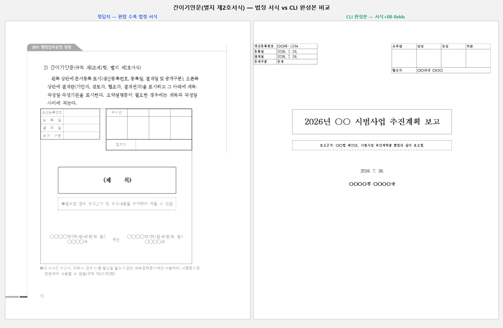

# PR #3376 검토 기록

## 라우팅·메타데이터

외부 collaborator 통합 검토, HWPX 자산·시각 증적 경로를 적용했다. 작성 시점 참고값:
`kevin9327`의 `pr/task-3372-gian-form` → `devel`, 최신 head `8650f832df17`, 보류
comment/review 없음, 검토 branch `review/kevin9327-20260726`.

## 변경 검토

일반기안문(별지 제1호)과 간이기안문(별지 제2호) HWPX 서식, 결정적 재생성 스크립트, 예시값,
사용 문서를 제공한다. 일반기안문은 실제 `fields` 23개를 `fill-fields`로 채우고 재독했다.
새 형식 fixture가 아니라 도구용 표준 서식 자산이므로 IR field sweep baseline 추가 대상은 아니다.

## 실제 시각 검토

일반기안문은 좌측 편람 정답지의 두문·제목·본문·결문 영역을 우측 CLI 완성본이 보존한다.

간이기안문은 좌측 결재·제목 박스 구조와 우측 CLI 작성본의 등록표·결재란·제목·본문 구성이
실제로 보인다. 표준 서식의 목적상 두 이미지가 pixel-identical일 필요는 없으며, 겹침·잘림은 없다.

## 검증·권고

통합 release-test 전수·clippy·fmt·diff check 통과. 세부 CLI 재독 결과와 기준은
[통합 구현 기록](pr_3345_review_impl.md)에 있다.

**수용 가능**. #3372는 통합 PR merge 뒤 close 상태를 확인한다.
