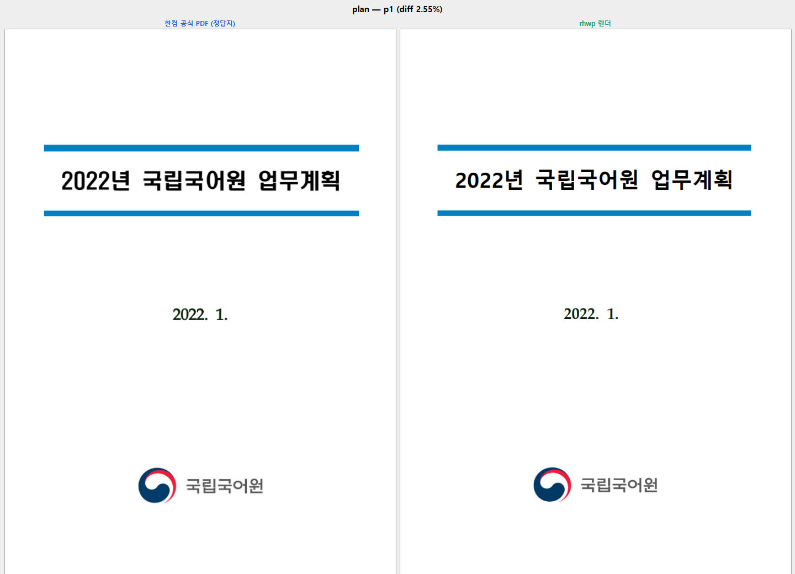
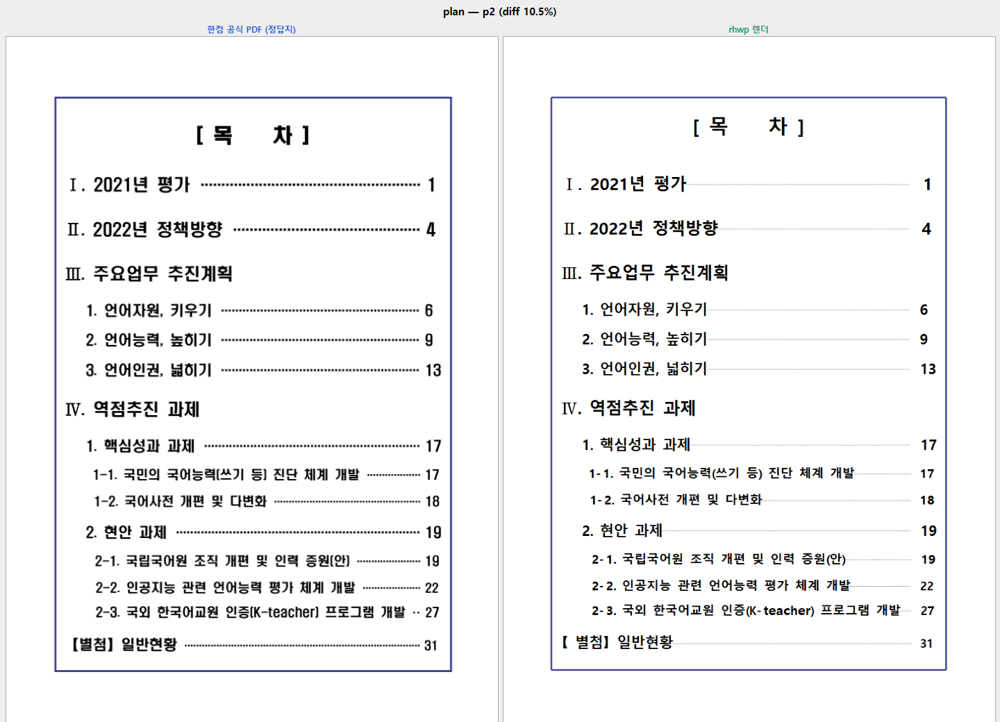
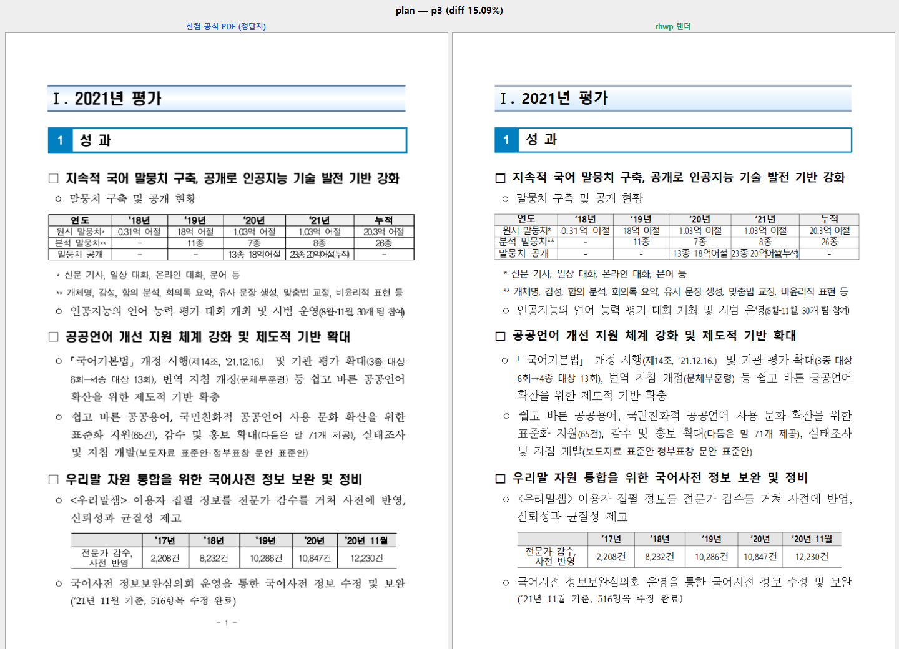

# PR #3390 검토 기록

## 라우팅·메타데이터

외부 collaborator 통합 검토와 Windows 시각 검증 경로를 적용했다. 작성 시점 참고값:
`kevin9327`의 `pr/task-3386-fidelity-harness` → `devel`, 최신 head `0cf47643e233`, 보류
comment/review 없음, 검토 branch `review/kevin9327-20260726`.

## 변경 검토

`tools/fidelity_compare`는 한컴 공식 PDF와 rhwp 렌더를 페이지별 나란히 만들고 diff 비율을
랭킹해, 최악 페이지부터 사람이 감사하게 한다. 절대 diff%가 합격선이 아니라 폰트·자간 차이를
찾는 우선순위라는 문서 설명도 구현과 맞는다.

## Windows 실제 시각 검토

`win10-ted`의 **cmd.exe**에서 독립 review target으로 release-test `rhwp.exe`를 build하고,
공식 PDF 대비 `fidelity_compare.py plan 0 2`를 실행했다. p1 2.55%, p2 10.50%, p3 15.09%로
나왔으며, 아래 실제 결과에서 표·문단·제목의 구조와 페이지 흐름은 유지되고 잔여 차이는 주로
글꼴 폭·두께·leader dot이다.

기계 결과 원본: [Windows report.tsv](../assets/pr_3390_kevin9327_fidelity_windows_report.tsv).

## 검증·권고

Windows build·비교 실행과 통합 release-test 전수·clippy·fmt·diff check가 통과했다. Python
비교 도구 및 증적 자산 변경이므로 IR baseline은 대상이 아니다. 상세 환경은
[통합 구현 기록](pr_3345_review_impl.md)에 있다.

**수용 가능**. #3389는 통합 PR merge 뒤 close 여부를 확인한다.
