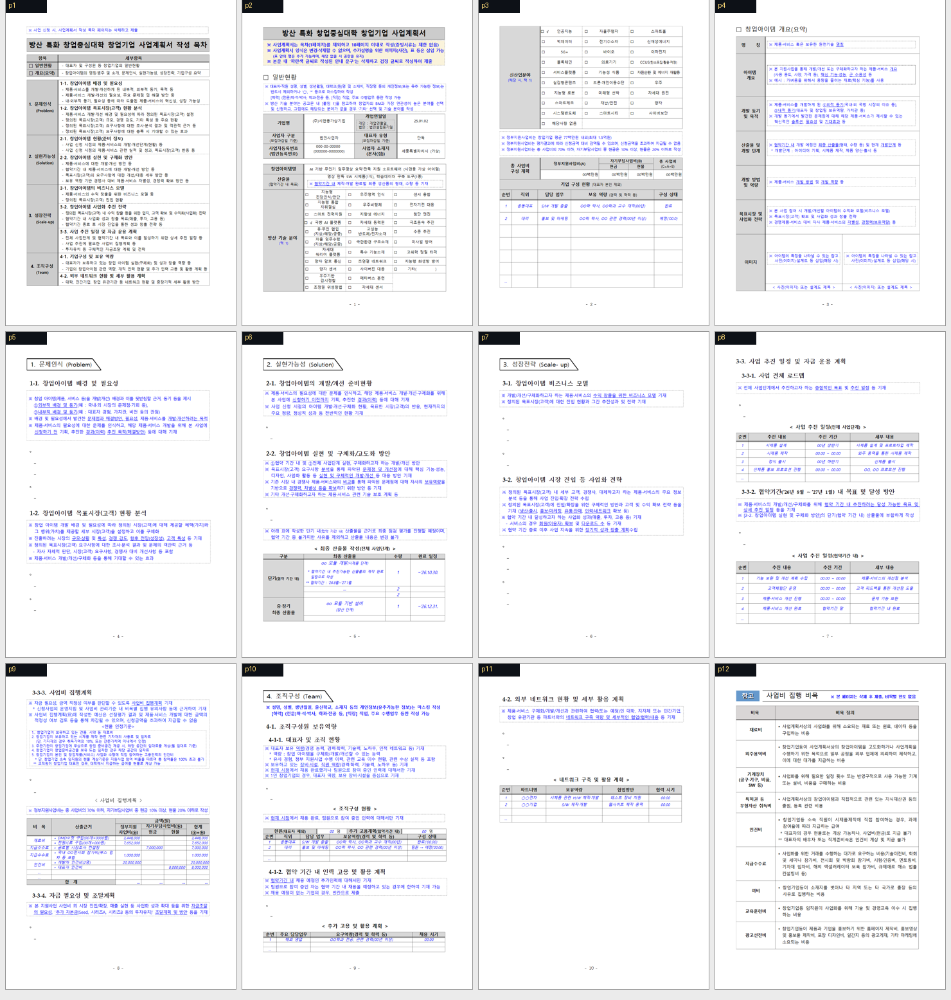

# PR #3394 검토 기록

## 라우팅·메타데이터

외부 collaborator 통합 검토와 문서·시각 증적 경로를 적용했다. 작성 시점 참고값:
`kevin9327`의 `pr/task-cli-form-gallery` → `devel`, 최신 head `552d643d9074`, 보류
comment/review 없음, 검토 branch `review/kevin9327-20260726`.

## 변경 검토와 메인터너 보정

CLI로 정부 양식을 읽고·채우고·재독하고·한컴 PDF와 비교한 사진 갤러리를 하나로 모은
reference 문서다. 원 front matter의 `kind: report`는 manifest 허용 역할이 아니어서
`reference`로 보정했다. 12쪽 몽타주에는 상단 한글 제목만 글꼴 누락으로 깨져 있었으므로,
문서 본문 제목을 유지하고 비재현성 상단 strip만 제거했다. 실제 페이지 증적은 변경하지 않았다.

## 실제 시각 검토

아래 갤러리는 p1–p12가 모두 실제로 보이며, 목차·표·체크 항목·본문·참고 표까지 순서대로
포함한다. p1–p12 라벨과 문서 본문을 대조해 누락·잘림이 없는 것을 확인했다.

## 검증·권고

PNG/TSV/TXT/Markdown 자산만의 PR이므로 별도 Cargo test는 실행하지 않았다. 실제 파일 존재,
상대 링크, 시각 증적을 확인했으며 통합 branch의 fmt·diff check에는 포함된다. 상위 기능의
release-test·Windows 비교 결과는 [통합 구현 기록](pr_3345_review_impl.md)에 있다.

**메인터너 문서·증적 보정 후 수용 가능**. 연관 PR/이슈의 close는 통합 PR merge 뒤 실제 상태로
확인한다.
