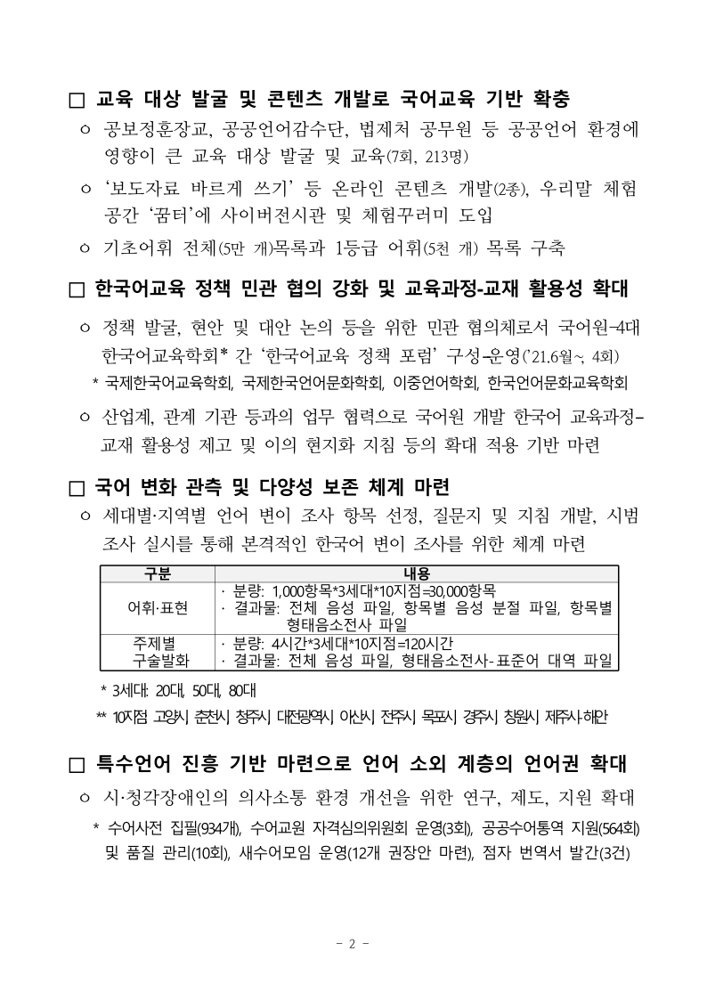

# PR #3404 검토 기록 — RAG 인용 CLI 작동 사례

| 항목 | 내용 |
| --- | --- |
| 원 PR | [#3404](https://github.com/edwardkim/rhwp/pull/3404) — `docs(report): RAG 인용 CLI 작동 사례 — 검색으로 근거 쪽을 답하고 그 쪽만 렌더` |
| 작성자·검토자 | `@kevin9327` (external contributor) · `@jangster77` (collaborator) |
| base / source head | `devel` / `032e263f6c21dabea4203af7808425c9f91d32fd` (작성 시점 참고값) |
| 작성 시점 상태 | `MERGEABLE`, `BEHIND`, draft 아님. merge 전 최신 상태 재확인 필요 |
| 원 변경 규모 | 4 files, +66 / -0; `mydocs/report/rag_citation_demo`의 Markdown 1개와 PNG 3개 |
| 관련 이슈 | [#3403](https://github.com/edwardkim/rhwp/issues/3403) 참고. 이 PR이 close하는 이슈는 없음 |
| 통합 기준 | `review/kevin9327-20260726-v2`; 최초 `upstream/devel` `732147a30c`, 최신 동기화 `7f8fcfef0`; 원 기능 commit을 `2883e3b77`, `ed2cda794`, `1accb0a06`으로 저자 보존 체리픽 |
| 메인터너 보정 | 통합 후보에서 README를 current release 실측 2건으로 정합화하고, 잘못된 수치가 박힌 PNG 2개를 제거한 뒤 독립 review asset을 추가 |
| 라우팅 | base route: `collaborator_external_pr.md`; modifiers: `intake_and_review.md`, `local_validation.md`, `multi_pr_update_branch.md`, `review_only_fast_pass.md` |

Loaded documents: `pr_review_workflow.md`, `pr_review/README.md`, 위 라우팅 문서. source head의 `devel`
merge commit은 통합 검토에서 제외하고, contributor가 작성한 세 문서 commit만 최신 `upstream/devel` 위에
적용했다.

## 변경 범위와 원본 판정

원 변경은 `search --json`이 반환한 0-based page를 `export-svg -p`에 그대로 넘겨 해당 페이지만
렌더하는 CLI 사용자 여정을 문서화한다. Rust source, test, renderer, fixture를 바꾸지 않는다.

통합 후보 바이너리로 같은 fixture와 검색어를 다시 실행한 결과는 다음과 같다.

- `samples/2022년 국립국어원 업무계획.hwp`에서 `한국어교육 정책` 검색은 `matchCount=2`, 첫
  match의 `page=3`이었다.
- `page=3`을 `export-svg -p 3`에 넘기면 1-based 파일명 `_004.svg` 한 개가 생성되고, 그 안에
  `한국어교육 정책 민관 협의 강화`가 존재했다.
- 따라서 `search.page`와 `-p`가 모두 0-based이고 출력 파일명만 1-based라는 핵심 인용 루프는
  독립 재현됐다.

Contributor README의 동일 명령 예시에 처음 적힌 `matchCount:123`과 “123건 중 103건(약 83%)”은
현재 실측 `matchCount=2`와 일치하지 않았다. 통합 후보에서 README를 두 match 모두 page 3이라는 실제
결과와 `export-render-tree`의 `TextRun` 확인 명령으로 고쳤고, 광역 정확도나 분할 표 건수를 이 데모로
추정하지 않도록 범위를 좁혔다. 잘못된 123/83% 수치가 이미지 자체에 박힌 `rag-cite-demo.png`와
`rag-flow.png`는 수정된 문서에 남겨 오해를 지속시키지 않도록 제거했다. contributor 원본은 Git 이력에서
복구할 수 있다.

## 증적자료

current release 바이너리에서 `-p 3`으로 다시 렌더한 실제 4번째 쪽을 안정 review 경로에 보존했다
(`794×1123`, SHA-256
`b39c68c1d62497eae74251bc5794b5767c91cd68968659dc036596613cd204d0`). 화면 안에 검색 문구
“한국어교육 정책 민관 협의 강화”가 실제로 보인다.

이 이미지는 CLI 사용자 여정의 증적이며 renderer 개선을 주장하는 전후 비교가 아니다. source·renderer·fixture가
바뀌지 않으므로 별도 visual sweep과 Cargo 검증은 원 PR 단독 범위에서는 생략했다.

## 검증과 CI

- source head `032e263f`의 GitHub Actions는 docs-only fast-pass로 CI preflight와 `Build & Test`가
  통과했다. heavy worker의 skipped는 허용 범위에 따른 정상 결과다.
- 로컬에서 `search`의 `matchCount=2`, 첫 page `3`, `_004.svg` 단일 생성과 인용문 존재를 확인했다.
- `git diff --check`: 통과.
- 여러 코드 PR을 함께 담은 통합 후보에서는 공통 전체 게이트를 별도로 실행했다. release build, release lib
  `2943 passed / 0 failed / 7 ignored`, release-test 전체(실행 target 모두 exit 0, IR field sweep 2/2),
  Native Skia 공식 3종 `57/0`, `2/0`, `4/0`, fmt, diff check, clippy `-D warnings`, doc test
  `4/0/2 ignored`, 전용 경로 wasm-pack web build가 모두 통과했다.
- 최종 merge 조건은 통합 PR 최신 head의 GitHub Actions와 mergeable 상태 재확인이다.

## Risk와 최종 권고

분할 표의 뒤쪽 셀 match가 표 시작 페이지로 귀속되는 격차는 #3403의 별도 범위이며 이 문서 PR이 해결하거나
close하지 않는다. `123/83%` 문서 불일치는 current release 실측과 독립 asset으로 보정했으므로
**보정 후 기술적 수용 가능**하다.

owner의 [#3445 범위 지시](https://github.com/edwardkim/rhwp/issues/3445#issuecomment-5083833363)는 당시
열린 PR을 **v0.8.2 핫픽스 기준선**에서 제외한 것이었다. 이후
[v0.8.2 릴리즈가 완료](../../report/task_m100_3445_report.md)됐으므로 이 지시는 현재 통합 PR의
`devel` merge 보류 사유가 아니다. **최신 통합 head CI와 mergeable 상태가 성공하면 merge 권고**한다.
