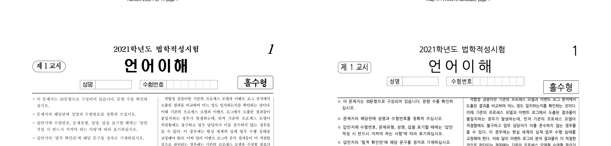

# PR #3410 검토 기록 — TAC 인라인 표 outMargin x-원점 정합

| 항목 | 내용 |
| --- | --- |
| 원 PR | [#3410](https://github.com/edwardkim/rhwp/pull/3410) — `fix(#3396): TAC 인라인 표 x-원점에 outMargin 좌/우 배선` |
| 관련 이슈 | [#3396](https://github.com/edwardkim/rhwp/issues/3396) — 표 셀 콘텐츠 x-원점 +4px 오프셋 |
| 작성자·검토자 | `@planet6897` · `@jangster77` |
| 원 기능 커밋 / 최신 source head | `2e0cd528c564968a722ad7ce5b1b765d8fe76fbf` / `a9206f80e983e1533dd0fa19f7688a4d5e75a726` |
| 통합 후보 적용 | `review/planet6897-20260726`의 `a87c538e8` (`-x` cherry-pick) |
| 기준 | 로컬 검증 시작점 `upstream/devel` `ace187d52`; 최신 source head `a9206f8`은 이후 `devel`을 merge한 commit이며 기능 diff는 `2e0cd52`와 같다 |
| 변경 범위 | renderer 3, regression test 2, golden SVG 2 (7 files) |
| 라우팅 | collaborator 통합 PR: `collaborator_self_merge` + intake/review·local validation·visual fixture evidence·multi-PR 보조 절차 |

## 코드 검토

`treat_as_char`(TAC) 표는 글자처럼 진행 폭을 차지하되, 눈에 보이는 표 테두리의 x-원점은 좌측
`outMargin` 뒤에서 시작해야 한다. 이번 수정은 이 계약을 네 배치 경로에 일관되게 적용한다.

- 일반 인라인 문단과 composed run은 정렬 폭·다음 pen 전진 폭에 좌·우 `outMargin`을 모두 포함하고,
  실제 표 배치는 좌측 margin만큼 이동한다.
- 중첩 표 경로도 같은 x 이동·전진 폭 규칙을 적용한다.
- page item fallback의 좌·우·가운데 정렬은 margin을 반영하되, 기존 #1195 보정 표식이 있는 경로는
  이중 보정하지 않는다.
- `inline_x_override`가 있는 TAC 표는 이미 보정된 x를 그대로 쓰므로, table layout에서 좌측 margin이
  다시 더해지지 않는 것을 확인했다.

기존 `issue_1285_tac_sequence_right_align`의 `성명` 표는 우측 여백(283 HU = 약 3.77 px)과 최종
table의 우측 경계를 직접 고정하고, `issue_501`도 다른 TAC·nested path를 덮는다. 별도 #3396 파일을
추가하지 않았더라도 이번에 바뀐 계약을 회귀 테스트와 golden SVG로 포착한다.

## 시각·fixture 증적

- 재현 원본: `samples/21_언어_기출_편집가능본.hwp`
  (`SHA-256 905454045ca2e236839a7cab59750678116d08af3db31dbf846819af355b8d15`).
- 한컴 기준 PDF: `pdf/21_언어_기출_편집가능본-2022.pdf`, 15 pages
  (`SHA-256 f2d858d7974393661d91a658e6b384b951114ef52783379f426a963effd97b72`).
- rhwp 후보는 통합 후보의 review 전용 release-test binary로 page 1을 2배율·high-quality PNG로
  export했고, 기준 PDF page 1은 192 DPI로 render했다.
- 보존 asset: `mydocs/pr/assets/pr_3410_planet6897_issue3396_p001_review.png`
  (`SHA-256 81773dffcf1461122a19839810c6a08bea1a420f4efe545cdb0f722316391c56`).

사람 검토에서 `성명`·`수험번호` TAC 표와 양 옆 text의 순서·여백 흐름은 기준 PDF와 같은 머리말
구조에 머문다. 한컴 PDF와 macOS rhwp의 글꼴·glyph metric 차이는 보이므로 픽셀 동등성은 주장하지
않는다. 표의 정확한 우측 gap·전진 폭 계약은 위 전용 regression test 결과를 정답 근거로 사용한다.

## 로컬 검증

모든 Cargo 실행은 `CARGO_TARGET_DIR=target/review-planet6897-20260726`,
`CARGO_INCREMENTAL=0`으로 수행해 공유 target을 건드리지 않았다.

- `git diff --check upstream/devel...HEAD`: 통과.
- `cargo fmt --check`: 통과.
- `cargo clippy --all-targets -- -D warnings`: 통과.
- `cargo test --profile release-test --test issue_1285_tac_sequence_right_align`: 2 passed.
- `cargo test --profile release-test --test issue_501`: 1 passed.
- `cargo test --profile release-test --tests`: 통과.
- `cargo test --profile release-test --features native-skia skia --lib`: 57 passed.
- native-Skia renderer 회귀: `issue_2225_missing_picture_placeholder` 2 passed,
  `render_p37_direct_pdf_export` 4 passed.
- WASM은 작업지시자가 수동 실행하는 환경이므로 이 검토에서는 실행하지 않았다.

## 최종 권고

**통합 PR에서 merge 수용 권고**. 최신 `devel` 위에 적용했을 때 충돌이 없고 code-path·native renderer·
visual witness를 모두 확인했다. 통합 PR의 최신 head CI와 merge 가능 상태를 다시 확인하고 작업지시자
승인을 받은 뒤 merge한다. merge 뒤에는 #3396 자동 close 여부를 확인하고, 닫히지 않으면 이 통합 PR을
근거로 완료 코멘트와 함께 처리한다. 원 PR #3410은 적용·검증된 통합 PR을 연결해 superseded close 한다.
