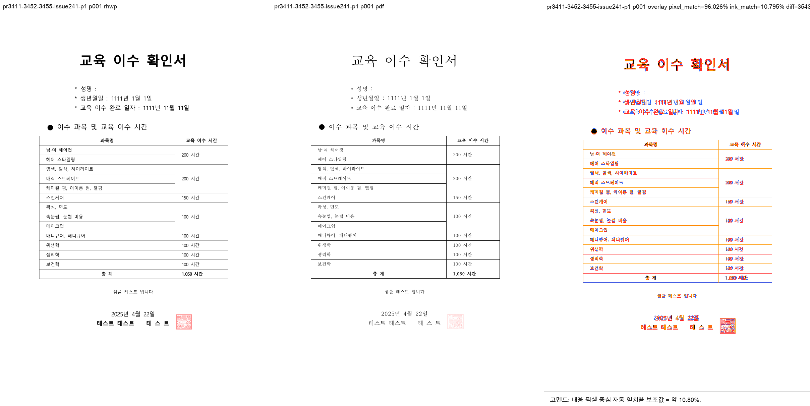
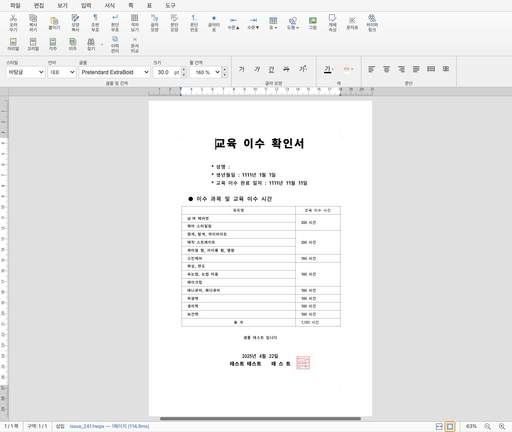

# lpaiu-cs PR #3411·#3423·#3440–#3444·#3452·#3455 통합 검토·구현 기록

## 라우팅과 접수 범위

```text
base route: collaborator_external_pr
modifiers: intake_and_review, local_validation, visual_fixture_evidence,
  multi_pr_update_branch, review_only_fast_pass
loaded documents: pr_review_workflow.md, pr_review/README.md,
  collaborator_external_pr.md, intake_and_review.md, local_validation.md,
  visual_fixture_evidence.md, multi_pr_update_branch.md,
  review_only_fast_pass.md
validated code head: ceda586e72fbcaa18ab66a758d7356210be0836a
```

`upstream/devel` `7779e737ac5c5df3428d1a06f1099be16375be49` 위에 사용자가 볼 수 있는
`review/lpaiu-cs-20260727` branch를 만들고, `@lpaiu-cs`의 open PR을 사전 분류했다. 아래 9건은
`@jangster77`를 reviewer로 지정하고 contributor의 기능 commit을 누적했다. #3456
(`chore/3315-cleanup-round1`, head `80a14d3726a6d5da095c3c875eeb014fa2a3165e`)은 여러 PR 뒤 cleanup을
모은 draft이므로 이번 독립 수용 범위에서 제외했다.

원 PR 상태·head SHA·source CI는 문서 작성 시점 참고값이다. merge 전에는 원 source head가 바뀌지
않았는지와 최신 통합 PR의 mergeable·required check를 다시 확인한다. 원 PR에 maintainer comment로 지정된
보류는 없었다.

| 원 PR | source head | contributor source → 통합 commit | source CI·판정 |
| --- | --- | --- | --- |
| #3411 | `64fe53bae600b82ed47fd18b4dee106ff94fffa7` | `073378a8`→`5baefb899`, `06a2b685`→`4066fb8cf`, `374066a3`→`dfae7f30d` | Build & Test green; 공개 Vec 계약 보정 뒤 부분 수용 |
| #3423 | `66c1d9ec6dbd0b231785e008f6688e9469d2551a` | `4d814823`→`dcc0e212c` | source Build & Test 없음; exact anchor 보정 뒤 통합 full CI 조건 수용 |
| #3440 | `afa8e26a86ed981b12c5704ad7cc80c35c7f418c` | `a2167e04`→`efe9c6d7b`, `a275805e`→`64bac3b20` | Build & Test green; symlink 제거·browser 재검증 뒤 수용 |
| #3441 | `d3c30c41dfb64592c0c4f6ee9f4bdd7b85893508` | `b7391102`→`c222606b4` | Build & Test green; 실제 event·undo/redo 확인 뒤 원 변경 수용 |
| #3442 | `e4d8a6700b0e621ba519c67dbcc828acb2ac583c` | `dc891415`→`7c99b235a`, `3065d201`→`7e628bf2d` | Build & Test green; symlink·source parser 보정 뒤 수용 |
| #3443 | `641fbc45bec152db16c8e1f4c97c5eb87a89b005` | 공유 #3440 commits 제외, `6c442c20`→`4ad7b4d52` | Build & Test green; runtime throw test·browser failure 확인 뒤 수용 |
| #3444 | `5831dce7b3bdbc1e950d28e27ec5181baa0b25c7` | `fbc254af`→`d43fdc557` | Build & Test green; 완전 archive 재시도 보정 뒤 수용 |
| #3452 | `a2a836778f3d0d825d28975dfa90ca01d559f066` | `61c7bcdb`→`9c468dace` | Build & Test green; 선행 #3411 타입에 맞춘 `data.as_slice()`→`&data[..]` 두 곳의 의미 동등 적응과 padding 3형태 test 보정 뒤 수용 |
| #3455 | `991d85b038db336b89bf4934ee90774ed109943a` | 공유 #3452 commit 제외, `b34611fb`→`6d3dd3d05`, `18564b38`→`f175aef8d` | Build & Test green; cache correctness·중첩 image browser 보정 뒤 수용 |

각 source branch의 devel merge commit은 최신 devel 위 누적 체리픽에서 제외했다. #3443의 #3440 공유
commits와 #3455의 #3452 공유 commit도 한 번만 적용해 contributor 이력을 중복하지 않았다.

#3452는 #3411의 바이트 소유 타입 보정이 먼저 누적된 상태에서 적용했다. 이에
`src/document_core/queries/rendering.rs`와 `src/paint/json.rs`의 `data.as_slice()` 두 곳을 현재 타입에
맞는 `&data[..]`로 의미 동등하게 적응했다. 동일 slice를 빌려 base64로 쓰는 계약은 변하지 않으며, 이
체리픽 적응 때문에 source `61c7bcdb`와 통합 `9c468dace`의 patch-id는 다르다.

## Collaborator 보정 commit

Contributor 원 commit을 rewrite하지 않고 다음 네 commit 경계로 통합 branch에 보정을 더했다.

### `011702107`·`037f4b47a` — 환경 종속 symlink 제거

#3440과 #3442 source에 각각 포함된 절대 `rhwp-studio/node_modules` symlink만 정확히 제거했다. 공유
`node_modules`나 사용자 산출물을 삭제한 것이 아니며, 저장소에는 환경 종속 링크를 남기지 않는다.

### `0b58a0d4497d2154b37e797ce49b8eca79357fd2` — 통합 안전성 보정

- #3411: 공개 `Vec` enum·method·struct 계약을 복원하고 additive shared ingestion을 세 경로에 적용했다.
  공개 호환과 snapshot Arc sharing test를 추가했다.
- #3423: CLAUDE link를 `local_validation.md` 4.3 exact anchor로 고쳤다.
- #3440/#3442: fixed-length·optional parameter에 취약한 source guard를 실제 function body와 call 범위로
  바꾸고 root `node_modules` ignore를 명확히 했다.
- #3443: router와 fallback이 실제 throw할 때 warning+`false`가 되는 runtime test를 추가했다.
- #3444: `curl | tar`를 없애고 `--retry-all-errors`로 완전 archive를 내려받은 뒤 tar, trap cleanup을
  수행하도록 했다.
- #3452: 255-byte 무패딩 base64 case를 추가해 길이 `% 3` 세 형태를 모두 고정했다.
- #3455: document generation, cacheable false, current rawSvg, decode-completion·request-token 계약을
  보강했다. compact query는 cached RenderTree를 직접 순회하고 public PageLayerTree 모양을 보존했으며,
  schema minor를 20으로 올렸다.

### `ceda586e72fbcaa18ab66a758d7356210be0836a` — 실제 browser 발견 보정

#3455의 prefetch 정규식이 중첩 `bbox` 첫 `}`에서 끊겨 실제 image op를 못 찾는 것을 Chrome에서 발견했다.
layer-tree JSON 구조를 재귀 순회해 raster image data URL을 수집하도록 고치고 회귀 test를 추가했다.

## 로컬 검증

Cargo 검증은 `CARGO_INCREMENTAL=0`, 검토 전용
`CARGO_TARGET_DIR=target/review-lpaiu-cs-20260727`에서 공유 checkout 기준으로 순차 실행했다. 공유
`target/debug`, `target/release`, `target/release-test`, `target/wasm32-unknown-unknown`은 정리 대상으로
가정하지 않았다.

- focused: image base64 1, image key 6, public Rust Vec compatibility 2, Studio 관련 30 — 통과.
- `cargo build --release`: 통과.
- `cargo test --release --lib`: **2949 passed / 0 failed / 7 ignored**.
- `cargo test --profile release-test --tests`: 모든 test target exit 0, IR field sweep **2/2** 포함.
- Native Skia 공식 3종: **57/0**, **2/0**, **4/0**.
- `cargo fmt --check`, `git diff --check`, `cargo clippy --all-targets -- -D warnings`: 통과.
- doc test: **4 passed / 0 failed / 2 ignored**.
- composite action YAML parse와 embedded Bash `bash -n`: 통과.
- `npm --prefix rhwp-studio ci`, fresh `wasm-pack build --target web`, TypeScript 검사, Studio production
  build: 통과.
- 최종 `ceda586e7` 후보 Studio full test: **670 passed / 0 failed**.
- 새 HWP/HWPX fixture가 없어 IR field sweep baseline 신규 등록 trigger는 없다. golden/baseline도 바꾸지
  않았다.

## 실제 browser와 시각 검증

Google Chrome `150.0.7871.186`, Node `v24.15.0`, Vite `127.0.0.1:7700`에서 저장소
Puppeteer E2E harness로 실제 menu/dialog를 사용했다.

- #3440: 경계 z-order no-op 두 번 뒤 undo·snapshot 불변, 기존 redo 보존·재실행. 삭제 뒤 undo에서 모델과
  canvas ink 복원.
- #3441: field insert/edit의 `document-mutated` 각 1회. 셀 숫자 서식은 쉼표→undo→redo→decimal-add
  순서로 정확히 왕복.
- #3443: 여섯 dialog가 각각 undo 1건을 만들고 6회 undo로 원복. 강제 router 실패 때 dialog open,
  undo·snapshot 불변, warning 1, console error 0.
- #3455: `issue_241.hwpx` 첫 load generation 1, 같은 generation skip, 같은 bytes reopen generation 2에서
  layer tree 1회 재조회, 다음 render skip. console error·warning 0. 중첩 image 탐색 보정 뒤 최종 통과.

`samples/hwpx/issue_241.hwpx` page 1을 한글 2022 기준 PDF와 비교했다. sweep 임시 경로는
`output/pr3411-3452-3455-image-pipeline-p1-20260727/pr3411-3452-3455-issue241-p1/`이고,
자동 후보 0/1, pixel match `96.02618%`, visual proxy `10.7953%`였다. 기준 devel과 후보 SVG는
byte-identical하며 사람 확인에서 그림·표·본문 누락이나 clipping이 없었다.





최종 `ceda586e7` OVR은 5개 preset 142 pages를 비교했다. 실제 개체가 있는 KTX 3개,
`21_언어_기출_편집가능본` 2개, aift 6개, 총 11개 개체에서 ±2px 회귀 0건이었다. 개체가 0개인
exam_math와 biz_plan 행은 무회귀 근거의 개체 수에 포함하지 않았다. 최종 시각 판정 권위는 작업지시자에게
있다.

## 이슈 close 계약

통합 PR 본문에는 아래 여섯 항목만 자동 close로 기록한다.

```text
Closes #3422
Closes #3431
Closes #3434
Closes #3435
Closes #3436
Closes #3437
```

#3315는 Track 1–4 umbrella이고 #3411·#3452·#3455가 부분 범위만 해결하므로 `Closes #3315`를 쓰지
않고 open으로 유지한다.

## 최종 권고와 실행 단계

9건은 모두 **필요한 collaborator 보정을 포함해 기술적으로 수용 가능**하다. 현재 통합 후보는 source,
test, composite action을 포함하므로 review-only fast-pass가 아니며 최신 통합 head의 full CI가 필수다.

1. 개별 review 9개, 이 implementation 기록, 안정 asset 2개와 오늘할일을 final review commit으로 묶는다.
2. 작업지시자 승인 뒤 원본 저장소의 임시 head branch로 push하고 `devel` 대상 통합 PR을 만든다.
3. 최신 통합 head full CI와 mergeable 상태를 확인한다. update branch가 발생하면 이전 SHA run을 문서의
   force-cancel 규칙으로 정리하고 새 head의 full CI를 다시 기다린다.
4. merge 승인 뒤 통합 PR을 merge하고 merge SHA를 확인한다.
5. 실제 merge 뒤에만 원 PR 9건에 통합 결과·검증·감사 comment를 남기고 close/merge 상태를 확인한다.
   #3422·#3431·#3434·#3435·#3436·#3437의 close 상태도 확인하되 #3315는 open을 유지한다.
6. `upstream/devel` 동기화 뒤 review branch·source fetch branch·검토 전용 target을 정확한 범위로 정리한다.

## rollback 경계

- browser 추가 보정만 되돌리면 `ceda586e7`, 공통 안전성 보정은 `0b58a0d44`, 환경 symlink 정리는
  `037f4b47a`와 `011702107` 순으로 독립 검토할 수 있다.
- 특정 원 PR을 제외해야 하면 위 source→통합 mapping의 해당 contributor commit과 그 PR 전용 보정만
  역순으로 제거한다. #3443은 #3440의 no-op 계약에 의존하고, #3455는 #3452를 공유하므로 의존 순서를
  지킨다.
- 원 contributor branch는 rebase·amend·force-push하지 않았으므로 통합 branch rollback이 원 PR 이력을
  바꾸지 않는다.
