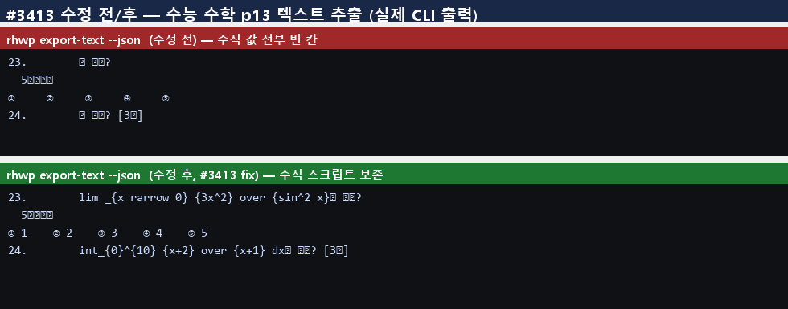
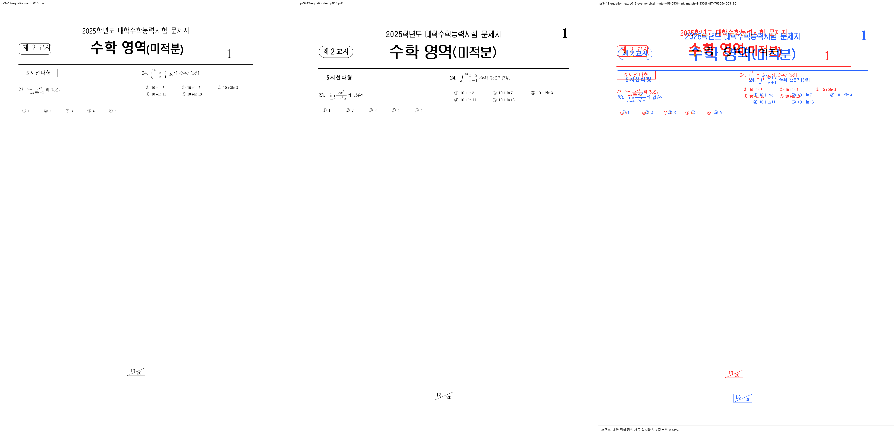

# PR #3419 검토 기록 — 텍스트 추출의 수식 스크립트 보존

| 항목 | 내용 |
| --- | --- |
| 원 PR | [#3419](https://github.com/edwardkim/rhwp/pull/3419) — `fix(text): export-text 가 수식(Equation) 내용을 조용히 누락하던 결함 수정` |
| 작성자·검토자 | `@kevin9327` (external contributor) · `@jangster77` (collaborator) |
| base / source head | `devel` / `46ddd3adfdabcd54a6613d45580a5d72ab934cf5` (작성 시점 참고값) |
| 작성 시점 상태 | `CONFLICTING`, `DIRTY`, draft 아님; source head에 보고된 GitHub check 없음 |
| 원 변경 규모 | GitHub 표면 12 files, +29,239 / -29,153. 대부분 줄끝 변환이며 의미 변경은 86 added lines 규모 |
| 관련 이슈 | [#3413](https://github.com/edwardkim/rhwp/issues/3413) **부분 해결**. 이 PR 또는 통합 PR에서 close하지 않음 |
| 통합 기준 | `review/kevin9327-20260726-v2`; 최초 `upstream/devel` `732147a30c`, 최신 동기화 `7f8fcfef0`; 원 기능 commit을 `97981fea0`으로 저자 보존 체리픽·conflict 정리 |
| 메인터너 보정 | `a1fe4ce760899f4ad0b12bc5fbddf808611e9dd5` 중 Markdown 표 셀·표준 test binary·Skia 생성자 보강 |
| 라우팅 | base route: `collaborator_external_pr.md`; modifiers: `intake_and_review.md`, `local_validation.md`, `visual_fixture_evidence.md`, `multi_pr_update_branch.md`, `rework_and_exceptions.md` |

Loaded documents: `pr_review_workflow.md`, `pr_review/README.md`, 위 라우팅 문서.

## 원 변경과 conflict 처리

Contributor의 의미 변경은 `EquationNode`에 원본 HWP 수식 `script`를 싣고, layout의 생성 지점에서 값을
채운 뒤 평문·Markdown 수집기가 Equation 노드를 방출하게 하는 것이다. `exam_math.hwp` page 13에서
`lim`/`sin` 발문과 ①~⑤ 선택지 값이 조용히 사라지던 문제를 회귀 테스트로 고정했다.

source head는 최신 `devel`과 conflict했고 6개 대형 Rust 파일의 CRLF/LF 변환이 약 29K lines diff로
섞여 있었다. 통합 체리픽에서는 그 비기능 줄끝 churn을 버리고 `EquationNode.script`, 실제 생성 지점,
수집 분기, test와 contributor 증적만 `97981fea0`에 보존했다. 따라서 원 contributor의 기능과 credit은
유지하면서, 현재 devel 구현을 과거 파일 전체로 덮어쓰지 않았다.

## 메인터너 보정

통합 검토에서 세 가지 누락을 발견해 `a1fe4ce76`으로 보정했다.

- Markdown 표 셀은 page render tree를 거치지 않아 원 변경의 Equation 분기만으로는 수식이 계속 빠졌다.
  `markdown_paragraph_text_with_equations`가 control text position에 script를 합치고, 표 셀 변환이 이를
  사용하도록 했다. 내부 단위 test와 실제 `exam_math.hwp` page 13 Markdown test를 추가했다.
- CLI 통합 test는 nextest archive에서도 동작하도록 런타임 `CARGO_BIN_EXE_rhwp`를 먼저 읽고 compile-time
  값을 fallback하는 표준 `rhwp_bin()` 패턴으로 고쳤다. sample·binary 부재를 조용히 skip하지 않는다.
- `EquationNode` 필드 추가로 깨질 수 있는 Native Skia test 생성자 두 곳에도 명시적 빈 script를 넣었다.

## 기능·시각 증적

CLI 수정 전후 실제 출력(`980×384`, contributor asset, SHA-256
`40db5fd50e0df44b12dbb1b1a8d7dbc848a95fee4faec7045121f1099bad9b59`):

독립 검토 asset은 HWP 후보·한컴 2022 기준 PDF·overlay를 page 13 한 장에 담았다(`5080×2468`,
SHA-256 `6440e32dc3574cd7c4a5001049675a8be7b3a6721e201fd5d08c4a72c0a3f469`). HWP 원본은
`samples/exam_math.hwp`(SHA-256 `e40e3d675373c8efb3a844fc71f209600d3b0db987a04b3808b8e74a6b1671fe`),
기준은 `pdf/exam_math-2022.pdf` 20 pages(SHA-256
`1ce31c7cc901b9e309ff23000a8ed51b3faeb6cf024d82d488cd6c7cd83c6013`)다.

임시 sweep 경로는
`output/pr_review/kevin9327-20260726-v2/pr3419_visual/pr3419-equation-text`다. 검토 page 1개(page 13),
자동 flagged page 1개였고 `pixel_match=98.09263%`, `visual_accuracy_proxy=9.33002%`였다. 기준 PDF와
rhwp의 page scale·글꼴·line band 차이 때문에 content-bottom/line-band/large-ink와 `[VISUAL]` 중첩 후보가
잡혔지만, 이 PR의 핵심 위험인 `equation_text_overlap` 후보는 **0건**이었다. 사람 검토에서도 23·24번의
수식과 ①~⑤ 값이 양쪽에 존재하고 수식끼리 겹치지 않았다. 이 PR은 layout 좌표를 바꾸지 않으므로 낮은
ink proxy와 광범위 baseline scale 차이를 기능 blocker로 재분류하지 않는다.

## 검증

모든 Cargo 명령은 `CARGO_INCREMENTAL=0`, 검토 전용
`CARGO_TARGET_DIR=target/review-kevin9327-20260726-v2`로 순차 실행했다.

- 수동 CLI: `export-text --json` page 13에서 `lim`/`sin`과 ①~⑤ 값 확인.
- `issue_3413_equation_text_extraction`: 2 passed / 0 failed. 평문과 표 셀 Markdown 모두 검증.
- Markdown helper 단위 test: 1 passed / 0 failed.
- Native Skia Equation 생성자 focused test: 2 passed / 0 failed.
- `cargo build --release`: 통과.
- `cargo test --release --lib`: 2943 passed / 0 failed / 7 ignored.
- `cargo test --profile release-test --tests`: 모든 test target exit 0; IR field sweep 2/2 포함.
- Native Skia 공식 3종: 57/0, 2/0, 4/0.
- `cargo fmt --all -- --check`, `git diff --check`, `cargo clippy --all-targets -- -D warnings`: 통과.
- doc test: 4 passed / 0 failed / 2 ignored.
- wasm-pack web build: 검토 전용
  `target/review-kevin9327-20260726-v2/wasm-pkg` 출력으로 통과.

source head에는 CI가 없고 conflict 상태였으므로 과거 source 상태를 merge 근거로 쓰지 않는다. 최종 조건은
보정이 포함된 통합 PR 최신 head의 full CI와 mergeable 상태다.

## 남은 범위와 최종 권고

#3413은 `export-text`, `search`, `export-structure`, 누락 관측 계약을 함께 요구한다. 이번 원 PR과 보정은
평문·Markdown 추출을 해결하지만 나머지 표면 전체를 단독으로 닫지 않는다. 통합 묶음의 별도 PR이 search를
보강하더라도 `export-structure` 등 이슈의 잔여 요구를 확인해야 하므로 **#3413은 close하지 않는다**.

불필요한 줄끝 churn을 제거하고 표 셀·test 실행·Skia 생성자 누락을 보정한 후보는 **보정 후 기술적 수용
가능**하다. owner의 [#3445 범위 지시](https://github.com/edwardkim/rhwp/issues/3445#issuecomment-5083833363)는
당시 열린 PR을 v0.8.2 핫픽스 기준선에서 제외한 것이고,
[해당 릴리즈는 완료](../../report/task_m100_3445_report.md)됐다. 따라서 현재 보류로 확장하지 않으며,
**최신 통합 head CI와 mergeable 상태가 성공하면 merge 권고**한다.
