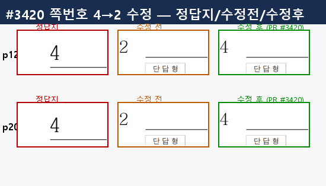
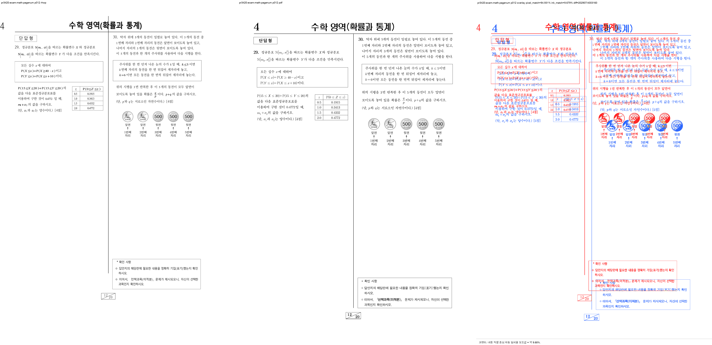
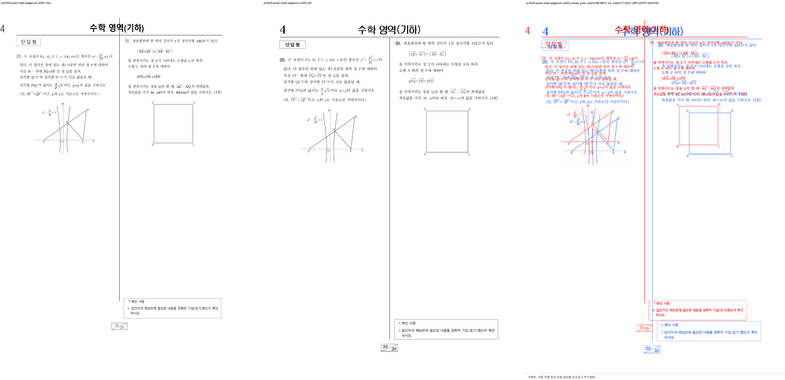

# PR #3420 검토 기록 — 표 셀 안 중첩 머리말과 소책자 쪽번호

## 라우팅

```text
base route: collaborator_external_pr.md (작업지시자가 승인한 통합 PR 예외)
modifiers: intake_and_review.md, local_validation.md, multi_pr_update_branch.md,
           visual_fixture_evidence.md
loaded documents: pr_review_workflow.md, pr_review/README.md,
                  pr_review/collaborator_external_pr.md,
                  pr_review/intake_and_review.md,
                  pr_review/local_validation.md,
                  pr_review/multi_pr_update_branch.md,
                  pr_review/visual_fixture_evidence.md
current source head: 작성 시점 참고값 167c9dabece7abe2737ef8f56394179d4be50afe
```

원 contributor branch에 직접 보정하지 않고, 작업지시자가 승인한 다수 PR 통합 경로에 원 commit을
저자 보존 적용한 뒤 source SHA→통합 SHA 매핑을 기록하고 메인터너 보정을 별도 commit으로 추가했다.

## PR metadata

| 항목 | 작성 시점 참고값 |
| --- | --- |
| 원 PR | [#3420](https://github.com/edwardkim/rhwp/pull/3420) |
| 작성자 / base | `@kevin9327` / `devel` |
| source branch / head | `pr/task-exam-pagenum` / `167c9dabece7abe2737ef8f56394179d4be50afe` |
| 규모 | 8 files, +241 / -21, 2 commits |
| 원 PR 상태 | `MERGEABLE`, `BEHIND`, draft 아님; source head check 없음; 개별 메인터너 보류 comment/review 없음 |
| 관련 issue | 자동 close 대상 없음 |
| 통합 기준 | 최초 `upstream/devel` `732147a30cf122839afae59c99c91f7854e2f3f2`; 최신 동기화 `7f8fcfef08610df7bf9f5cc2f4b32a9a711f5e2d` |
| 통합 branch | `review/kevin9327-20260726-v2` |
| contributor 적용 | `fb4e8105c8a3` → `f8e0c37fd`, `167c9dabece7` → `79ea4e79e` |
| 메인터너 보정 | `a1fe4ce760899f4ad0b12bc5fbddf808611e9dd5` 중 #3420 관련 hunk |

source head, mergeable, CI는 확정값이 아니다. 최종 merge 조건은 최신 통합 PR head의 GitHub Actions
통과와 작업지시자 승인이다.

## 변경 범위와 코드 검토

### Contributor 원 변경

`samples/exam_math.hwp`의 선택과목 소책자는 각 4쪽의 모서리 쪽번호가 `1,2,3,4`로 재시작한다.
확률과 통계 p12와 기하 p20의 `4` 머리말은 1×1 표 셀 안에 중첩되어 있는데, 기존 수집은 문단의
최상위 control만 순회해 앞선 짝수 머리말 `2`를 계속 사용했다.

원 변경은 다음을 일관되게 보강한다.

- `HeaderFooterRef`에 표·셀 경로를 기록하고 중첩 머리말/꼬리말을 재귀 수집한다.
- pagination, typeset, document rendering의 활성 머리말 선택에서 중첩 정의를 포함한다.
- layout 시 저장한 표 경로를 따라 실제 Header/Footer control을 해석한다.
- `exam_math`의 p10·12·14·16·18·20 모서리 숫자 `2,4,2,4,2,4`를 회귀 테스트로 고정한다.

### 메인터너 보정

원 변경의 활성 머리말 선택은 중첩 control을 보았지만, 구역 종료 시 다음 구역으로 넘기는 odd/even
carry 갱신은 여전히 최상위 Header/Footer만 수집했다. 통합 보정은 carry 갱신에도 최상위와 표 셀 내부
Header/Footer를 같은 순서로 수집해 구역 경계에서 수정이 사라지지 않게 했다.

회귀 테스트는 fixture나 특정 쪽을 못 찾았을 때 `return`/`continue`로 조용히 통과하던 경로를 제거했다.
파싱·조판 실패는 `expect`/`panic`으로 실패하고, 대상 여섯 쪽을 모두 찾았는지와 숫자
`2,4,2,4,2,4`를 정확히 단언한다.

범위 밖인 일반 본문 pagination, 머리말 내용 편집, fixture 교체는 포함하지 않는다.

## Renderer·fixture·baseline 판정

- pagination/layout과 실제 페이지 머리말 선택을 바꾸므로 renderer 및 시각 검증 대상이다.
- 기존 `samples/exam_math.hwp`와 기존 기준 `pdf/exam_math-2022.pdf`만 사용한다. 새 HWP/HWPX
  fixture의 추가·교체·이동이 없어 IR field sweep baseline 수동 등록 트리거는 없다.
- 전수 `release-test --tests` 안의 `ir_field_sweep_baseline` 2/2가 통과했다. baseline TSV를
  수정하거나 새 발산을 승인하지 않았다.
- 원본 HWP SHA-256은 `e40e3d675373c8efb3a844fc71f209600d3b0db987a04b3808b8e74a6b1671fe`,
  기준 PDF SHA-256은 `1ce31c7cc901b9e309ff23000a8ed51b3faeb6cf024d82d488cd6c7cd83c6013`이다.

## 시각 검증

독립 sweep 임시 산출물은
`output/pr_review/kevin9327-20260726-v2/pr3420_visual/pr3420-exam-math-pagenum/`에 있다.
그 아래 `compare/compare_NNN.png`, `overlay/overlay_NNN.png`, `review/review_NNN.png`를
p10·12·14·16·18·20에 대해 생성했다.

- 검토 페이지: 6쪽 / 자동 후보: 0쪽 (`flagged 0/6`).
- 평균 pixel match `96.93044%`, 최저 `94.93133%`.
- 평균 visual accuracy proxy `8.18171%`, 최저 `6.72437%`.
- 글꼴·glyph metric 차이 때문에 ink 기반 proxy는 낮다. 이를 픽셀 동등 합격선으로 해석하지 않았고,
  사람 확인과 정확한 모서리 숫자 회귀 테스트를 주 근거로 삼았다.
- 사람 확인 결과 p10·12·14·16·18·20의 모서리 번호는 기준 PDF와 같은
  `2,4,2,4,2,4`이며, frame overflow·본문 흐름·clipping 후보는 없었다.

Contributor가 남긴 수정 전/후 설명 자료도 원인과 결과를 같은 방향으로 보여 준다.



독립 검토 대표 asset은 문제를 직접 재현한 p12와 p20을 보존한다.





## 로컬 검증

모든 Cargo 명령은 `CARGO_INCREMENTAL=0`, 검토 전용
`CARGO_TARGET_DIR=target/review-kevin9327-20260726-v2`로 순차 실행했다.

- 집중 회귀 `test_exam_math_booklet_corner_page_number_on_fourth_page`: 통과, 여섯 쪽 모두 단언.
- `cargo build --release`: 통과.
- `cargo test --release --lib`: 2943 passed, 0 failed, 7 ignored.
- `cargo test --profile release-test --tests`: 모든 target exit 0; IR field sweep 2/2 포함.
- Native Skia 공식 3종: 57/0, 2/0, 4/0.
- `cargo fmt --all -- --check`, `git diff --check`,
  `cargo clippy --all-targets -- -D warnings`: 통과.
- `cargo test --doc`: 4 passed, 0 failed, 2 ignored.
- `wasm-pack build --target web`: 검토 전용
  `target/review-kevin9327-20260726-v2/wasm-pkg` 출력으로 통과.

## 리스크·최종 권고

중첩 Header/Footer를 여러 수집 지점에서 같은 순서로 다뤄야 하므로 향후 한 경로만 수정하면 다시
불일치할 수 있다. 이번 보정은 활성 선택과 carry 갱신을 함께 덮고, 여섯 쪽 exact assertion과 독립
시각 검토로 현재 계약을 고정했다. 검토 범위에서 추가 blocker는 찾지 못했다.

**메인터너 보정 후 기술적으로 수용 가능**하다. #3445가 고정한 v0.8.2 핫픽스 기준선은
[릴리즈 완료](../../report/task_m100_3445_report.md)로 종료됐으므로 현재 `devel` merge 보류 사유가
아니다. 최신 통합 PR head CI와 mergeable 상태가 성공하면 merge한다.
