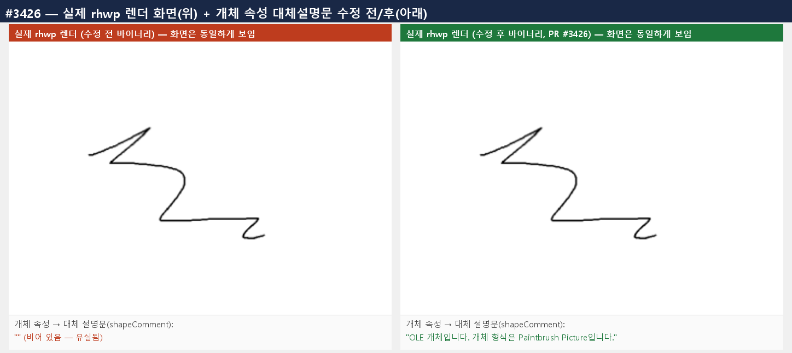

# PR #3426 검토 기록 — HWPX OLE·차트 shapeComment 보존

## 라우팅

```text
base route: collaborator_external_pr.md (작업지시자가 승인한 통합 PR 예외)
modifiers: intake_and_review.md, local_validation.md, multi_pr_update_branch.md,
           visual_fixture_evidence.md
loaded documents: pr_review_workflow.md, pr_review/README.md,
                  pr_review/collaborator_external_pr.md,
                  pr_review/intake_and_review.md,
                  pr_review/local_validation.md,
                  pr_review/multi_pr_update_branch.md,
                  pr_review/visual_fixture_evidence.md
current source head: 작성 시점 참고값 803e1cea42c74d409cb32d282a75b9a549b1e06c
```

원 contributor branch에 직접 보정하지 않고, 작업지시자가 승인한 다수 PR 통합 branch에 원 commit을
저자 보존 적용한 뒤 source SHA→통합 SHA 매핑을 기록하고 메인터너 테스트 보정을 별도 commit으로 추가했다.

## PR metadata

| 항목 | 작성 시점 참고값 |
| --- | --- |
| 원 PR | [#3426](https://github.com/edwardkim/rhwp/pull/3426) |
| 작성자 / base | `@kevin9327` / `devel` |
| source branch / head | `pr/task-hwpx-roundtrip-bugfind` / `803e1cea42c74d409cb32d282a75b9a549b1e06c` |
| 규모 | 3 files, +44 / -0, 3 commits |
| 원 PR 상태 | `MERGEABLE`, `BEHIND`, draft 아님; source head check 없음; 개별 메인터너 보류 comment/review 없음 |
| 관련 issue | 자동 close 대상 없음 |
| 통합 기준 | 최초 `upstream/devel` `732147a30cf122839afae59c99c91f7854e2f3f2`; 최신 동기화 `7f8fcfef08610df7bf9f5cc2f4b32a9a711f5e2d` |
| 통합 branch | `review/kevin9327-20260726-v2` |
| contributor 적용 | `8b91e2bf9413` → `e91e8ad93`, `6d0ace8a83e9` → `e8b1e672f`, `803e1cea42c7` → `360e3a478` |
| 메인터너 보정 | `a1fe4ce760899f4ad0b12bc5fbddf808611e9dd5` 중 #3426 관련 hunk |

source head, mergeable, CI는 문서 작성 시점 참고값이다. 최종 merge 조건은 최신 통합 PR head CI와
작업지시자 승인이다.

## 변경 범위와 코드 검토

### Contributor 원 변경

HWP5에서 HWPX로 직렬화할 때 serializer는 OLE·차트의 `<hp:shapeComment>`를 쓰지만, HWPX를 다시
읽는 OLE·차트 공용 `parse_common_shape_children`에는 해당 element 분기가 없어 대체 설명문이
빈 문자열로 사라졌다. 원 변경은 기존 도형 파서와 같은 `read_dutmal_text` 경로로
`common.description`을 복원하고, OLE XML을 직접 파싱하는 회귀 테스트를 추가한다.

이는 화면의 그림 bitmap을 바꾸는 수정이 아니라 접근성·대체 설명과 HWPX roundtrip 의미 보존을
회복하는 수정이다.

### 메인터너 보정

수정 함수는 OLE와 차트가 공유하지만 원 회귀 테스트는 OLE만 직접 검증했다. 통합 보정은
`<hp:chart><hp:shapeComment>분기별 매출 차트</hp:shapeComment></hp:chart>`를 파싱해 차트로 모델링된
OLE shape의 `common.description`까지 같은 값으로 복원되는 direct test를 추가했다. 구현 범위는
넓히지 않고 PR이 주장한 두 control 종류를 모두 고정한다.

## Renderer·fixture·baseline·시각 판정

- 기존 `samples/bitmap.hwp`를 실제 roundtrip 입력으로 사용하며 fixture 자체는 바꾸지 않는다.
- 새 HWP/HWPX fixture의 추가·교체·이동이 없어 IR field sweep baseline 수동 등록 트리거는 없다.
  전수 `release-test --tests`의 `ir_field_sweep_baseline` 2/2가 통과했고 baseline TSV 변경도 없다.
- `shapeComment`는 화면에 그려지는 속성이 아니다. 따라서 full visual sweep이나 pixel score는 이
  의미 보존 계약을 검증하지 못해 생략했다. 이 생략은 renderer 통과 판정이 아니라, 실제
  `export-hwpx --verify`와 direct parser test를 권위 근거로 선택한 것이다.
- `samples/bitmap.hwp` SHA-256은
  `299b2c0e909a50aa9a06b5d515bf4dc0884594bdc86e6ab42c80d7cceab55dc6`이다.

Contributor 자료는 화면이 수정 전후 동일하고 숨은 shapeComment 값만 복원된다는 범위를 보여 준다.
독립 시각 sweep의 대체물이 아니라 범위 설명용 증적이다.



## 실제 fixture 검증

통합 후보의 검토 전용 release-test binary로 다음 사용자 경로를 실행했다.

```text
rhwp export-hwpx samples/bitmap.hwp <temporary>/bitmap.hwpx --verify --verify-pages
```

결과는 1 page, IR identical, `diffCount: 0`, exit 0이다. 원 결함의
`shape comment expected=... actual=""` 발산이 재현되지 않았고 페이지 검증도 통과했다.

## 로컬 검증

모든 Cargo 명령은 `CARGO_INCREMENTAL=0`, 검토 전용
`CARGO_TARGET_DIR=target/review-kevin9327-20260726-v2`로 순차 실행했다.

- OLE direct shapeComment test와 메인터너 추가 chart direct test: 모두 통과.
- `cargo build --release`: 통과.
- `cargo test --release --lib`: 2943 passed, 0 failed, 7 ignored.
- `cargo test --profile release-test --tests`: 모든 target exit 0; IR field sweep 2/2 포함.
- Native Skia 공식 3종: 57/0, 2/0, 4/0.
- `cargo fmt --all -- --check`, `git diff --check`,
  `cargo clippy --all-targets -- -D warnings`: 통과.
- `cargo test --doc`: 4 passed, 0 failed, 2 ignored.
- `wasm-pack build --target web`: 검토 전용
  `target/review-kevin9327-20260726-v2/wasm-pkg` 출력으로 통과.

## 리스크·최종 권고

공용 자식 파서에 분기를 추가하므로 OLE와 차트가 모두 영향을 받지만, 두 종류의 direct test와 실제
OLE fixture roundtrip이 같은 의미 보존 결과를 확인했다. 가시 bitmap 변화나 새 baseline 발산은 없고,
검토 범위에서 추가 blocker를 찾지 못했다.

**메인터너 테스트 보정 후 기술적으로 수용 가능**하다. #3445가 고정한 v0.8.2 핫픽스 기준선은
[릴리즈 완료](../../report/task_m100_3445_report.md)로 종료됐으므로 현재 `devel` merge 보류 사유가
아니다. 최신 통합 PR head CI와 mergeable 상태가 성공하면 merge한다.
