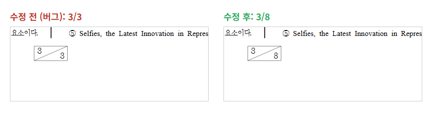
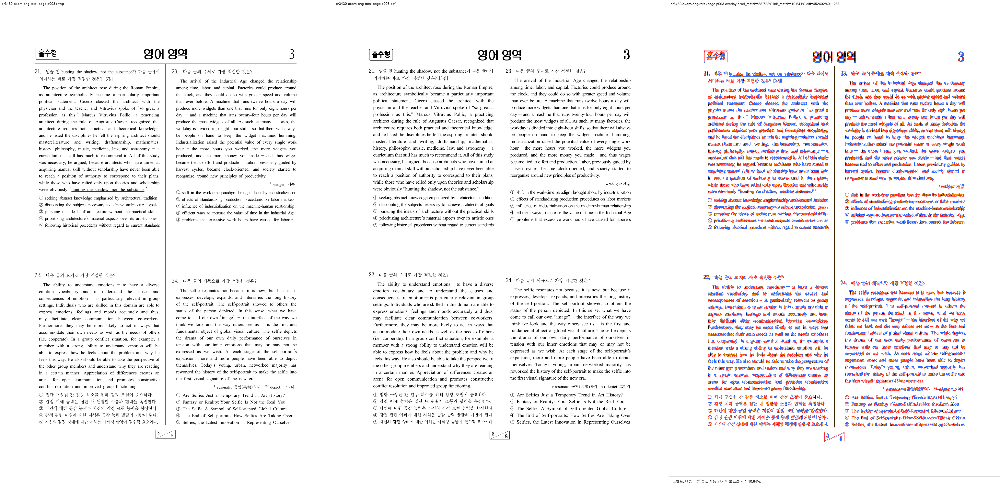

# PR #3430 검토 기록 — 꼬리말 총쪽수 필드 정합

| 항목 | 내용 |
| --- | --- |
| 원 PR | [#3430](https://github.com/edwardkim/rhwp/pull/3430) — `fix(hwp5): 꼬리말 총쪽수 필드가 현재 쪽번호로 오치환되던 버그 수정` |
| 작성자·검토자 | `@kevin9327` (external contributor) · `@jangster77` (collaborator) |
| base / source head | `devel` / `6c652bdde77d866443ca9965d1b46f7a55784fdb` (`pr/task-examEng-footer-total`) |
| 원 변경 규모 | 12 files, +170 / -7, 2 commits |
| 통합 검토 | `review/kevin9327-20260726-v2`; 최초 기준 `upstream/devel` `732147a30c`, 최신 동기화 `7f8fcfef0`; 원 변경 적용 `e69a2d286`·`b7ae99580` |
| collaborator 보정 | `a1fe4ce760899f4ad0b12bc5fbddf808611e9dd5` 중 #3430 범위 |
| 관련 이슈 | 별도 자동 close 대상 없음. #3420의 중첩 머리말 문제와는 원인·fixture가 다름 |
| 작성 시점 source 상태 | `MERGEABLE` / `BEHIND`; merge 전 최신 head·required check 재확인 필요 |
| 라우팅 | base: `collaborator_external_pr`; modifiers: `intake_and_review`, `local_validation`, `visual_fixture_evidence`, `multi_pr_update_branch` |

Loaded documents: `pr_review_workflow.md`, `pr_review/README.md`,
`collaborator_external_pr.md`, `intake_and_review.md`, `local_validation.md`,
`visual_fixture_evidence.md`, `multi_pr_update_branch.md`.

## 원 변경 범위와 판정

HWP5 `atno`의 하위 4비트 값 `6`을 `AutoNumberType::TotalPage`로 파싱하고, 현재 페이지 번호와
총 페이지 수를 서로 다른 값으로 렌더하도록 모델·HWP/HWPX parser·serializer·layout의 exhaustive
경로를 확장한다. `samples/exam_eng.hwp`의 꼬리말은 수정 전 `3/3`, `6/6`처럼 현재 페이지를 두 번
표시했지만 후보에서는 총쪽수 `8`을 보존해 `3/8`, `6/8`로 표시한다.

원 구현의 방향은 맞지만, 공용 `assign_auto_numbers`가 새 enum 값을 일반 번호 카운터로 취급할 여지가
남았다. 총쪽수는 페이지네이션 완료 뒤 정해지는 표시값이므로 Page 카운터를 증가시키거나
`NewNumber(TotalPage)`로 재설정할 대상이 아니다. 이 상태로는 뒤의 Page 필드 번호가 밀리거나 잘못
재시작할 수 있어 보정 전에는 수용하지 않았다.

## Collaborator 보정

`a1fe4ce76`에서 다음 계약을 추가했다.

- `counter_index`를 `Option<usize>`로 바꾸고 `TotalPage`를 `None`으로 분리했다.
- `AutoNumber(TotalPage)`가 저장된 표시값을 유지하면서 Page 카운터를 증가시키지 않는 test를 추가했다.
- `NewNumber(TotalPage)`가 Page 카운터를 재설정하지 않고, 명시적 `NewNumber(Page)`만 기존대로
  동작하는 test를 추가했다.
- HWP→HWPX 왕복 test의 AutoNumber 수집을 본문 최상위뿐 아니라 머리말·꼬리말·표 셀·도형 글상자까지
  재귀하도록 고쳐, 실제 꼬리말의 `TOTAL_PAGE` 보존을 검증했다.

기여자 원 commit은 유지했으며 위 보정은 별도 collaborator commit이다.

## Renderer·fixture·baseline·시각 판정

- 원본 fixture: `samples/exam_eng.hwp`, 8 pages
  (`SHA-256 7a5755a2f773fce4d295cbfeb1c5d722edb02c7f920bb067fa56940e8cd6a05b`).
- 한글 2022 권위 PDF: `pdf/exam_eng-2022.pdf`, 8 pages
  (`SHA-256 68ce956dc33f6cc6c21537488a0accebd20a1c4dde7ee720843d4565532c9844`).
- 두 파일은 기존 추적 자료이며 새 HWP/HWPX fixture 추가·교체·이동이 없다. 따라서 IR field sweep
  baseline 수동 등록 trigger는 없고 `tests/fixtures/ir_field_sweep_baseline.tsv`도 바꾸지 않았다.
- visual sweep 임시 경로:
  `output/pr_review/kevin9327-20260726-v2/pr3430_visual/pr3430-exam-eng-total-page/`.
  page 1–8을 모두 비교해 자동 판정 `flagged_pages=0/8`, 평균 pixel match `89.84801%`, 평균
  `visual_accuracy_proxy_percent` `15.33969%`를 기록했다.
- 별도 진단에는 사람 기준 p7의 table paragraph 280에서 `LAYOUT_OVERFLOW 4.3px` 후보 1건이 있다.
  이번 변경은 꼬리말 TotalPage 필드 의미를 고치며 본문 표 layout을 바꾸지 않으므로 범위 밖 후보로
  기록하되 숨기지 않는다.
- 대표 page 3은 pixel match `88.72178%`, `visual_accuracy_proxy_percent` `10.64070%`다.
  compare/overlay/review는 각각 `compare/compare_003.png`, `overlay/overlay_003.png`,
  `review/review_003.png`에 생성했고, 안정 asset은
  `mydocs/pr/assets/pr_3430_kevin9327_total_page_review_p003.png`
  (`SHA-256 3959f099f54ee7773c73ab9e700ff214590a41cf9a9eb0355fad3aaa9b3fd387`)이다.

전체 raster 일치율은 한컴 PDF와 macOS 공개 폰트의 glyph metric 차이를 크게 반영하므로 합격률로
해석하지 않는다. 사람이 대표 PNG의 꼬리말을 확인한 결과 현재쪽 `3`과 총쪽수 `8`이 분리되고,
자동 `flagged_pages`는 전 페이지 0이었고 위 p7의 소규모 overflow 진단은 별도로 남겼다. 최종 한컴
시각 판정 권위는 작업지시자에게 있다.

## 검증

- `cargo test --profile release-test --lib total_page_`: 3 passed.
- `total_page_auto_num_preserved_on_hwp_to_hwpx_roundtrip`: 1 passed.
- release-test CLI `export-text --json samples/exam_eng.hwp`: page 3 말미 `3/8` 확인.
- 통합 후보 공통 게이트: release build PASS; release lib `2943 passed / 0 failed / 7 ignored`;
  `cargo test --profile release-test --tests` all targets exit 0, IR sweep `2/2`; Native Skia
  `57/0`, `2/0`, `4/0`; fmt·diff check·clippy PASS; doc test `4/0/2`; wasm-pack PASS.

## Risk와 최종 권고

총쪽수 enum을 추가하면 번호 할당·직렬화의 exhaustive 경로가 넓어지는 위험이 있으나, 보정 뒤에는
카운터 비간섭과 중첩 컨트롤 왕복을 모두 고정했다. **메인터너 보정 후 기술적으로 수용 가능**하다.

#3445의 범위 고정은 당시 열린 PR을 v0.8.2 핫픽스 기준선에서 제외한 것이며,
[해당 릴리즈는 완료](../../report/task_m100_3445_report.md)됐다. 현재 보류로 확장하지 않는다. 최신 통합
head CI·mergeable 상태가 성공하면 merge하고, 원 PR은 통합 PR을 연결해 후속 처리한다.
