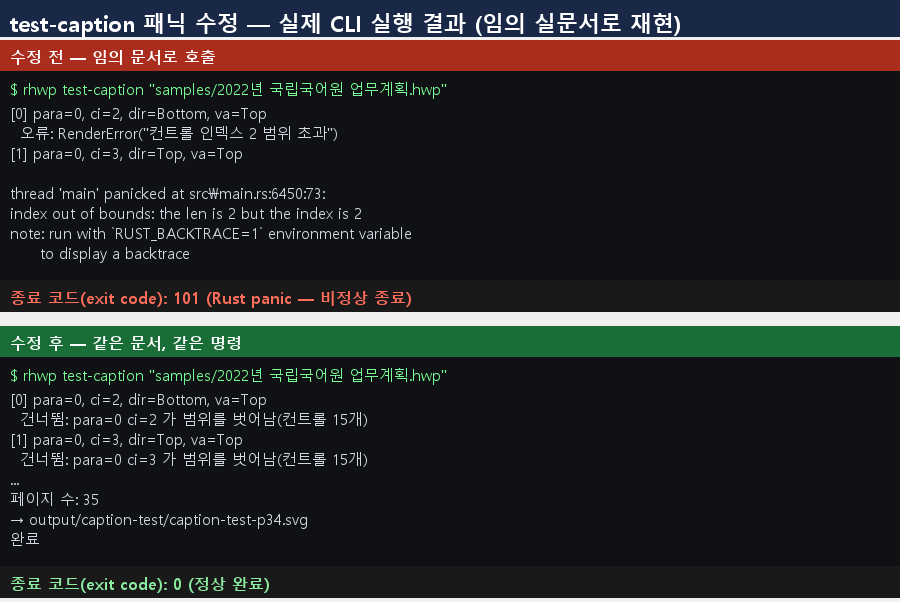

# PR #3448 검토 기록 — test-caption 임의 문서 panic 제거

| 항목 | 내용 |
| --- | --- |
| 원 PR | [#3448](https://github.com/edwardkim/rhwp/pull/3448) — `fix(cli): test-caption 이 임의 문서로 호출되면 패닉(exit 101)하던 결함 수정` |
| 작성자·검토자 | `@kevin9327` (external contributor) · `@jangster77` (collaborator) |
| base / source head | `devel` / `e7179e2149906f514d313725fa7646dcb308278a` (`pr/task-test-caption-panic`) |
| 원 변경 규모 | 3 files, +62 / -2, 2 commits |
| 통합 검토 | `review/kevin9327-20260726-v2`; 최초 기준 `upstream/devel` `732147a30c`, 최신 동기화 `7f8fcfef0`; 원 변경 적용 `a6efc3cf0`·`6cc0c1e66` |
| collaborator 보정 | `a1fe4ce760899f4ad0b12bc5fbddf808611e9dd5` 중 #3448 범위 |
| 관련 이슈 | 별도 자동 close 대상 없음 |
| 작성 시점 source 상태 | `MERGEABLE` / `BEHIND`; merge 전 최신 head·required check 재확인 필요 |
| 라우팅 | base: `collaborator_external_pr`; modifiers: `intake_and_review`, `local_validation`, `multi_pr_update_branch` |

Loaded documents: `pr_review_workflow.md`, `pr_review/README.md`,
`collaborator_external_pr.md`, `intake_and_review.md`, `local_validation.md`,
`multi_pr_update_branch.md`.

## 원 변경 범위와 판정

`test-caption`은 특정 fixture의 문단·control 인덱스를 직접 참조해, 구조가 다른 정상 HWP를 받으면
index-out-of-bounds panic(exit 101)으로 종료됐다. 원 PR은 직접 인덱싱을 `.get()` 기반 접근으로 바꿔
범위 밖 control을 건너뛰고 CLI가 계속 실행되게 했다. `capabilities`가 파일 인자를 받는 명령으로
노출하는 이상 임의 실문서가 프로세스를 panic시키지 않아야 한다는 방향은 타당하다.

다만 원 구현은 parse·section·render·write 실패를 제어된 종료 코드로 충분히 전달하지 못했고, 출력 위치가
고정돼 test와 사용자 실행이 기존 산출물에 섞일 수 있었다. 원 test도 nextest archive의 runtime binary
계약과 격리된 output을 완전히 고정하지 못했다.

## Collaborator 보정

`a1fe4ce76`에서 다음을 추가했다.

- `test_caption`이 성공·실패 종료 코드를 반환하고 top-level dispatch가 그 코드를 사용하게 했다.
- 입력 파일 읽기·parse, 빈 section, output directory 생성, SVG render와 write 오류를 panic 대신
  제어된 메시지와 non-zero exit로 처리했다.
- `-o`와 `--output`을 모두 지원하고 help의 사용법을 실제 CLI와 맞췄다.
- 통합 test는 runtime `CARGO_BIN_EXE_rhwp`를 우선하고 compile-time 값을 fallback으로 쓰는 표준
  `rhwp_bin()` 패턴을 사용한다.
- 고유한 OS temp directory를 만들고 silent skip 없이 exit `0`과 실제 SVG 생성을 단언한 뒤 자신의
  임시 경로만 정리한다.

기여자 원 commit은 rewrite하지 않았고, 위 변경은 별도 collaborator 보정이다.

## Renderer·fixture·baseline·시각 판정

- 재현 fixture: `samples/2022년 국립국어원 업무계획.hwp`
  (`SHA-256 ab59c95dde8cd42e490f7b9a3deb13a9142969706e784053237bf9dc625150e9`).
- 기존 fixture를 읽기만 하며 새 HWP/HWPX 추가·교체·이동이 없다. IR field sweep baseline 수동 등록
  trigger가 없고 baseline TSV도 바꾸지 않았다.
- 변경 목적은 CLI의 panic·오류·output 계약이다. renderer 출력 정합을 바꾸는 PR이 아니므로 visual sweep은
  생략하고 실제 종료 코드와 SVG 개수를 검증했다.

위 PNG는 기여자 측 before/after 설명 자료다. collaborator는 보정 후보에서 같은 문서를 고유 temp output으로
실행해 exit `0`과 SVG `35`개를 독립 확인했다.

## 검증

- `issue_cli_test_caption_no_panic`: 1 passed, silent skip 없음.
- release-test binary 실제 실행: exit `0`, 지정 temp output의 SVG `35`개.
- 통합 후보 공통 게이트: release build PASS; release lib `2943 passed / 0 failed / 7 ignored`;
  `cargo test --profile release-test --tests` all targets exit 0, IR sweep `2/2`; Native Skia
  `57/0`, `2/0`, `4/0`; fmt·diff check·clippy PASS; doc test `4/0/2`; wasm-pack PASS.

## Risk와 최종 권고

내부 진단 명령이 일반 사용자 CLI surface에 보이는 만큼, panic만 제거하고 render/write 실패를 성공으로
숨기는 것도 위험하다. 보정 뒤에는 오류 단계와 exit code, output 격리, CI binary 탐색이 모두 계약으로
고정됐다. **메인터너 보정 후 기술적으로 수용 가능**하다.

#3445의 범위 고정은 당시 열린 PR을 v0.8.2 핫픽스 기준선에서 제외한 것이며,
[해당 릴리즈는 완료](../../report/task_m100_3445_report.md)됐다. 현재 보류로 확장하지 않는다. 최신 통합
head의 full CI·mergeable 상태가 성공하면 반영하고, 원 PR은 통합 PR을 연결해 후속 처리한다.
