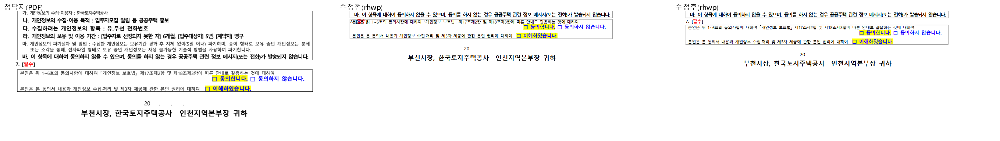
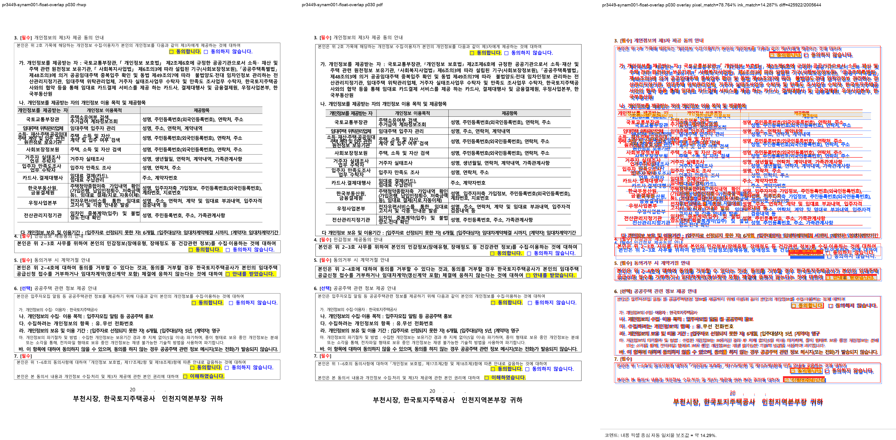

# PR #3449 검토 기록 — synam-001 p30 자리차지 표 host 줄 겹침

| 항목 | 내용 |
| --- | --- |
| 원 PR | [#3449](https://github.com/edwardkim/rhwp/pull/3449) — `fix(layout): 자리차지 표 host 줄과 표 첫 줄 겹침 수정 (samples/synam-001.hwp p30)` |
| 작성자·검토자 | `@kevin9327` (external contributor) · `@jangster77` (collaborator) |
| base / source head | `devel` / `8a52a36b6997b3e18f9ea466653cfde7c97bc36f` (`pr/task-synam001-bugfind`) |
| 원 변경 규모 | 3 files, +124 / -1, 2 commits |
| 통합 검토 | `review/kevin9327-20260726-v2`; 최초 기준 `upstream/devel` `732147a30c`, 최신 동기화 `7f8fcfef0`; 원 변경 적용 `78f27671f`·`10bc93cfd` |
| collaborator 보정 | `a1fe4ce760899f4ad0b12bc5fbddf808611e9dd5` 중 #3449 범위 |
| 관련 회귀 계약 | [#2439](https://github.com/edwardkim/rhwp/issues/2439) co-anchored float stack |
| 작성 시점 source 상태 | `MERGEABLE` / `BEHIND`; merge 전 최신 head·required check 재확인 필요 |
| 라우팅 | base: `collaborator_external_pr`; modifiers: `intake_and_review`, `local_validation`, `visual_fixture_evidence`, `multi_pr_update_branch` |

Loaded documents: `pr_review_workflow.md`, `pr_review/README.md`,
`collaborator_external_pr.md`, `intake_and_review.md`, `local_validation.md`,
`visual_fixture_evidence.md`, `multi_pr_update_branch.md`.

## 원 변경 범위와 판정

`samples/synam-001.hwp` page 30의 “7. [필수]” host 줄과 뒤따르는 `TopAndBottom`, `vert=Para`
표 첫 줄이 거의 같은 y에 놓여 글자가 겹쳤다. 선행 float exclusion이 실제 표 시작점을 아래로 밀었지만,
host 한 줄을 예약하는 `title_flow_y`는 보정 전 `para_y_for_table`에서 다시 계산돼 예약분이
`max()`에 흡수된 것이 원인이다.

원 PR은 일반 visible-host float에서 `title_flow_y`의 기준을 보정된 `table_y_start`로 바꿔 p30 겹침을
해소했다. 그러나 이 일반화는 같은 host 문단에 두 co-anchored 표가 있는 #2439의 좁은 저장 형상에도
적용되어, exclusion에서 이미 복원한 outer-top을 host 줄 보정에서 다시 더하는 회귀를 만들었다.
따라서 원 변경 그대로는 수용할 수 없었다.

## Collaborator 보정

`a1fe4ce76`은 `has_preceding_coanchored_float` 여부로 두 계약을 분리한다.

- #2439처럼 같은 문단에 선행 co-anchored float가 있으면 기존 `para_y_for_table` 기준을 유지한다.
- 일반 visible-host float에서만 실제 exclusion 보정 뒤 `table_y_start`를 기준으로 host 한 줄을 예약한다.
- synam test는 `y > host_y`를 먼저 걸러 겹친 후보를 숨기지 않고, host와 가장 가까운 표 셀의 “본”을
  고른 뒤 `cell_y > host_y`를 직접 단언한다.
- gap 하한 `8px`뿐 아니라 상한 `19px`도 고정해 겹침과 outer-top 이중 가산을 함께 잡는다.

현재 후보의 실측 gap은 `16.52px`로 두 경계 안에 있다. 기여자 원 commit은 유지했고 보정은 별도
collaborator commit으로 추가했다.

## Renderer·fixture·baseline·시각 판정

- 재현 원본: `samples/synam-001.hwp`, 35 pages
  (`SHA-256 1dce9356ec316407b6c684d5a11190a44bb26da643a7749626763e781ab0c13b`).
- 한글 2022 권위 PDF: `pdf/synam-001-2022.pdf`, 35 pages
  (`SHA-256 2f430884f916f00e65796beeb524b65b0f0c4aac48c6283431c40a97a2325fc8`).
- 기존 fixture를 읽기만 하며 새 HWP/HWPX 추가·교체·이동이 없다. IR field sweep baseline 수동 등록
  trigger가 없고 baseline TSV도 바꾸지 않았다.
- visual sweep 임시 경로:
  `output/pr_review/kevin9327-20260726-v2/pr3449_visual/pr3449-synam001-float-overlap/`.
  page 29–31 세 쪽을 비교했고 target page 30은 자동 후보가 없었다. page 30의 pixel match는
  `78.76383%`, `visual_accuracy_proxy_percent`는 `14.28692%`다. compare/overlay/review는
  각각 `compare/compare_030.png`, `overlay/overlay_030.png`, `review/review_030.png`에 생성했다.
- 안정 asset: `mydocs/pr/assets/pr_3449_kevin9327_synam001_review_p030.png`
  (`SHA-256 4b8ca1288d2455c5ecd5c6784844668c659b8237b73028d4568223e5461b8201`).

사람 검토에서 page 30의 “7. [필수]” host 줄과 표 첫 줄은 분리되어 읽을 수 있다. 낮은 raster proxy는
문서 전반의 폰트·배치 차이를 포함하므로 단독 합격률로 쓰지 않고 gap test와 대표 PNG를 함께 판정했다.
최종 한컴 시각 판정 권위는 작업지시자에게 있다.

세 쪽 중 자동 후보는 page 31 한 쪽뿐이다. broad line/column/layout 및 footer frame bleed 후보이며,
frame 밖 extent는 rhwp와 PDF가 모두 `21px`이다. target p30 결함과 다른 기존·범위 밖 차이로 분류하되,
후속 renderer 작업에서 독립 조사할 수 있도록 후보 사실을 숨기지 않는다.

## 검증

- `issue_synam001_visible_float_host_line_overlap`: 1 passed, gap `16.52px` (`8 <= gap <= 19`).
- `tests/issue_2439.rs`: 4 passed.
- 통합 후보 공통 게이트: release build PASS; release lib `2943 passed / 0 failed / 7 ignored`;
  `cargo test --profile release-test --tests` all targets exit 0, IR sweep `2/2`; Native Skia
  `57/0`, `2/0`, `4/0`; fmt·diff check·clippy PASS; doc test `4/0/2`; wasm-pack PASS.

## Risk와 최종 권고

이 코드는 오래 누적된 float exclusion·host-line·outer-margin 계약이 만나는 민감한 영역이다. 보정은
일반 visible-host와 #2439 co-anchored stack을 분리하고 양방향 gap test로 범위를 좁혔다. page 31 후보는
이번 변화의 목표가 아니며 target p30 판정과 섞지 않는다. **메인터너 보정 후 기술적으로 수용 가능**하다.

#3445의 범위 고정은 당시 열린 PR을 v0.8.2 핫픽스 기준선에서 제외한 것이며,
[해당 릴리즈는 완료](../../report/task_m100_3445_report.md)됐다. 현재 보류로 확장하지 않는다. 최신 통합
head의 full CI·mergeable 상태가 성공하면 반영하고, 원 PR은 통합 PR을 연결해 후속 처리한다.
