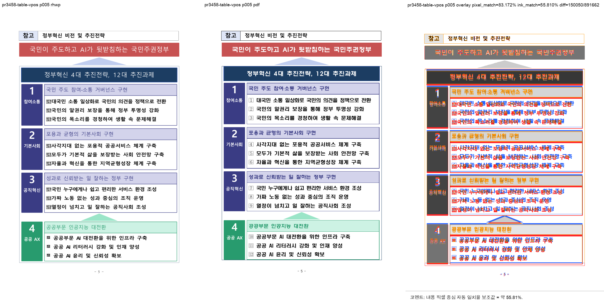

# PR #3458 검토 기록 — 표 렌더 수직 정합 A/C/D

| 항목 | 내용 |
| --- | --- |
| 원 PR | [#3458](https://github.com/edwardkim/rhwp/pull/3458) — `fix(#3386): 표 렌더 수직 정합 3건(A/C/D)` |
| 작성자·검토자 | `@planet6897` (external contributor) · `@jangster77` (collaborator) |
| base / source head | `devel` / `d8849ba05bb0c6d0bc81eb42ffae99a06368dfec` (`fix/3386-acd-row-render-trust`) |
| 통합 검토 | `review/planet6897-20260727`, 기준 `upstream/devel` `6e9d0821889c3a5bd64da37ff17bcde49e684633` |
| 원 변경 적용 | `a668f4…` → `81d208159`, `d8849ba…` → `f3f2d9bd0` |
| 작성 시점 source 상태 | `MERGEABLE` / `BEHIND`, source CI 전체 성공; 최신 통합 head CI·mergeable 재확인 필요 |
| 라우팅 | `collaborator_external_pr` + `intake_and_review`, `local_validation`, `visual_fixture_evidence`, `multi_pr_update_branch` |

## 판정

중첩 TAC 표의 anchor outer-margin, 선언 행 높이와 셀 크기, 모순된 cellMargin을 각각 분리해
수직 위치와 행 재분배를 바로잡는다. 고정 좌표 대신 cursor rect로 표의 대상 셀을 찾도록 시험도
강화해 macOS 폰트 행높이 차이에 덜 취약하다. `RHWP_DIAG_TAC` 진단은 기존 환경변수 기반 진단
경로이며 상시 출력 추가가 아니다. 코드상 차단점은 발견하지 못했다.

## 재현·시각 증적

- fixture: `samples/table-vpos-01.hwp`, SHA-256
  `2e6c5bb4bf29f60d97d332414a0ded023b894e59ae49b5f9d6bb11476d39d766` (5 pages).
- 한글 2022 기준 PDF: `pdf/table-vpos-01-2022.pdf`, SHA-256
  `bbabf4cc2f999979480963ae87ebd1485c891075ac83decea77646cc0b8046cc`.
- sweep: `output/review-planet6897-20260727/pr3458/visual_sweep/pr3458-table-vpos/`.
  대상 p5 자동 후보 `0/1`, pixel match `83.17187%`, visual proxy `55.81007%`.
  표의 head/행 경계와 배치는 정합하며, 남은 넓은 래스터 차이는 글꼴 글리프·크기 차이다.

안정 asset은 `2416×1211` PNG, SHA-256
`b1c3bc53163c13bb65614ec81677574d3f44a7c5ab2af0bcdf9241d9892ef893`다. 새 fixture를 추가하지
않았으므로 IR field-sweep baseline 수동 등록 대상이 아니다.

## 검증

- #3386 focused renderer test 14/0, #1198 2/0, #850 3/0.
- 통합 후보 `cargo test --profile release-test --tests`: 전체 성공, IR sweep 2/2 포함.
- Native Skia 공식 3종 57/0, 2/0, 4/0; fmt, diff check, clippy, WASM lib check 성공.

## 최종 권고

**#3459와 한 단위로 기술적으로 수용 가능**. #3458의 제출 조건은 r25 10k 동승 판정이며, #3459가
그 모집단 결과를 기록한다. 코드는 기준 PDF·focused regression·통합 검증으로도 독립적으로 안전성을
확인했다. 최신 통합 PR CI, mergeable 상태와 작업지시자 승인을 최종 조건으로 둔다.
