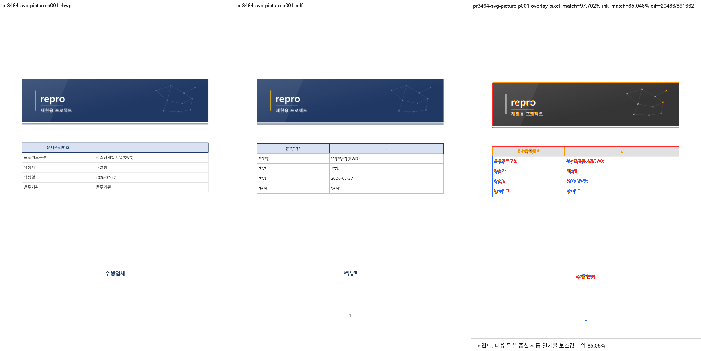
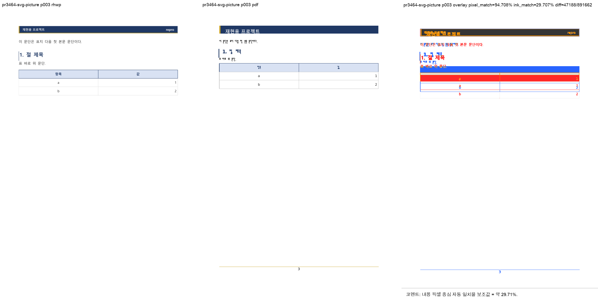

# PR #3464 검토 기록 — HWPX 임베드 SVG picture 렌더

| 항목 | 내용 |
| --- | --- |
| 원 PR | [#3464](https://github.com/edwardkim/rhwp/pull/3464) — `fix(render/#3460): 임베드 SVG picture 렌더` |
| 작성자·검토자 | `@planet6897` (external contributor) · `@jangster77` (collaborator) |
| base / source head | `devel` / `edb7116cc4badc068b7748946203229c475aba36` |
| 통합 검토 | `review/planet6897-20260727`; 적용 `edb7116c…` → `e1cc64bbf` |
| 작성 시점 source 상태 | `MERGEABLE` / `BEHIND`, source CI 전체 성공 |
| 라우팅 | `collaborator_external_pr` + `intake_and_review`, `local_validation`, `visual_fixture_evidence`, `multi_pr_update_branch` |

## 판정

HWPX `BinData`의 MIME 오판, 숫자가 아닌 manifest ID가 참조된 master page, native-Skia SVG raster
미지원 세 경로를 함께 고친다. section/master XML의 `binItemRef`를 manifest index에 맞게 정규화하고,
SVG MIME이면 native-Skia에서 크기·scale guard 아래 PNG로 rasterize한다. 새 fixture는 cover SVG와
master-page SVG를 함께 포함해 세 경우를 재현한다.

## 재현·시각 증적

- fixture: `samples/issue3460/svg_picture_repro.hwpx`, SHA-256
  `1d348927597b5519c65acf56206561247089720e7eac76711dca3541416a4f2` (3 pages).
- 한글 2020 기준 PDF: `pdf/issue3460/svg_picture_repro-2020.pdf`, SHA-256
  `24845c4879beaed3b2f672d88816ca959b82c2f2a78c8a835cfdb34dd725e4d7` (3 pages).
- sweep: `output/review-planet6897-20260727/pr3464/visual_sweep/pr3464-svg-picture/`; 자동 후보 0/3.
  p1 pixel `97.70249%`/proxy `85.04595%`, p3 pixel `94.70786%`/proxy `29.70654%`.
  낮은 p3 proxy는 PDF/rhwp 한글 글꼴 raster 차이이며 header SVG·표 구조 손실은 없다.

안정 asset은 모두 `2416×1211` PNG이며 SHA-256은 p1
`50e74ace7e52b53e1f7c178e0c75b7f5888aa85c517ba4f66586b518e9567b5b`, p3
`bf4b6844c71f61daf6d30147b24de71210136ccc568eec2f4e0ea185536f74f6`다.

## 검증

- `issue_3460_svg_picture_render` 2/0; IR field sweep dump 672행이 baseline TSV와 완전 일치해
  신규 baseline 등록은 필요 없다.
- native-Skia `export-svg`와 `export-png`로 3쪽 모두 생성·사람 검토 완료.
- 통합 `cargo test --profile release-test --tests` 전체 성공, Native Skia 공식 3종 57/0·2/0·4/0,
  fmt·diff check·clippy·WASM lib check 성공.

## 최종 권고

**기술적으로 수용 가능**. 기준 PDF와 실제 PNG evidence는 통합 PR에 함께 넣어야 하며, 최신 통합 PR
CI·mergeable과 작업지시자 승인을 최종 조건으로 둔다.
