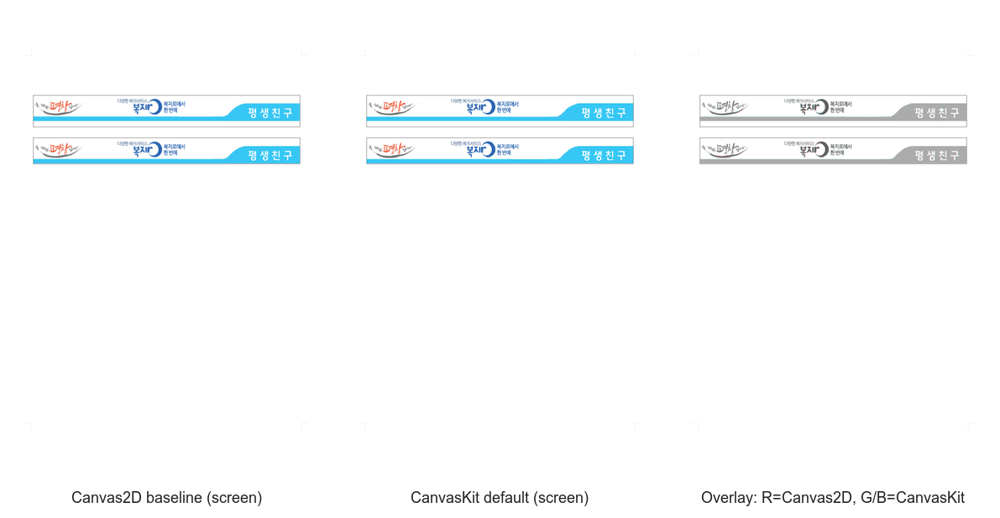

# PR #3536 검토 — CanvasKit 사전검증과 이미지 재생 경계 강화

- 검토일: 2026-07-31
- PR: [#3536](https://github.com/edwardkim/rhwp/pull/3536)
- 관련 이슈: [#536](https://github.com/edwardkim/rhwp/issues/536) (P40 추적 이슈, 이번 PR merge 뒤에도 후속 단계 때문에 유지)
- 작성자 / reviewer: `@seo-rii` / `@jangster77` (collaborator 매개 외부 PR)
- base / 현재 code head: `devel` `a435f41da4fce1201b57de1120172c5b6d543999` / `b14d245a2023eeee225e9cb3c1f69f4c012e1efd`
- 원 code 변경 규모: 12 files, +1,000 / -208 (검토 기록 추가 전)

## 변경 범위와 판정

CanvasKit 선택 전 사전검증이 실제 `displayText`와 그 재생 비용을 함께 반영하도록 맞추고, base64 이미지의
형식·치수·payload 한계를 Rust와 Studio에서 같은 경계로 판정한다. 이미지 재생 경로는 문서 세대와 source key를
포함한 cache key를 사용하고, 실패 진단은 페이지 전환마다 초기화해 이전 페이지 오류가 다음 페이지의 readiness를
오염시키지 않게 한다.

검토에서는 다음의 좁은 계약 경계를 확인했다.

- `displayText`가 원문과 다를 수 있는 text run은 원문과 projection 양쪽의 byte 비용을 사전검증에 반영한다.
  CharOverlap·control mark는 원문, tab leader·decoration은 projection에 남기는 기존 의미 분리가 유지된다.
- PNG/GIF/WebP/BMP/JPEG header 판정과 24 MiB base64·8192 px·32 MP 상한이 Rust/browser에서 같은 결과를
  내며, header가 불완전하거나 한계를 넘으면 CanvasKit 재생을 허용하지 않는다.
- `documentGeneration`을 포함한 cache key와 collision regression은 stale image 재사용을 막는다. 실패는
  readiness의 hard gate로 승격되고 page diagnostics는 reset된다.

source branch의 contributor code commit 10개(`e5412d1`, `6a9c051`, `59bc906`, `c9966d8`, `663a5a2`,
`007cf71`, `30aa123`, `0565438`, `d8d918a`, `fc68f75`)를 최신 `upstream/devel` 위
`review/seo-rii-3536-20260731`에서 순서대로 재현 적용했다. 후속 base update merge
`b14d245`는 정확히 그 최신 base를 포함하며 conflict가 없었다.

## 검증

| 검증 | 결과 |
| --- | --- |
| 최신 `devel` 위 cherry-pick merge simulation / `git diff --check` | conflict 없음 / 통과 |
| `CARGO_INCREMENTAL=0 cargo test --profile release-test --lib renderer::canvaskit_policy::tests --quiet` | 40 passed |
| `CARGO_INCREMENTAL=0 cargo test --profile release-test --lib renderer::image_header::tests --quiet` | 4 passed |
| `npm --prefix rhwp-studio test` | 685 passed, 0 failed |
| `CARGO_INCREMENTAL=0 cargo test --profile release-test --tests --quiet` | exit code 0; 3,030 passed, 0 failed, 7 ignored |
| Native Skia focused (`skia` lib, placeholder, P37 direct PDF) | 58 + 2 + 4 passed |
| `cargo fmt --all -- --check` / `cargo clippy --all-targets -- -D warnings` | 통과 / 통과 |
| `rhwp-studio` `npx tsc --noEmit` / `npm run e2e:renderer-contract` | 통과 / contract guard 통과 |
| GitHub Actions (현재 code head `b14d245`) | CI preflight, Lint, frontend gates, Native Skia, default-feature 8 shards, `Build & Test`, CodeQL, Canvas visual diff 모두 success |

### 시각 검증 기록

로컬 headless CanvasKit sweep은 23개 sample, `canvas2d`·`canvaskit-compat`·`canvaskit-default`,
`screen`·`fast-preview` 조합으로 캡처했다. P40의 직접 대상은
`samples/pic-crop-01.hwp` p0(`sha256:3b5afbe4cdb18faa49452a9cbed770d5caa27aed2f83b708e9ab8516c65ebf4c`)다.
`image-crop`은 CanvasKit 4개 조합 모두 2% tolerant diff budget 안에서 통과했다(최대 selected diff ratio
`1.4700637%`, image replay failure `0`). 원본 report는 로컬 검토 출력
`output/renderer-baseline/studio-headless/browser-baseline-report.json`에 남겼다.

대표 panel은 `mydocs/pr/assets/pr3536_canvaskit_image_crop_backend_parity_review_p0_3way.png`
(`sha256:c229ad55374a77e69a3f799bcd2063bd7072d3579df49dadfcb1cf23b77f2165`)에 보존했다. 왼쪽은 Canvas2D,
가운데는 CanvasKit default, 오른쪽은 R=Canvas2D·G/B=CanvasKit의 channel overlay다.

이 panel의 Canvas2D는 browser backend 비교 기준이지 한컴 HWP/PDF 정답지가 아니다. 따라서 이 asset은
P40 image replay의 backend-parity 증적이며 외부 문서 충실도의 독립 최종 판정으로 확대하지 않는다.

같은 broad corpus에는 이번 이미지 재생 변경의 성공 증거로 사용하지 않은 기존 진단도 있다. report의 hard gate
16건은 `image-start`·`header-image`·`legacy-doc-2010`의 `textRun:glyphMapping` 및 `exam-math`의
`equation:invalidLayout`이 각 CanvasKit backend/profile에 반복된 것이다. 이미지 실패는 0건이지만, 전체 backend
parity는 88 comparison 중 48 pass / 40 fail / 4 capture error이므로 broad sweep 전체를 성공으로 표현하지 않는다.
병합 판단의 visual CI gate는 현재 code head에서 success한 [Canvas visual diff](https://github.com/edwardkim/rhwp/actions/runs/30582566458/job/91006231320)이며, 위 broad corpus 경고는 P40 범위 밖 후속 renderer 과제로 분리한다.

## 권고와 merge 전 조건

**결론: 수용·merge 완료.** 현재 code head `b14d245a2023eeee225e9cb3c1f69f4c012e1efd`의 full CI와
CodeQL, Canvas visual diff, `Build & Test` 및 review-only tail의 fast-pass preflight·최종 aggregate를
확인한 뒤 PR은 [`b432958`](https://github.com/edwardkim/rhwp/commit/b432958cc2028b1f063e36dd34036a801ea967b8)로
merge됐다. #536은 추적 상태로 유지했고 contributor 결과 comment와 `devel` sync를 완료했다. 이 대표 asset은
merge 뒤 증적 보완 fast-pass PR로 archive에 추가한다.
