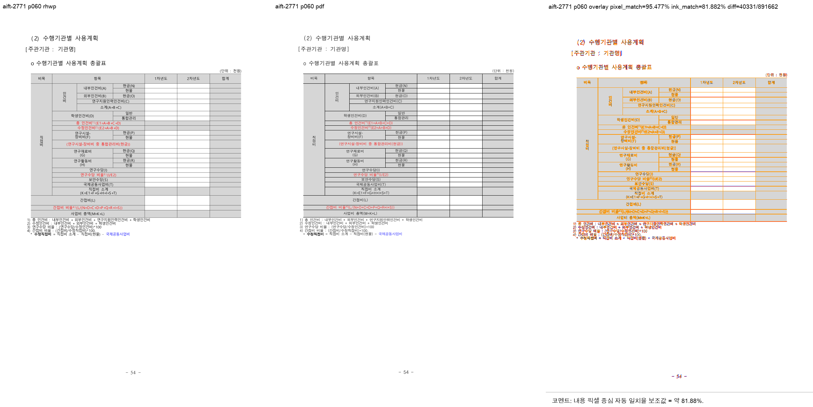

# PR #3540 검토 기록 — HML 셀 정렬과 첨자 renderer 정합

| 항목 | 내용 |
| --- | --- |
| 원 PR | [#3540](https://github.com/edwardkim/rhwp/pull/3540) — HML `PARALIST@VertAlign`, SVG/Canvas/Skia 첨자 (#3189, #2771) |
| 작성자·검토자 | `@kevin9327` · `@jangster77` |
| source head / 통합 commits | `fe1c2b181d512c9bd31a4c455fad339d3bb94dfd` / `04e37d699`, `0a1e6bb29` |

HML은 `PARALIST`의 `VertAlign`을 reader→adapter→serializer로 보존하고, 셀 안 `DRAWTEXT`의
PARALIST가 바깥 셀 값을 덮지 않게 owner를 구분한다. 속성 부재 HML 셀의 실효 기본값은 `Top`이 아닌
`Center`라는 규약도 고정한다. 첨자는 0.7배 glyph에 맞춰 SVG/Canvas text advance를 축소하고,
Native Skia에도 글자 크기·baseline·장식 기하를 같은 shared metrics로 반영한다.

## 검증과 판정

- `issue_3189_hml_cell_vertical_align`: 3 passed — Top/Center/Bottom 왕복, 기본 Center, textbox
  귀속을 검증했다. HML fixture에는 공식 기준 PDF가 없어 parser/serializer 계약으로만 판정한다.
- #2771은 `samples/aift.hwp`와 `pdf/aift-2022.pdf`의 56·60·62쪽을 같은 74쪽 기준으로 시각 대조했다.
  sweep은 3/3 compare, **0/3 flagged**였고 p60의 pixel match 95.477%, ink match 81.882%였다.
  대표 panel(`2400×1200`, SHA-256
  `0bd5a9dac8d3631146cfae28b1dfd909196af3c098d6b61b9944edfb74958fe1`)은 아래에 보존했다. 이 지표는
  기존 글꼴·조판 차이를 포함하는 보조값이지 첨자만의 정확도 판정은 아니다.
- Native Skia 및 wasm renderer gate는 기본 build에 포함되지 않으므로 별도 feature/wasm 검증을 수행한다.

중간점 vector 위치는 base advance를 유지하는 것이 원 이슈의 계약이므로 textLength만 scale한다. 공식
baseline 대조와 feature gate를 통과하는 조건으로 **기술적 수용 가능**이다.

