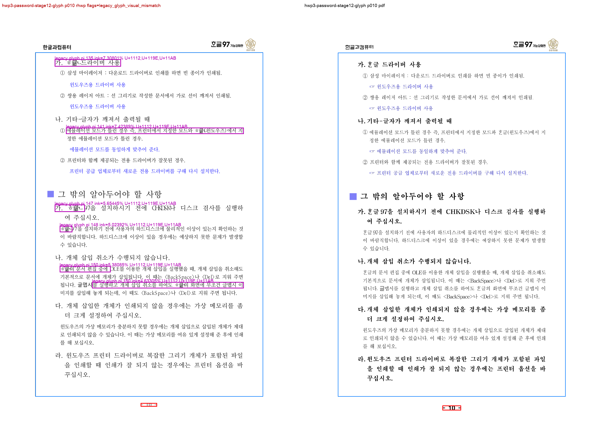

# PR #3562 검토 — HWP3 glyph PDF 불일치 후보 검출

- 검토일: 2026-07-30
- PR: [#3562](https://github.com/edwardkim/rhwp/pull/3562)
- 관련 이슈: [#3486](https://github.com/edwardkim/rhwp/issues/3486)
- 작성자 / reviewer: `@jangster77` / `@jangster77` (collaborator self-merge 후보)
- base / 검토 head: `devel` / `991a48d0b97c64dee23c493987144de3b354b9ee`
- 규모: 18 files, +642 / -24 (review 기록 추가 전)

## 경로와 metadata

기본 경로는 collaborator self-merge이며, renderer/PDF 기준 자료와 visual sweep 증적을 포함하므로
시각·fixture 증적 보조 경로를 적용했다. 작성자와 reviewer 계정이 같으므로 별도 review request는
등록하지 않는다.

위 head, `MERGEABLE`/`CLEAN`, CI 상태는 이 문서 작성 시점의 참고값이다. 이 review 기록과 대표 asset을
추가한 뒤에는 review-only fast-pass의 최신 preflight와 `Build & Test` aggregate를 다시 확인해야 한다.

review 기록 commit 뒤 `devel`의 `0255624ea`가 PR branch에 병합되어 최신 head는
`d5099e46eb28c3f1e3c1bb1ee782293979c21564`가 됐다. 이 2-parent update-branch commit 뒤에는
review-only 단일 부모 commit이 없었으므로 fast-pass를 재사용하지 않고 full CI fallback을 적용했다.

## 변경 범위와 검토

- `scripts/visual_sweep.py`가 옛한글 자모(U+1100–U+11FF, U+A960–U+A97F,
  U+D7B0–U+D7FF)와 BMP PUA(U+E000–U+F8FF) `TextRun`을 render-tree bounding box로
  raster에 대응시킨다.
- PDF 기준 이미지와의 국소 ink union/diff를 계산해 `legacy_glyph_visual_mismatch`,
  `legacy_glyph_visual_candidates`, `legacy_glyph_visual_pages`를 summary와 review PNG에
  남긴다. 후보 조건은 union ink 24 이상, 국소 ink match 80% 이하로 제한되어 있다.
- focused test는 옛한글 자모와 PUA 양성 사례, 현대 한글 `한글` 음성 사례를 각각 고정한다.
- p10·p24의 compare, overlay, review, annotated PNG와 SHA-256 목록은
  [조사 증적](../../tech/investigations/issue-3486/hwp3_legacy_glyph_visual_sweep.md)에 보존했다.
  대표 p10 주석 PNG는 이 archive와 함께 `mydocs/pr/assets/`에도 보존한다.

이 PR은 parser, raw IR, layout advance, SVG/Web Canvas paint 동작을 직접 바꾸지 않는다. 따라서
`ᄒᆞᆫ → 한`의 전역 치환이나 HWP3 전용 parser 보정으로 문제를 덮지 않는다. 실제 PDF와의 사용자
가시 차이이지만 원인·문맥 범위가 아직 확정되지 않았으므로, #3486의 다음 단계는 bug-hunter의
source → IR → layout → paint 인과 분석이며 visual sweep은 후보 식별과 before/after 증적에 한정한다.

## 시각 증적 판정

입력 `samples/HWP3-password-123456.hwp`와 비교 PDF
`pdf/HWP3-password-123456.pdf`를 144dpi로 대조했다. 24쪽 전체 SVG/render-tree export는
완료했지만 raster/overlay는 실행 한도 내 대표 페이지 p10·p24만 수행했다.

| 페이지 | pixel match | visual accuracy proxy | glyph 후보 |
| --- | ---: | ---: | --- |
| p10 | 92.47090% | 6.92828% | 6건, `가. ᄒᆞᆫ글 드라이버 사용` 등 |
| p24 | 95.37655% | 9.66831% | 5건, `나. ᄒᆞᆫ소프트 회원등록` 등 |

자동 후보는 2/2쪽에서 검출됐다. 이 수치는 렌더 정합 통과가 아니라 후속 인과 분석이 필요한
불일치 관측이다. PDF text bbox 추출은 exit -6으로 실패했으므로 text layer 일치 주장을 하지 않는다.

## 검증

| 검증 | 결과 |
| --- | --- |
| `python3 -m unittest scripts/tests/test_visual_sweep.py` | 7건 통과 |
| `python3 -m py_compile scripts/visual_sweep.py` | 통과 |
| `python3 scripts/check_markdown_links.py mydocs/manual/verification mydocs/plans/task_m100_3486_v2.md` | 12문서 내부 링크 통과 |
| `python3 scripts/check_document_metadata.py` | 421문서 메타데이터 통과 |
| `git diff --check` | 통과 |
| GitHub Actions — CI | preflight, Lint, archive, Native Skia, default-feature 8 shards, `Build & Test` 모두 success |
| GitHub Actions — CodeQL | preflight, JavaScript/TypeScript·Python·Rust 분석과 aggregate 모두 success |

최초 full CI는 review 기록 추가 전 code head `991a48d0b97c64dee23c493987144de3b354b9ee` 기준이다.
update-branch 최신 head `d5099e46eb28c3f1e3c1bb1ee782293979c21564`에서는
[CI run 30468906842](https://github.com/edwardkim/rhwp/actions/runs/30468906842)가 19분 48초에
success였다. preflight, Lint, Build test archive, Native Skia, default-feature 8 shards,
`Build & Test`, CodeQL이 모두 success이고 WASM·frontend gate는 영향 없음으로 skipped였다.

이 추가 기록은 archive review만 변경하는 review-only 범위다. push 뒤 최신 preflight와
`Build & Test` aggregate를 다시 확인한다.

## 권고와 merge 전 조건

**권고: 수용.** 이 PR은 #3486의 원인을 성급히 확정하거나 렌더 결과를 변환하지 않고, 재현 가능한
glyph 후보 검출과 안정 증적, bug-hunter 우선 라우팅을 제공한다. 다음 조건을 충족하면 merge한다.

1. 이 최종 review-only head의 CI preflight와 `Build & Test` aggregate가 success여야 한다.
2. 최신 head가 `MERGEABLE/CLEAN`이어야 한다.
3. #3486은 open으로 유지하며, 전수 PDF/Studio 판정과 원인 규명은 후속 bug-hunter 단계에서 수행한다.
