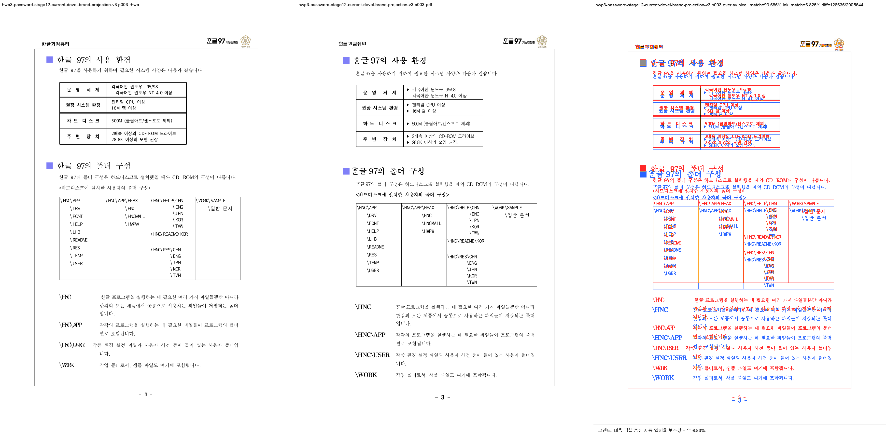
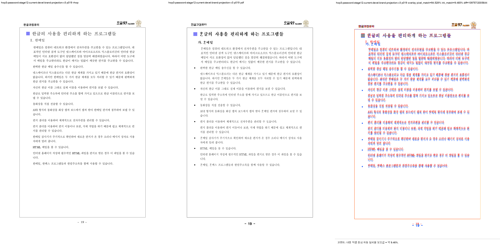

# PR #3563 검토 — 한컴 legacy 제품명 표시와 재개 가능한 visual sweep

- 검토일: 2026-07-30
- PR: [#3563](https://github.com/edwardkim/rhwp/pull/3563)
- 관련 이슈: [#3486](https://github.com/edwardkim/rhwp/issues/3486)
- 작성자 / reviewer: `@jangster77` / `@jangster77` (collaborator self-merge 후보)
- base / code candidate head: `devel` / `7d0bc0023ec3e80eedafab406fa835b4b91b9123`
- 초기 규모: 9 files, +1473 / -171 (review 기록·대표 asset 추가 전)

## 경로와 metadata

기본 경로는 collaborator self-merge이며 renderer 출력·기준 PDF 대조를 포함하므로 시각·fixture 증적
보조 경로도 적용했다. 변경이 1,000줄을 넘으므로 대형 PR 규칙에 따라 코드 review, 시각 증적, 전체 CI,
작업지시자 merge 승인을 각각 분리해 확인한다.

초기 code head `bcf4ed4f5`의 CI preflight·lint·Native Skia·Canvas visual diff·CodeQL은 성공했으나,
default-feature shard에서 #2099 fixture가 실패했다. 원인은 render tree 최종 순회가 raw `U+F53A`가 아닌
이미 PUA 확장된 `displayText`의 `ᄒᆞᆫ글`까지 제품명으로 현대화한 것이었다. 이 PR의 두 번째 code commit
`7d0bc0023`은 raw `text`가 닫힌 제품명일 때만 projection을 허용해 실제 옛한글 PUA display를 보존한다.
따라서 이전 CI는 merge 근거가 아니며 새 code candidate의 full CI를 다시 기다린다.

수정된 code candidate의 [CI run 30480431244](https://github.com/edwardkim/rhwp/actions/runs/30480431244)는
Lint, test archive, Native Skia, default-feature 8 shards와 `Build & Test` aggregate를 모두 success로
끝냈다. [Render Diff run 30480431000](https://github.com/edwardkim/rhwp/actions/runs/30480431000)의 Canvas
visual diff와 [CodeQL run 30480435841](https://github.com/edwardkim/rhwp/actions/runs/30480435841)의 세 분석도
success다. 이 review 기록은 이 green code candidate 뒤에 review-only commit으로 remote push한다. 그 뒤에는
최신 head의 preflight와 `Build & Test` aggregate를 fast-pass 조건으로 다시 확인한다.

## 변경 범위와 검토

- `scripts/visual_sweep.py`는 HWP/PDF·Git HEAD·실행 스크립트/바이너리·DPI·diff threshold
  provenance를 `run_manifest.json`으로 기록한다. 새 실행은 output을 초기화하고, `--resume`은 provenance가
  같은 경우에만 완성 artifact를 모두 갖춘 page checkpoint를 재사용한다. shard 요청과
  requested/completed/missing/run_state를 원자적으로 집계한다.
- 한컴 PDF에서 현대 글리프로 확인된 `ᄒᆞᆫ글`·`ᄒᆞᆫ메일`·`ᄒᆞᆫ팩스`·`ᄒᆞᆫ소프트`만 `displayText`로
  투영한다. raw parser/IR `text`, 검색, caret offset은 바꾸지 않으며 일반 `ᄒᆞᆫ겨울`과 CharOverlap은
  대상이 아니다.
- 문단 composer뿐 아니라 표 셀·머리말처럼 `TextRunNode`를 직접 만드는 경로에도 render tree 최종화
  순회를 적용했다. p3 표 제목이 앞선 composer-only 구현을 우회했던 결함을 이 경로가 닫는다.
- PUA `U+F53A`처럼 실제 옛한글 `ᄒᆞᆫ`으로 이미 확장된 display 문자열은 raw model text가 제품명 어휘와
  일치하지 않으므로 projection 대상이 아니다. #2099 SVG 회귀로 이 경계를 고정했다.
- legacy glyph visual 후보는 raw `text`보다 실제 paint 문자열 `displayText`를 우선 읽는다. 이미 현대
  글리프로 투영된 source text를 후보로 다시 보고하지 않는다.

이 PR은 p3의 표·줄높이·본문 배치와 같은 전반 layout fidelity를 해결하지 않는다. 해당 차이는 별도
원인으로 남기며 이 제품명 glyph 보정의 성공 근거로 섞지 않는다.

## 시각·fixture 증적

입력은 `samples/HWP3-password-123456.hwp`
(`sha256: db743d084efc9e08e839a5b4d978b16b8676434011776e090e4cda43e57304be`), 기준 PDF는
`pdf/HWP3-password-123456.pdf`
(`sha256: 3ced5ad95ad30331e2756b5b34509c1ac91dfe3c72013c8e14f2556ca6bd5776`)다. current source의
전용 release-test binary로 144 DPI에서 p3·p19만 raster/overlay/review했다. SVG와 render tree는 24쪽
export됐지만, 이 기록은 **24쪽 raster sweep 완료를 주장하지 않는다**.

임시 산출 경로는
`/private/tmp/rhwp_3486_stage12_hwp3_brand_projection_v3/hwp3-password-stage12-current-devel-brand-projection-v3/`다.
run summary는 `requested=[3,19]`, `completed=[3,19]`, `missing=[]`, `run_state=complete`이고,
두 페이지 모두 `legacy_glyph_visual_candidates=[]`다. PDF `pdftotext -bbox-layout`은 exit -6이라 text layer
일치 주장은 하지 않는다.

| 페이지 | pixel match | visual accuracy proxy | glyph 후보 | 별도 판정 |
| --- | ---: | ---: | --- | --- |
| p3 | 93.68602% | 6.82500% | 0 | `content_bottom_drift` 유지 — 표/본문 layout 차이는 범위 밖 |
| p19 | 94.52759% | 9.46458% | 0 | 제품명 glyph 후보 없음 |

p3에서 rhwp 표 제목은 이제 `한글 97의 사용 환경`으로, p19의 `한메일`·`한팩스`도 PDF와 같은 현대
글리프로 표시되는 것을 사람 눈으로 확인했다. 낮은 ink proxy는 전체 page fidelity 수치이며 이 PR의
좁은 glyph 판정을 대체하거나 전체 정합 합격을 뜻하지 않는다.

대표 PNG는 Git LFS 대상 여부를 먼저 확인한 결과 일반 Git 경로였고, 아래 두 asset을 이 PR branch에
포함한다.

- `mydocs/pr/assets/pr_3563_hwp3_password_p003_review.png`
  (`sha256: 5b72cf44f41a5156e39f05c99ac2c069985165ce9348ab356d19c3eccd8c71fe`)
- `mydocs/pr/assets/pr_3563_hwp3_password_p019_review.png`
  (`sha256: 2169370244b1960ad40f0164ccf2e026c4669d8f38031893d1eaf643a812b155`)

## 로컬 검증

| 검증 | 결과 |
| --- | --- |
| `cargo test --profile release-test legacy_hancom_product --lib` (`CARGO_TARGET_DIR=target/task3486-stage12`, `CARGO_INCREMENTAL=0`) | 3 passed — raw text 보존, 일반 옛한글 비변경, 줄 경계와 composer 우회 경로 |
| `python3 -m py_compile scripts/visual_sweep.py` | 통과 |
| `python3 scripts/tests/test_visual_sweep.py` | 12 passed — provenance/resume/shard와 `displayText` glyph 음성 회귀 |
| `cargo test --profile release-test --test issue_2099_araea_pua` (`CARGO_TARGET_DIR=target/task3486-stage12`, `CARGO_INCREMENTAL=0`) | 4 passed — U+F53A의 실제 옛한글 SVG 확장을 제품명으로 오투영하지 않음 |
| `cargo fmt --check`, `git diff --check` | 통과 |
| GitHub Actions — CI | `7d0bc0023` 기준 preflight, lint, test archive, Native Skia, default-feature 8 shards, `Build & Test` 모두 success |
| GitHub Actions — Render Diff / CodeQL | Canvas visual diff와 JavaScript·Python·Rust CodeQL 분석 모두 success |
| 전체 integration/clippy | 로컬에서 추가 실행하지 않음. 초기 code head의 CI failure는 #2099 PUA 회귀였고, 수정 candidate의 GitHub Actions로 다시 확인 완료 |

## 권고와 merge 전 조건

**권고: CI 대기 후 수용.** 제품명 한정 표시 projection은 실제 PDF와 일치하고 원문 모델을 훼손하지
않는다. 다음을 모두 충족하면 merge 후보가 된다.

1. code candidate `7d0bc0023`의 최신 CI, CodeQL, Render Diff는 success를 확인했다.
2. 이 review-only 기록과 PNG asset을 push한 최신 head에서 preflight와 `Build & Test` aggregate가
   success여야 한다.
3. merge 직전에 최신 head가 `MERGEABLE/CLEAN`이어야 하며, 작업지시자 승인을 다시 확인한다.
4. #3486은 이 PR이 제품명 glyph와 sweep 증적만 닫으므로, p3의 남은 layout fidelity 범위는 자동 close로
   처리하지 않는다.
