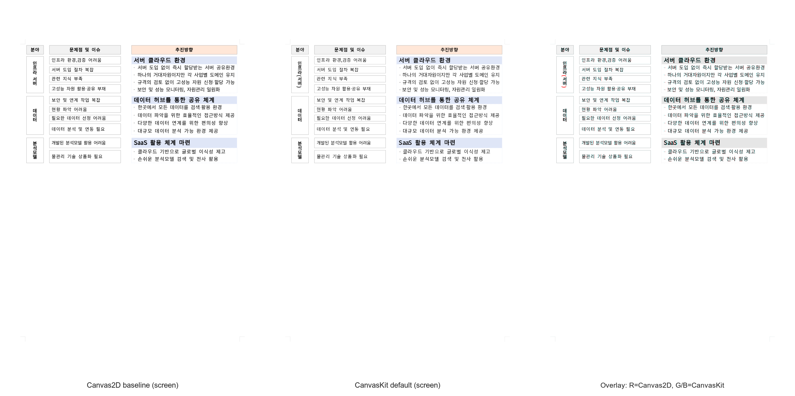

# PR #3638 검토 — CanvasKit text·stroke replay 범위 확장

- 검토일: 2026-07-31
- PR: [#3638](https://github.com/edwardkim/rhwp/pull/3638)
- 관련 이슈: [#536](https://github.com/edwardkim/rhwp/issues/536) (CanvasKit renderer 단계 추적; 이번 P41 merge 뒤에도 다음 단계가 남아 open 유지)
- 작성자 / reviewer: `@seo-rii` / `@jangster77` (collaborator 매개 외부 PR)
- base / 현재 code head: `devel` `3bd523f245c9fad99a66040f76b007a6f085b721` / `bdee8b6c7826894329090d4836125f1c786859ff`
- 원 code 변경 규모: 18 files, +1,402 / -266 (검토 기록 추가 전)

## 변경 범위와 판정

이 PR은 public 기본 renderer를 Canvas2D로 유지한 채 CanvasKit의 replay 가능 범위를 확장한다. Rust policy와
Studio browser preflight가 Unicode mark·format control, 복합 shaping script, 옛한글·boxed PUA 및 paint effect
조합을 계속 fail-closed로 두고, 안전한 producer-positioned nominal text만 CanvasKit으로 보낸다. stroke는
solid·dash·dot·dash-dot·dash-dot-dot의 `PathEffect` 수명과 함께 replay하며, vertical text·vertical presentation
punctuation, text ratio·shade·shadow·outline·emboss·engrave 및 `한양중고딕` 별칭도 같은 ready 경계에서 다룬다.

검토에서는 다음 계약을 확인했다.

- browser runtime의 shaping guard가 Rust `canvaskit_policy`와 같은 금지 경계를 적용하고, 불확실한 text run은
  Canvas2D fallback을 유지한다.
- dash effect 객체는 stroke draw가 끝날 때까지 보존되고, 지원하지 않는 stroke/style은 CanvasKit readiness를
  통과한 것으로 표시하지 않는다.
- `table-004` readiness fixture가 dash 12건, vertical presentation punctuation 2건, vertical text run 14건을
  실제 browser replay에서 세도록 고정한다. 이는 단위 계약만으로는 놓칠 수 있는 CanvasKit draw-path 경계다.
- source branch의 최신 merge commit `bdee8b6`은 현재 `upstream/devel` `3bd523f`을 조상으로 포함한다. 최신
  devel 위 merge simulation은 conflict 없고 `git diff --check`도 통과했다.

## 검증

| 검증 | 결과 |
| --- | --- |
| 최신 `devel` 위 merge simulation / `git diff --check` | conflict 없음 / 통과 |
| `CARGO_TARGET_DIR=target/review-seo-rii-20260731 CARGO_INCREMENTAL=0 cargo test --profile release-test --lib renderer::canvaskit_policy` | 42 passed, 0 failed |
| `npm --prefix rhwp-studio run e2e:renderer-contract` | renderer backend contract guard 통과 |
| `CARGO_TARGET_DIR=target/review-seo-rii-20260731 CARGO_INCREMENTAL=0 wasm-pack build --target web --out-dir pkg` | release build 및 `wasm-opt` 통과 (2m 36s) |
| `cargo test --profile release-test --tests` | 작업지시로 로컬 재실행하지 않음. 최신 code head의 GitHub Actions `Build & Test` 완료 결과를 통합 근거로 사용 |
| GitHub Actions (현재 code head `bdee8b6`) | CI preflight, Lint, frontend package gates, Native Skia, default-feature 8 shards, Build test archive, `Build & Test`, CodeQL, Canvas visual diff 모두 success |

### 시각 검증 기록

CanvasKit 변경의 직접 판정은 SVG/PDF sweep이 아니라 동일 browser capture에서 Canvas2D와 CanvasKit default를
대조하는 readiness gate다. current code head의 [Canvas visual diff](https://github.com/edwardkim/rhwp/actions/runs/30621047246/job/91125438952)는 고정 Chromium/default surface에서 8/8을 통과했다. 대표
`table-border-style`의 p0은 selected diff ratio/ink mask `0.004510677812893226`(한계 `0.005`), non-ink
pixel `2`(한계 `4`), solid-ink ratio `0.003971235737308532`(한계 `0.0065`), expected/actual ink
`61,090 / 59,106`(최소 `50,000`)이다. feature count도 dash `12`, vertical presentation punctuation `2`,
vertical text run `14`로 정확히 일치했고 unsupported/error는 없었다.

CI artifact `render-diff-artifacts`의 동일 p0 capture로 만든 대표 panel은
`mydocs/pr/assets/pr3638_canvaskit_table_border_style_backend_parity_review_p0_3way.png`
(`sha256:f1db65b3a945c19205e949c4ad0921b66901aee7532465d3e0bf0c3041ab9311`)에 보존했다. 왼쪽은 Canvas2D,
가운데는 CanvasKit default, 오른쪽은 R=Canvas2D·G/B=CanvasKit의 channel overlay다.

로컬에서는 사용자가 이미 실행한 Vite `:7700`을 이용해 같은 8개 readiness sample을 다시 캡처했다. host
Chrome 146/software surface에서 `table-border-style`만 selected ratio `0.005470682837218587`로 한계보다
`0.000470682837218587` 높아 7/8이었다. 그러나 feature count(12/2/14), non-ink `0`, solid-ink
`0.0046587`, actual ink `59,978`, unsupported/error `0`은 모두 통과했다. 이는 CI의 pinned Chromium/default
surface와 다른 local host raster 결과이므로 숨기지 않고 기록하되, merge 판정은 동일 code head에서 통과한 CI
canonical run을 사용한다.

이 panel의 Canvas2D는 browser backend 비교 기준이지 한컴 HWP/PDF 정답지가 아니다. 기존
`samples/table-004.hwp`와 1쪽 기준 PDF `pdf/table-004-2022.pdf`는 fixture provenance로 보존되어 있지만,
이번 P41의 직접 증거를 외부 PDF 충실도 판정으로 확대하지 않는다.

## 권고와 merge 전 조건

**권고: 수용.** 현재 code head `bdee8b6c7826894329090d4836125f1c786859ff`의 full CI와 CodeQL,
Canvas visual diff, `Build & Test`가 모두 success이고 merge 상태는 `MERGEABLE`·`CLEAN`이다. 이 archive
review·시각 증적·오늘할일만 추가한 최신 head가 review-only fast-pass의 preflight와 최종 `Build & Test`
aggregate를 통과하고 mergeability를 유지하는지 확인한 뒤 승인·squash merge한다. merge 뒤에는 #536을 추적
상태로 유지한 사실, contributor 결과 comment, `devel` sync와 review branch·전용 Cargo target 정리를 확인한다.
