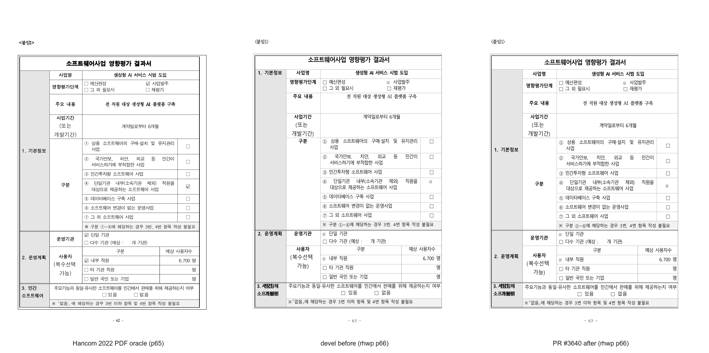
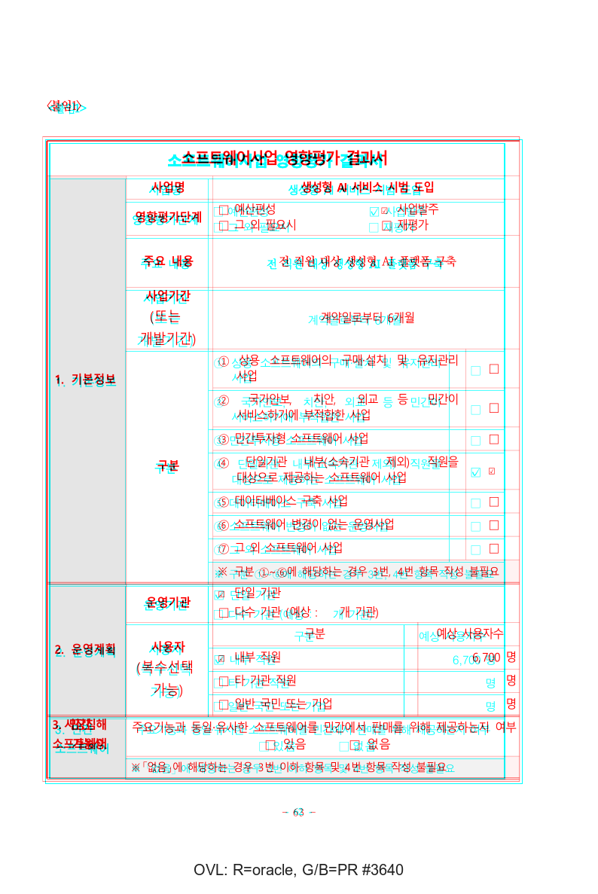

# PR #3640 검토 — 실제로 잘린 중첩 표 셀에만 Top 세로정렬 적용

- 검토일: 2026-07-31
- PR: [#3640](https://github.com/edwardkim/rhwp/pull/3640)
- 관련 이슈: [#3592](https://github.com/edwardkim/rhwp/issues/3592) (`closes #3592`; merge 뒤 close 상태 재확인 필요)
- 작성자 / reviewer: `@NacreousCloud` / `@jangster77` (collaborator 매개 외부 PR, 첫 기여자)
- base / 현재 code head: `devel` `c7be19d7d07ea470e0690908db190aeffe19bc3d` / `45b05be4380a1fdf6bcdaccb00606c693980a708`
- 원 code 변경 규모: 2 files, +192 / -1 (검토 기록·증적 추가 전)

## 변경 범위와 판정

중첩 표의 부분 렌더가 행 범위 필터를 가질 때, 기존 구현은 보이는 조각의 모든 셀을
`VerticalAlign::Top`으로 덮었다. 이 PR은 반열림 visible row range `[sr, er)` 밖으로 실제로 걸치는
셀에만 그 정책을 한정한다.

```rust
let cell_end_row = (r + cell.row_span as usize).min(row_count);
let cell_clipped_by_row_filter = row_filter.is_some_and(|(sr, er)| {
    r < sr || cell_end_row > er
});
```

`r < sr`은 이전 조각에서 시작한 rowspan cell의 상단 잘림, `cell_end_row > er`은 현재 조각 아래로
이어지는 하단 잘림이다. 어느 쪽도 아닌 셀은 조각에 온전히 들어가므로 원래 HWP model의
`cell.vertical_align`을 유지한다. Pagination의 `end_row`가 exclusive이고 기존 visible-cell skip도 같은
반열림 범위를 사용함을 교차 확인했다. 따라서 Task #44의 실제 split cell Top 정책을 보존하면서
[#3592](https://github.com/edwardkim/rhwp/issues/3592)의 지나친 Top 강제만 제거한다.

새 integration 회귀는 한컴 기준에서 중앙 정렬된 `1. 기본정보`·`2. 운영계획`·`5. 종합의견`과, 문서 전체의
Center 중첩 셀을 render tree에서 직접 대조한다. source contributor commit `8cd14d6` 뒤의
`45b05be`는 현재 `upstream/devel`을 merge한 최신 PR head이며, devel 위 merge simulation은 conflict 없이
완료했고 `git diff --check`도 통과했다.

## 검증

| 검증 | 결과 |
| --- | --- |
| 최신 `devel` 위 merge simulation / `git diff --check` | conflict 없음 / 통과 |
| `CARGO_TARGET_DIR=target/review-nacreouscloud-20260731 CARGO_INCREMENTAL=0 cargo test --profile release-test --test issue_3592_row_filter_valign` | 2 passed, 0 failed |
| 로컬 `cargo test --profile release-test --tests` | 시작 후 작업지시로 중단. 결과를 통과로 쓰지 않으며 current-head CI로 대체 |
| GitHub Actions (현재 code head `45b05be`) | CI preflight, Lint, Build test archive, default-feature 8 shards, Native Skia, `Build & Test`, CodeQL, Canvas visual diff 모두 success |

## 시각 검증 기록

직접 대상 fixture는 `samples/kps-ai.hwp`
(`sha256:9b0fceb3d96956f27c893e15a72a1ad94f7ee005bd581381a1aadfcb1f57a7b9`)와 한컴 2022 기준
`pdf/kps-ai-2022.pdf`
(`sha256:7c064fd290368369a3c8eaa7d7b03668c46fb4dfe0fc18ba52d00456ffe01d28`)다. candidate와 devel에서
각각 78쪽 SVG를 export했으며, 76쪽은 byte-identical이고 변화는 결함 조각인 rhwp 66·67쪽에만 있었다.
기준 PDF는 77쪽이라 `task1274_visual_sweep.py`의 같은 페이지 번호 자동 매칭을 이 판정에 쓰지 않았다.
대신 PR이 재현한 대응인 **PDF 65 ↔ rhwp 66**을 직접 raster했다. 인쇄 footer는 각각 62·63으로 다르지만,
두 페이지 모두 같은 `소프트웨어사업 영향평가 결과서` 첫 조각(사업명·기본정보·운영계획)을 담는 기존
pagination offset이다. 이 offset은 devel과 candidate 모두에서 같고 이번 변경 범위가 아니다.

정답지·devel·candidate 3-way와 channel overlay를 사람이 확인했다. devel의 `1. 기본정보` 등은 cell
상단에 남지만 candidate는 한컴 기준의 중앙 위치로 돌아온다. 표선·행 높이·나머지 content geometry를
바꾸지 않고, 글자 주변의 red/cyan 미세 fringe는 한컴/오픈소스 폰트 메트릭 차이로 해석한다.

- 임시 3-way: `output/pr3640-visual-review/kps-ai_row-filter-valign_p066_3way.png`
- 임시 after OVL: `output/pr3640-visual-review/kps-ai_row-filter-valign_p066_ovl_labeled.png`
- 안정 3-way: `mydocs/pr/assets/pr3640_kps_ai_row_filter_valign_review_p66_3way.png`
  (`sha256:f6d8515461837f0b6b748490a32cdbe00576e26e35ce18e6e2445224aa20b81d`)
- 안정 OVL: `mydocs/pr/assets/pr3640_kps_ai_row_filter_valign_review_p66_ovl.png`
  (`sha256:4dcef850b42e16e8d9f99c5ebca8f9e898245c246f9c60ad7a6c3458ffde60ad`)





이 시각 자료는 한컴 기준 PDF와 rhwp의 해당 table fragment를 판정하는 증적이다. 전체 문서의 77/78쪽
offset이나 기존 페이지 23·36의 layout overflow diagnostic을 이번 수정의 성공으로 확대하지 않는다. 후자는
candidate와 devel SVG가 동일한 기존 진단이다.

## 권고와 merge 전 조건

**권고: 수용.** 현재 code head `45b05be4380a1fdf6bcdaccb00606c693980a708`의 full CI와 CodeQL,
Canvas visual diff, `Build & Test`가 모두 success이고 merge 상태는 작성 시점 `MERGEABLE`·`CLEAN`이다.
이 archive review·시각 증적·오늘할일만 추가한 최신 head가 review-only fast-pass의 preflight와 최종
`Build & Test` aggregate를 통과하고 mergeability를 유지하는지 다시 확인한 뒤 승인·squash merge한다.
merge 뒤에는 #3592 close 상태, 첫 기여자에게 남길 구체적인 감사 comment, `devel` sync와 review branch·전용
Cargo target 정리를 확인한다.
