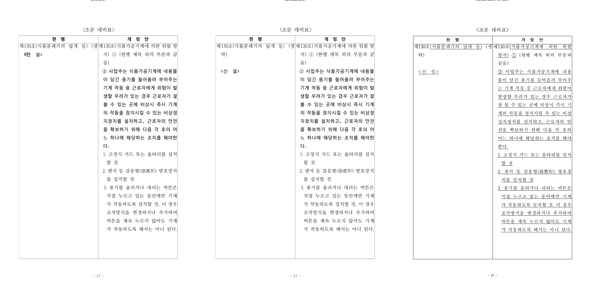
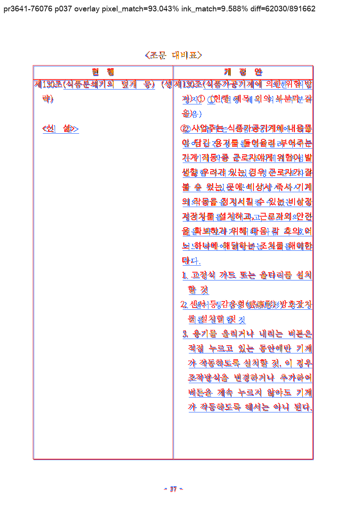

# PR #3641 검토 — 셀 문단 `vpos=0` 센티널을 절대 앵커로 쓰지 않기

| 항목 | 값 |
| --- | --- |
| 작성자 / reviewer | `@NacreousCloud` / `@jangster77` |
| 원 PR / 관련 이슈 | [#3641](https://github.com/edwardkim/rhwp/pull/3641) / [#3593](https://github.com/edwardkim/rhwp/issues/3593) |
| 원 head 참고값 | `1357ea41efa1c0c08152a9a3ee40e737c92141b1` |
| 통합 후보 | [#3657](https://github.com/edwardkim/rhwp/pull/3657) `f45799a46451557731458663f9b9d9dea8a6971e` |
| 원 변경 규모 | 5 files, +445 / -34 |
| 권고 | #3657로 수용 |

## 변경과 통합 판정

`LINE_SEG.vertical_pos == 0`은 첫 셀 문단에서는 유효한 셀 상단 좌표지만, 둘째 이후 문단에서는
앵커 미기록 센티널일 수 있다. PR은 이 경계를 `first_seg_vpos_is_anchor`와
`cell_vpos_ladder_is_intact`로 한 곳에 모으고, 셀 문단 배치·저장 flow 신뢰·중첩 표 호스트 셀 높이
측정의 세 소비지에 일관되게 적용한다. 따라서 붕괴한 사다리에서 문단이 같은 y에 겹치거나,
`max(vpos + line_height)`가 셀 높이를 한 문단분으로 축소하는 경로를 피한다.

통합 branch는 원 PR의 기능 커밋 `379ec0189`·`bbd38650e`·`0904c3a39`을
`02c176c18`·`59ff9ab9b`·`d06e14516`으로 순서대로 체리픽했다. 원 head의 `devel` 병합 commit은
제외했으며 `git range-diff`로 세 patch가 동등함을 확인했다. 추가 collaborator commit
`f45799a46`은 #3642로 페이지 위치가 달라져도 fixture를 전체 순차 조판에서 찾도록 회귀를
안정화한 것으로, `vpos` 판정 계약 자체는 바꾸지 않는다. 충돌은 없었다.

## 검증

| 검증 | 결과 |
| --- | --- |
| 원 #3641 head CI | `Build & Test`, default-feature 8 shards, Native Skia, lint, CodeQL, Canvas visual diff success |
| 통합 #3657 head CI | 동일한 full CI, CodeQL, Canvas visual diff 및 `Build & Test` success |
| 체리픽 동등성 / diff | `git range-diff` 동등, `git diff --check` 통과 |
| 추가 로컬 Cargo | 작업지시에 따라 중복 실행하지 않음. 성공 근거로 사용하지 않음 |

원 PR CI는 [CI run](https://github.com/edwardkim/rhwp/actions/runs/30624980213), 정확한 통합 head의
CI는 [#3657 CI run](https://github.com/edwardkim/rhwp/actions/runs/30626257965)에서 확인했다.

## 시각 증적

기준 fixture는 `samples/76076_regulatory_analysis.hwp`
(`sha256:3308ba8505391bae2d0d62963e9399f4e48cdae574304cc0f89a311c6efbb6b5`)와 한컴 2024
출력 `samples/issue1891/76076_regulatory_analysis-2024.pdf`
(`sha256:06a389455d6b96e5f6580c9930fd8555256f9c712be85fb3cdaf31fc601a090d`)다. 96 DPI로 37쪽을
비교했다. candidate는 82쪽 SVG와 render tree를 전수 export했고, 요청한 37쪽의 raster·compare·overlay·review
모두 완료했다.

- 임시 3-way / OVL: `output/pr3641-3642-visual/pr3641-76076/review/review_037.png`,
  `output/pr3641-3642-visual/pr3641-76076/overlay/overlay_037.png`
- 안정 3-way: `mydocs/pr/assets/pr3641_cell_para_vpos_review_p037_3way.png`
  (`sha256:98f8e61070d9bd4b513ad7e93409d523556b03d30cfaabe575e93ab13e129968`)
- 안정 OVL: `mydocs/pr/assets/pr3641_cell_para_vpos_review_p037_ovl.png`
  (`sha256:f3d7dae35131c77213fbc13ca2290309e5f270c3b86e4243acc045fe483b6eea`)

사람이 3-way를 확인해 devel에서 겹치던 `… (생 략)`과 `<신 설>`이 candidate에서 서로 다른
baseline으로 복구된 것을 확인했다. 자동 구조 검출의 flagged page는 0건이다. 다만 pixel match 93.04333%,
ink match/visual-accuracy proxy 9.5878%는 폰트와 조판 차이가 큰 밀집 2단 페이지에서 ink 지표가
지배됨을 보여 준다. 이 수치를 PDF 전체 정합 성공으로 확대하지 않고, 이 PR이 겨냥한 셀 문단 겹침의
대표 페이지 판정으로만 사용한다.

## 권고와 merge 전 조건

**권고: 수용.** #3657의 현재 code head full CI가 성공했고 상태는 작성 시점 `CLEAN`·`MERGEABLE`이다.
archive review·증적·오늘할일만 추가한 review-only head의 preflight와 `Build & Test` aggregate를 다시
확인한 뒤 #3657을 merge한다. merge 뒤 #3593 close 상태와 원 PR #3641의 supersede 처리, contributor
감사 comment, devel 동기화와 검토 자원 정리를 확인한다.
