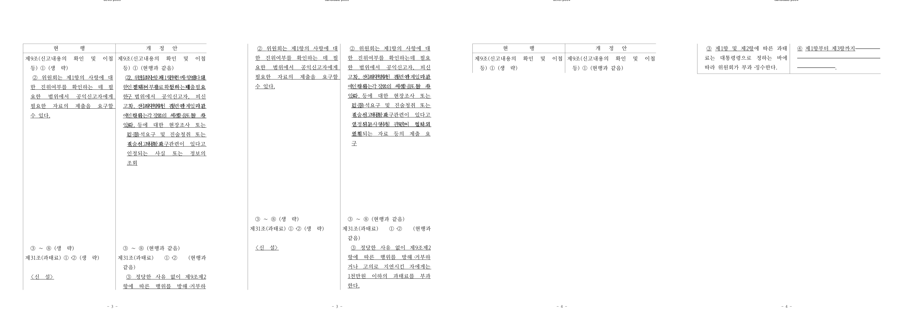
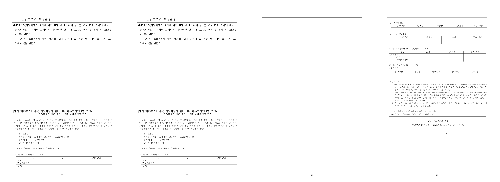

# PR #3642 검토 — 중첩 표 분할 조각의 행 정체성 보존

| 항목 | 값 |
| --- | --- |
| 작성자 / reviewer | `@NacreousCloud` / `@jangster77` |
| 원 PR / 관련 이슈 | [#3642](https://github.com/edwardkim/rhwp/pull/3642) / [#3595](https://github.com/edwardkim/rhwp/issues/3595) |
| 원 head 참고값 | `100d4de3a9f08bfe5dc9fd08a7b7a20b5dbf644e` |
| 통합 후보 | [#3657](https://github.com/edwardkim/rhwp/pull/3657) `f45799a46451557731458663f9b9d9dea8a6971e` |
| 원 변경 규모 | 3 files, +190 / -21 |
| 권고 | #3657로 수용, 꼬리 문단은 #3658로 분리 |

## 변경과 통합 판정

이 PR은 다문단 셀에서 per-중첩행 분해 조건은 문단 단위인데, cut range 전달은
`cell.paragraphs.len() == 1`로 막던 불일치를 고친다. 컷 유닛에 이미 저장된 `nested_row`를 읽어
`nested_row_range_from_cut_units`로 행 범위를 만들고, 해당 문단의 `NestedTableSplit`에 전달한다.
따라서 연속 페이지가 `available_h`의 0-offset 폴백으로 행 0부터 재렌더하지 않고, 실제 cut 행부터
이어 그린다. 픽셀 offset으로 행 범위를 유도하는 혼재 문단 경로도 함께 고정한다.

원 기능 커밋 `2e754c2e0`·`fd776d143`·`98115bed4`는 통합 branch에서
`2be4fa07d`·`a948d8b29`·`27786a712`으로 patch 동등하게 적용했다. 원 head의 `devel` 병합 commit은
제외했고 충돌은 없었다. base `44d046bf7`에는 선행 #3640의 실제 clipped-cell 세로정렬 보정이 이미
포함되어 있어, #3642가 복구하는 분할 행을 기존 Top 강제 결함에 다시 노출하지 않는다.

## 검증

| 검증 | 결과 |
| --- | --- |
| 원 #3642 head CI | `Build & Test`, default-feature 8 shards, Native Skia, lint, CodeQL, Canvas visual diff success |
| 통합 #3657 head CI | 동일한 full CI, CodeQL, Canvas visual diff 및 `Build & Test` success |
| 구조 회귀 | `nested_table_sharing_a_paragraph_with_text_is_not_dropped`가 둘째 행 marker를 render tree 전체에서 확인 |
| 추가 로컬 Cargo | 작업지시에 따라 중복 실행하지 않음. 성공 근거로 사용하지 않음 |

원 PR CI는 [CI run](https://github.com/edwardkim/rhwp/actions/runs/30625062531), 정확한 통합 head의
CI는 [#3657 CI run](https://github.com/edwardkim/rhwp/actions/runs/30626257965)에서 확인했다.

## 시각·구조 증적과 남은 범위

이 두 fixture에는 한컴 기준 PDF가 없으므로 OVL 정합을 주장하지 않는다. 대신 PDF 없이도 확정 가능한
구조 계약, 즉 모델에 있는 둘째 중첩행 marker가 전체 render tree에 존재하는지와 연속 페이지의 행 순서를
확인했다.

- `samples/basic/issue2007_nested_cell_pagination_42065.hwp` p3→p4: devel의 행 0 재렌더 대신
  candidate가 다음 행으로 이어지는 2×2 panel
- `samples/task2097/75544_pii_bunseok.hwpx` p59→p60: 다문단 호스트 셀의 중첩 표 조각 연속 panel
- 안정 asset: `mydocs/pr/assets/pr3642_nested_split_row_identity_review_p003_p004_2x2.png`
  (`sha256:de1f6ee08fac2f8f8826534ec2bf2974963063a925b1ce111cff64cde125c777`),
  `mydocs/pr/assets/pr3642_nested_split_row_identity_review_p059_p060_2x2.png`
  (`sha256:e27ab16318c7360a31546c67ae7e59ab707494a2fa97c2af04f84929457dabd1`)

`nested_table_tail_paragraph_is_rendered`는 의도적으로 `#[ignore]` 상태로 유지한다. 이는 #3595의
행 정체성 결함과 별개로, 빈 `end_cut`이 마지막 continuation을 만들지 않아 꼬리 문단을 남기는 문제다.
삭제하거나 통과한 것처럼 처리하지 않고 [#3658](https://github.com/edwardkim/rhwp/issues/3658)에
`issue2007` 1건·`75544` 8건과 함께 분리했다.

## 권고와 merge 전 조건

**권고: 수용.** #3657의 현재 code head full CI가 성공했고 상태는 작성 시점 `CLEAN`·`MERGEABLE`이다.
archive review·증적·오늘할일만 추가한 review-only head의 preflight와 `Build & Test` aggregate를 다시
확인한 뒤 #3657을 merge한다. merge 뒤 #3595 close 상태, #3658 open 상태, 원 PR #3642의 supersede
처리, contributor 감사 comment, devel 동기화와 검토 자원 정리를 확인한다.
