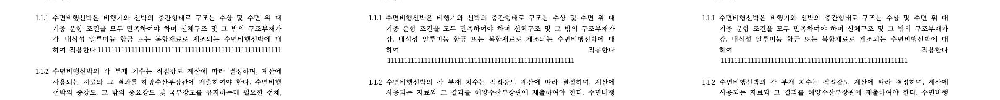

# PR #3745 검토 — 거대 표 셀 stable 입력 cursor·repaint 병목 제거

## 라우팅

```text
base route: collaborator self-merge
modifiers: intake_and_review.md, local_validation.md,
  visual_fixture_evidence.md, rework_and_exceptions.md (1,000줄 초과)
review 의견 시점 head: a0891ab2b10e65f960bd8641d4133a35a7864162
review 보정 시작/현재 원격 head: 95dc3e1261b0de47e12d762428a842fe988c2b2a
로컬 code candidate: 6dd0795af35fd030c2ef3fae0fb22cc28092d10c
```

## PR metadata

| 항목 | 값 |
| --- | --- |
| PR | [#3745](https://github.com/edwardkim/rhwp/pull/3745) |
| 관련 issue | [#3137](https://github.com/edwardkim/rhwp/issues/3137), 본문의 `Closes #3137` |
| 후속 architecture | [#3743](https://github.com/edwardkim/rhwp/issues/3743) |
| 작성자 | `@postmelee` |
| base / 원격 head | `devel` / `issue-3137-stable-input-fast-path` |
| review 의견 시점 head | `a0891ab2b10e65f960bd8641d4133a35a7864162` |
| review 보정 시작/현재 원격 head | `95dc3e1261b0de47e12d762428a842fe988c2b2a` (작성 시점 참고) |
| review 의견 | [issuecomment-5152897760](https://github.com/edwardkim/rhwp/pull/3745#issuecomment-5152897760) |
| 원격 변경 규모 | 24 files, +4,728 / -34 (작성 시점 참고) |
| 원격 상태 | open, ready, mergeable (작성 시점 참고) |

## 변경 범위와 판정

stable horizontal tail edit에서 exact cursor page-tree rebuild와 full Canvas replay를 제거한다.
자동 줄바꿈·Enter·문단 split/merge·pending pagination은 정확성을 위해 기존 전체 경로를 유지한다.

review 지적 3건은 로컬 code candidate에서 보정했고, focused Rust·Studio·production WASM·browser
검증과 transient Canvas 시각 증적이 통과했다. 다만 원격 head에는 아직 이 보정이 없고 현재 CI의
default-feature shard 3과 `Build & Test` aggregate가 실패했고 shard 4·5는 취소됐다. 따라서 현재 판정은
**보정 완료·push 승인 대기**이며, 최신 보정 head의 CI 성공과 작업지시자 승인 전에는 merge하지 않는다.

## Review 보정

| 발견 | 보정 | commit |
| --- | --- | --- |
| partial repaint마다 여백 가이드가 누적 | focused patch rect로 margin-guide stroke를 clip하고 full render는 기존 unclipped 경로 유지, 실제 `PageRenderer`를 포함한 동작 테스트 3건 추가 | `23967640f7aaeb991eb1d2d48938b5c4ce469a4c` |
| layout bbox 기반 text cull이 실제 잉크를 누락할 수 있음 | plain `TextRun`/`FootnoteMarker`만 `2 × max(line height, font size)` envelope로 cull하고 italic·shadow·outline·emboss/engrave·rotation·vertical·char-overlap·editor mark는 fail-closed replay | `b48ca8785439b1e373635aa0f55cb5de92748722` |
| 매 편집마다 `ResolvedStyleSet` deep clone | mutation 전후 짧은 `&self.styles` 불변 borrow로 geometry를 계산하고 `Copy` 결과만 유지 | `6dd0795af35fd030c2ef3fae0fb22cc28092d10c` |

## 정확성·성능 재측정

text culling을 전부 제거한 correctness-first 80ms smoke는 focused patch p95 17.6–18.0ms,
page repaint p95 17.7–18.3ms, input→2-rAF p95 19.8–20.4ms로 frame gate 0/6이었다.
채택한 보수적 envelope는 같은 smoke에서 각각 1.3–1.4ms, 1.4–1.5ms, 8.3–9.0ms로 6/6을
통과했다.

clone 제거 전 culling-fix production WASM의 canonical 24개 행렬은 다음과 같다.

- operation p95 0.7–1.3ms, focused WASM patch p95 1.3–1.4ms
- page repaint p95 1.4–1.6ms, input→2-rAF p95 8.4–15.6ms
- 24/24, 800 samples와 geometry/tree patch/dirty payload 800/800/800
- 실제 partial repaint 713회, full repaint·exact cursor·long task·flush/begin/step 0회

clone 제거까지 반영한 clean head `6dd0795af`에서는 전체 행렬을 반복하지 않고 80ms 최종 smoke를
실행했다. 6/6 통과, operation p95 0.7–1.1ms, repaint p95 1.4–1.5ms, 2-rAF p95
7.5–9.0ms였고 partial 200회, full/exact/flush/long task 0회였다.

임시 결과 경로:

- `output/poc/task3137/pr3745-no-cull-smoke/`
- `output/poc/task3137/pr3745-conservative-cull-smoke/`
- `output/poc/task3137/pr3745-conservative-cull-matrix/`
- `output/poc/task3137/pr3745-final-source-smoke/`

## 제한 로컬 검증

| 검증 | 결과 |
| --- | --- |
| margin-guide focused/full/실제 `PageRenderer` 동작 | 3 / 3 |
| conservative text replay native unit | 2 / 2 |
| `issue3137_focused_cell_geometry_matches_exact_rect` | 1 / 1, 실제 HWP/HWPX |
| atomic IME replace / deferred delete revision | 2 / 2 |
| `cargo fmt --all -- --check` / `git diff --check` | 통과 |
| `cargo check --lib` | culling-fix head `b48ca8785`에서 통과; 이후 clone 변경은 focused test와 WASM build로 컴파일 확인 |
| Studio `npx tsc --noEmit` | 통과 |
| 관련 Studio unit | 76 / 76 |
| production `wasm-pack build --target web --out-dir pkg --release` | 통과 |
| 최종 production WASM | 7,452,333 bytes, SHA-256 `5c42bdf6d6d775bc27a5f0c9181d9c4414b8b65bb3dbe9ab0d9ffb3317da22a7` |
| 최종 HWP/HWPX 80ms browser smoke | 6 / 6 |
| #2214/#2424 HWP/HWPX focused/raw/delete/IME/save | 형식별 1회 통과; print는 HWP 1회 통과 |

release-test 전체와 Native Skia 3종은 이번 Web Canvas review 보정에서 반복하지 않았다. 원격
`95dc3e126`의 lint, Frontend package gates, Native Skia, Canvas visual diff와 일부 shard 성공은
참고값일 뿐이고, 실패한 shard 3·aggregate와 취소된 shard 4·5를 포함해 최신 보정 head CI를
다시 확인해야 한다.

## 시각·fixture 증적

| 자산 | 역할 | SHA-256 |
| --- | --- | --- |
| `samples/issue1949_giant_cell_nested_tables_perf.hwp` | 115쪽 HWP fixture | `ef10261cd29325116028e4f4f3e6be1a72c675eb771bddfd8484e7fe5aa94b4e` |
| `samples/issue1949_giant_cell_nested_tables_perf.hwpx` | 동등 HWPX fixture | `fc6e5f156de470dfbb14aab392389491720ee7fb1bf6f03fe9a018e93b420c65` |
| `mydocs/pr/assets/pr_3745_issue3137_partial_repaint_review.png` | 왼쪽 55입력, 가운데 56입력 2-rAF, 오른쪽 pagination 완료 | `01e45ee7729271eb1b62042380e764ad08247015528602a0cc314bd177e5dfb0` |

HWP/HWPX 모두 55→56 입력 crop에서 7,404 pixel(3.88539%)이 바뀌어 4→5줄 전환을 포착했다.
56 입력의 2-rAF·100ms·850ms·1600ms·pagination 완료 crop은 changed pixel 0이며 동일 hash다.
두 형식의 crop hash도 서로 같았다. `--require-focused-repaint` 최종 smoke가 partial 200회와 full
repaint 0회를 별도로 단언하므로, 이 PNG와 trace를 결합해 본문 유지와 partial path를 판정한다.



margin-guide는 본문 crop 밖이므로 대표 PNG가 직접 증명하지 않는다. 대신 patch clip 호출 순서,
full render의 unclipped 경로, 실제 `PageRenderer`의 patch 전달을 검증한 3개 동작 테스트로 판정했다.
위험한 이웃 잉크도 별도 fixture로 시각 재현하지 않았고, 독립 잉크 효과를 culling하지 않는 native
계약으로 fail closed를 검증했다. 정적 PDF visual sweep은 transient partial Canvas path를 실행하지
않으므로 수치를 만들지 않았다.

## 위험·후속 범위

자동 줄바꿈·Enter 중 incremental flow와 동일 revision 게시 문제는 #3743의 `CellFlowTree`, 영속
`PageCheckpoint`, viewport 기반 `DisplaySnapshot`으로 분리한다. #3745 fast path를 구조 편집까지
확장하지 않으며 저장·인쇄는 full pagination barrier를 유지한다.

## 원격 상태 변경과 최종 권고

이 review 보정 세션에서는 원격 push, PR comment/review reply, thread resolve, approve, ready/draft
변경, merge, issue close를 수행하지 않았다. 작업지시자 승인 뒤 원 PR branch에 push하고 최신 head
CI를 확인하기 전의 권고는 **보정 완료·게시 승인 대기**다.
