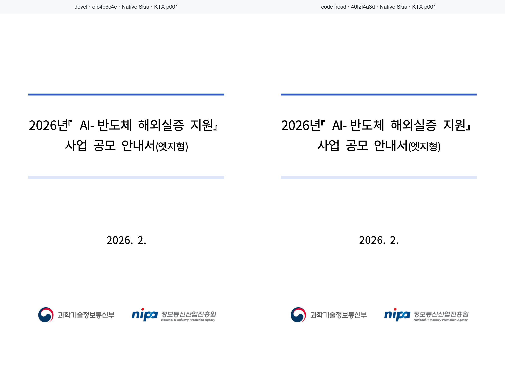

# PR #3272 검토 기록 — 그림 변환 결과 메모

## 메타

| 항목 | 값 |
| --- | --- |
| 원 PR | [#3272](https://github.com/edwardkim/rhwp/pull/3272) |
| 작성자 | `lpaiu-cs` |
| 관련 이슈 | #2520 (원 PR 본문 `closes #2520`; 통합 PR merge 전까지 close로 단정하지 않음) |
| 원 head | `ab811440bc500c96109d78228da679589f214dc6` (작성 시점 참고값) |
| base / 상태 | `devel` / `MERGEABLE`, `BEHIND` (작성 시점 참고값) |
| 원 변경 | 1 파일, +306/-15 (`src/renderer/image_resolver.rs`) |
| 누적 검토 branch | `review/lpaiu-cs-20260725` (`upstream/devel` `efc4b6c4c58b696c2fd4d28bbb82cbfeb6e0499d`) |
| 적용한 contributor commits | `7c098e0d164f242742c86754bcc921f2b3991afb` → `c0c566a4c`, `b873d66a3720447758874c9410e6f82cdcce244c` → `640d41320` |

## 변경 검토

그림 byte→byte 변환 7종의 결과를 thread-local LRU 메모에 저장한다. 결과 바이트 16 MiB와 `None`
결과를 포함한 항목 수 64를 모두 제한하므로, 회색 JPEG PNG 재인코딩 결과와 색 JPEG의 음성 결과가
각각 무한히 쌓이지 않는다.

초기 표본 key(길이와 앞·뒤 4 KiB)는 같은 크기·같은 가장자리·다른 가운데 픽셀의 BMP가 서로의
변환 결과를 받는 P1 결함이었다. 후속 `b873d66a`는 변환 종류와 **전체 바이트**를 해시하고, 실제로
파란 가운데가 빨강으로 바뀌지 않는 BMP 회귀 테스트를 추가했다. 이 P1 보정은 누적 branch에 포함됐다.

`u64` session key에는 이론적 hash collision 가능성이 남지만, 이전의 재현 가능한 표본 충돌은 제거됐고
현재 메모는 외부 저장·보안 digest가 아니다. 충돌을 재현하거나 메인터너 지시가 생기기 전에는 별도
cryptographic digest로 범위를 넓히지 않는다.

## 시각 검증

renderer 변경이므로 Native Skia before/current 대조를 수행했다. 원 PR은 새 fixture나 기준 PDF를
추가하지 않아 HWP 2020 PDF 대조 대상은 없다. 대신 image node가 실제로 있는 기존 fixture를 선택했다.

| 항목 | 값 |
| --- | --- |
| 원본 | `samples/KTX.hwp` (SHA-256 `b6c1492152f53e8dd7d4bbbb4faca88866bb8458e9018c70c936cd469ea6fab3`) |
| 기준 | `devel` `efc4b6c4c` Native Skia release binary |
| 현재 | code head `40f2f4a3d` Native Skia release binary |
| 방법 | `export-png`으로 image node 포함 1·17쪽을 각각 출력 후 SHA-256 및 pixel 비교 |
| 결과 | 1쪽 `4d7508…b7f56`, 17쪽 `3f6586…856d9`: 기준·현재 PNG SHA-256이 각각 동일, pixel match 100% |
| 임시 산출물 | `/tmp/rhwp-3272-visual.MA5Un0/{base,current}-p001`, `{base,current}-p017` |
| 대표 asset | `mydocs/pr/assets/pr_3272_lpaiu-cs_issue2520_p001_review.png` (SHA-256 `5026c386ca8f760a51fc213f0871dda36575302bdc1e989d2976b509630eafbe`) |

사람이 대표 asset의 좌·우 문서 제목, 하단의 과학기술정보통신부·NIPA image를 확인했고 차이가 없음을
확인했다. 1쪽과 17쪽 모두 raw PNG SHA-256이 같으므로 pixel match와
`visual_accuracy_proxy_percent`는 100%다. 이 검증은 성능 cache가 출력 바이트를 바꾸지 않는다는
회귀 확인이며, 한컴 출력 정합 자체를 새로 주장하지 않는다.

## 로컬 검증

통합 branch 전체에서 Rust release build·release lib, release-test 전체, Native Skia 공식 3종,
fmt, diff check, clippy, doc test, TypeScript, Studio test, WASM build를 실행했다. 상세 명령·결과는
[PR #2370 검토 기록](pr_2370_review.md#검증)에 공통 통합 검증으로 기록했다. #3272 직접 단위 범위에는
BMP 충돌 회귀, 동일 image 3회 변환 1회, 변환 종류 분리, byte/entry 상한 테스트가 포함된다.

## 최종 권고

**통합 PR로 merge 권고.** 원 #3272는 `BEHIND`이므로 원 source branch를 update하는 대신 최신 `devel`
위 누적 integration PR에서 정확한 두 contributor commit과 P1 보정을 검증한다. 통합 PR merge 뒤에는
#2520이 실제로 close됐는지 확인하고, 원 #3272를 close하는 경우 contributor credit과 통합 PR 링크를
남긴다. 이 문서 작성 시점에는 push·PR·issue close·GitHub review comment를 하지 않았다.

실행·rollback 순서는 [PR #3272 implementation 계획](pr_3272_review_impl.md)을 따른다.
