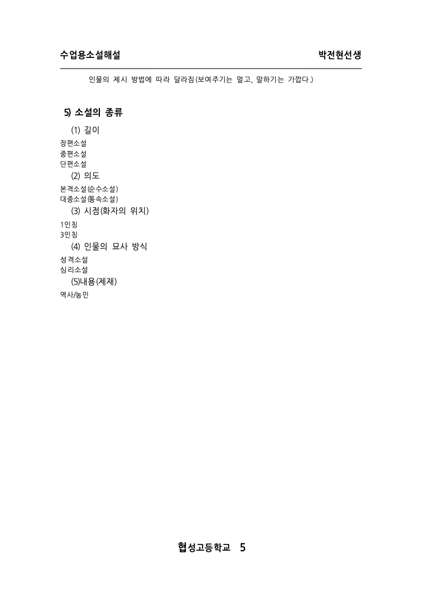

# PR #3323 검토 기록 — 머리말/꼬리말 필드의 표시·모델 좌표 분리

## 메타

| 항목 | 값 |
| --- | --- |
| 원 PR | [#3323](https://github.com/edwardkim/rhwp/pull/3323) |
| 작성자 | `lpaiu-cs` |
| 관련 이슈 | #3216 (`closes #3216`은 통합 PR merge 뒤에만 실제 close 여부 확인) |
| 원 head | `701a4906e9560fa398c092afbed167113634f334` |
| 원 base / 상태 | `devel` / `BEHIND` (P2 반영 뒤 검토 시점) |
| 원 변경 | 30 파일, +367/-80 |
| 검토 branch | `review/lpaiu-cs-hf-field-20260726` |
| 검토 base | `upstream/devel` `99732b2a1189` |
| 적용한 contributor commits | `d9c5b325` → `9e78b00c6`, `ca8219d232` → `07bbc1492`, `5ce61c9` → `cf2e52cc7` |
| 검토 라우트 | `maintainer_general` + `intake_and_review`, `local_validation`, `visual_fixture_evidence`, `rework_and_exceptions` |

원 tip만 체리픽하면 이미 revert된 #3212 보정이 빠져 충돌한다. 따라서 PR 범위의 첫 두 commit을 최신
`devel` 위에 순서대로 적용했다. 이후 contributor가 `upstream/devel` merge와 P2 `5ce61c9`를 새로
push했으므로, 최신 `devel`에 이미 있는 merge commit은 제외하고 P2 기능 commit만 clean cherry-pick했다.
reviewer는 `jangster77`로 요청했다.

## 원 변경 검토와 메인터너 보정

원 변경은 머리말/꼬리말의 페이지·전체 페이지·파일명 marker를 모델 문자열(`text`)에서 1자로
유지하고, 화면 표시만 `display_text`로 확장한다. 이 규약은 hit test와 편집이 표시 문자열 길이가 아니라
모델 오프셋을 쓰도록 만드는 핵심이다.

검토 중 확인된 결함과 최초 통합 PR CI에서 드러난 후속 회귀를 메인터너 보정으로 현재 branch에 반영했다.

1. `AutoNumber(Page)`가 있는 문단에서 기존 blanket `U+0015` 치환이 명시 쪽번호 필드까지 다시
   표시 문자열로 바꿔 `text`/`char_start` 정합을 깨뜨렸다. AutoNumber 컨트롤이 가리키는 위치만
   별도 run으로 분리해 marker 1자를 유지하고 `display_text`만 설정하도록 고쳤다.
2. Studio history가 `result.charOffset - 요청 cursor offset`으로 marker 길이를 추정했다. inline
   control 뒤 cursor에서는 native의 실제 text 삽입 위치와 달라 음수 길이 또는 잘못된 undo 범위가 될 수
   있었다. native 응답에 `insertedAt`·`insertedLength`를 명시하고, redo에는 원 cursor 좌표를,
   undo에는 실제 모델 범위를 사용하도록 고쳤다.
3. contributor P2는 marker로 split된 before/after 조각이 원 run의 전체 `display_text`를 상속해 주변
   글자를 중복 표시할 수 있던 문제를 조각별 PUA display 재계산으로 고쳤다. 또한 사람용 page text·Markdown
   추출이 raw marker가 아니라 display text를 사용하도록 배선하고 회귀 2건을 추가했다.
4. 최초 #3325 CI의 Default-feature shard 7은 실제 PNG/SVG가 아니라 `getPageRenderTree()` JSON이
   `TextRunNode.display_text`를 내보내지 않아, SO-SUEOP 5쪽의 footer AutoNumber(Page) `5`를 raw marker로만
   관찰한 문제였다. raw `text` 모델 좌표는 그대로 두고 조건부 `displayText`를 함께 직렬화했으며,
   #1692 검증은 표시 문자열 우선으로 실제 사용자 표시값을 검사하도록 고쳤다.
5. 전체 release-test에서 기존 #1100이 AutoNumber 뒤 `fwSpace`의 SVG x 앵커 불일치를 잡았다. AutoNumber
   marker와 뒤 공백을 정수 폭으로 분리하면 SVG의 소수 glyph advance보다 다음 공백이 앞서므로, raw 모델 run은
   유지하고 그 run의 `display_text`만 다시 구성하도록 바로잡았다. 단일 명시 field marker는 비반올림 bbox 폭과
   bbox 끝 기반 캐럿 경계를 써 모델 한 글자/표시 문자열의 좌표를 맞춘다. #1100의 기존 실제 SVG 계약이 재통과했다.

세부 적용·rollback은 [implementation 계획](pr_3323_review_impl.md)에 기록한다.

## 시각 검증

변경은 머리말/꼬리말의 실제 그리기와 hit-test 좌표를 함께 바꾼다. 원 PR은 새 HWP/HWPX fixture 또는
기준 PDF를 제공하지 않았으므로, 외부 기준 PDF 대조 대상은 없다. 회귀 테스트는 파일명 필드가 화면에는
`displayText`로 보이되 layer tree의 raw `text`는 marker 1자로 남는 것을 검증한다.

메인터너 보정 뒤 Native Skia로 `samples/SO-SUEOP.hwpx` 5쪽(0-based page `4`)을 렌더링했다.
아래 실제 산출물에서 머리말 제목·밑줄과 꼬리말의 학교명·AutoNumber(Page) `5`가 모두 보인다.
명시 field marker의 모델 1자 보존은 PNG만으로 판별할 수 없으므로, `issue_3216_hf_field_display_space`
및 이 PR에서 추가한 AutoNumber/필드 단위 테스트로 함께 검증했다.

- 생성 명령: `target/review-lpaiu-cs-hf-field-20260726/release/rhwp export-png samples/SO-SUEOP.hwpx --page 4 --output <temporary-output-dir> --max-dimension 1600` 뒤 실제 산출물을 이 asset 경로에 반영
- 산출물: `794 × 1123` RGBA PNG, SHA-256 `c4aa6cd11853ccc2a59db16631e5d04d58a2f19980b6c8d0860e579ff75211da`
- P2·render-tree JSON·AutoNumber 앵커 보정까지 포함한 최종 release 바이너리로 재생성해 같은 SHA와 바이트 동일성을 확인했다.
- 기준 PDF는 원 PR에 없으므로 PDF 대조를 주장하지 않는다.

이 기록을 작성하는 시점에는 아직 원격 push나 GitHub comment를 하지 않았다.

## 로컬 검증

검토 전용 target은 `target/review-lpaiu-cs-hf-field-20260726`이며 모든 Cargo 검증에
`CARGO_INCREMENTAL=0`을 사용한다. WASM build는 작업지시자가 수동 검증하는 범위라 실행하지 않는다.

| 항목 | 결과 |
| --- | --- |
| `git diff --check` | 통과 |
| `cargo fmt --check` | 통과 |
| 원 PR·P2 집중 Rust: `issue_3216_hf_field_display_space` | 최신 head에서 통과 (5 tests) |
| 원 PR 보조 Rust: `issue_1144` | 통과 (4 tests) |
| AutoNumber placeholder 회귀: `issue_1113_header_autonum_placeholder` | 통과 (1 test) |
| 전체 Rust: `cargo test --profile release-test --tests` | 최종 head에서 통과 (lib 2,923 passed, 7 ignored 및 모든 integration test binary exit 0) |
| #1100 AutoNumber 뒤 `fwSpace` 실제 SVG 앵커 | 통과 (3 tests) |
| #1692 SO-SUEOP 5쪽 render-tree 표시 문자열 계약 | 통과 (1 test) |
| Studio `npm run build` | 통과 (P2는 Studio 파일을 변경하지 않음) |
| Studio `npm test` | 통과 (637 tests, P2는 Studio 파일을 변경하지 않음) |
| 메인터너 AutoNumber/필드 회귀 | 통과 (1 test) |
| 메인터너 inline-control history 회귀 | 통과 (1 test) |
| Native Skia lib: `--features native-skia skia --lib` | 최종 head에서 통과 (57 tests) |
| Native Skia placeholder: `issue_2225_missing_picture_placeholder` | 통과 (2 tests) |
| Native Skia PDF: `render_p37_direct_pdf_export` | 통과 (4 tests) |

## 현재 권고

**메인터너 보정과 contributor P2를 포함한 최종 head의 검증·시각 증적이 완료됐다.** 원 #3323은 stale
base이므로, 원 contributor branch의 update 대신 이 최신 `devel` 기반 검토 branch에서 contributor credit과
메인터너 보정을 포함한 통합 PR [#3325](https://github.com/edwardkim/rhwp/pull/3325)로 처리한다. 최초 CI 실패
(render-tree `displayText` 누락)와 전체 테스트에서 발견된 #1100 앵커 회귀는 현 head에서 보정했다. 최신 push 뒤
full CI 통과와 작업지시자 merge 승인이 남았으며, 원 #3323 close·contributor comment·#3216 close 여부는 merge
뒤에 확인한다.
