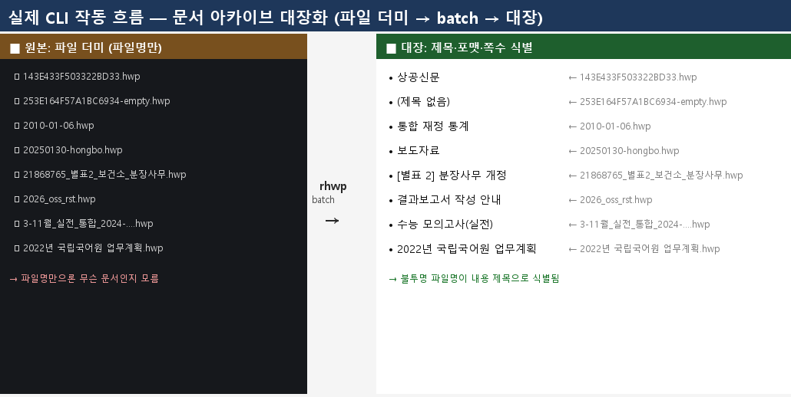
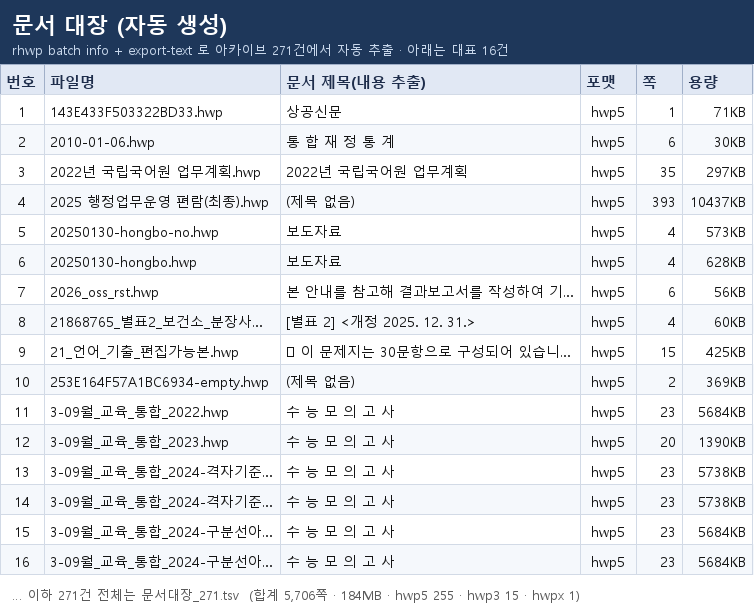

# 실제 CLI 작동 사례 — 문서 아카이브 대장화 (파일 더미 → 대장)

> 여정: [버그 헌팅 playbook](../../manual/bug_hunting_playbook.md) "대량 아카이브 대장화·조문 DB화".
> 실행: `rhwp` CLI만으로 실문서 271건을 대장화. 정답지 = 개별 `info` 호출.

## 실제 사람 작업

공무원이 쌓인 HWP 더미를 인계받으면, 파일명만으론 무엇인지 알 수 없어 하나씩 열어봐야 한다. `rhwp batch` 로 아카이브 전체의 **제목·포맷·쪽수·용량**을 한 번에 뽑아 대장을 만든다.

## 원본 문서 대비 흐름

**왼쪽(원본)**: 불투명한 파일 더미 — `143E433F503322BD33.hwp` 만 봐선 무슨 문서인지 모른다. **오른쪽(대장)**: `batch` 로 내용 제목이 식별된다 — `143E433F503322BD33.hwp` = "상공신문".



## 산출 대장



전체 271건은 [document_register_271.tsv](document_register_271.tsv) (합계 5,706쪽 · 184MB · hwp5 255 · hwp3 15 · hwpx 1).

## 재현

```bash
# 1) 아카이브 전체 메타데이터 (1회 배치)
ls samples/*.hwp | rhwp batch info --json > register.jsonl
#  → 271건 중 271 성공, 0 실패 (9.9s, threads=12). 손상 CFB 는 lenient 로 복구.
#  → 봉투는 JSONL(줄당 1레코드): {source, format, pageCount, paraCount, sections, sizeBytes, fonts, version}

# 2) 제목(내용 첫 heading)은 export-text --json 으로 (현재는 2-pass)
rhwp export-text --json DOC | jq -r '.pages[0].text' | head
#  → 표지가 이미지인 문서는 pages[0].text 가 비어 다음 쪽으로 fallback 필요
```

## 검증 (정답지 대조)

- `batch info` 결과를 개별 `rhwp info` 와 대조: 6개 표본에서 `format·pageCount·paraCount·sections·sizeBytes·version` **전 필드 일치**. batch 는 개별 호출과 동일한 값을 병렬로 낸다.
- `batch` 는 총량을 **정직하게 보고**한다("271건 중 271 성공, 0 실패") — 절단·은폐 없음.

## 발견한 격차

`info`/`batch info` 봉투에 문서를 식별할 **제목**이 없어, 대장화에 `export-text --json` 2-pass 와 소비자측 파싱 규칙이 필요하다. 1-pass 대장화를 위한 `title` 필드 추가를 [#3407](https://github.com/edwardkim/rhwp/issues/3407) 로 제안했다. 배치 처리 자체(속도·정확·에러 복구·총량 보고)는 이 규모에서 견고했다.

## 관련

- 방법론: [버그 헌팅 playbook](../../manual/bug_hunting_playbook.md)
- 명령 계약: [CLI 명령어 매뉴얼](../../manual/cli_commands.md)
- 개선 제안: [#3407](https://github.com/edwardkim/rhwp/issues/3407)
