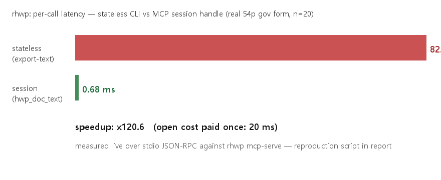

# 공개 벤치 — 세션 핸들 vs 무상태 CLI (#3608 M13)

세션 도구(#3571·#3598·#3601)의 존재 이유(재파싱 회피)를 **실측 수치**로 고정한다.

## 결과 (실물 54쪽 정부 서식 97KB, n=20, 이 저장소 릴리스 빌드 실측)

| 경로 | 호출당 지연 | 비고 |
|---|---:|---|
| 무상태 `export-text -p k` ×20 | **82.1 ms** | 매 호출 프로세스 기동+재파싱 |
| 세션 `hwp_open` 1회 + `hwp_doc_text` ×20 | **0.68 ms** | open 비용 20ms 는 1회만 |
| **속도비** | **×120.6** | |



에이전트 관점: 대형 문서에서 "찾고 → 읽고 → 채우고 → 확인"을 수십 번 반복하는
실제 루프에서, 세션은 왕복당 수십 ms 를 sub-ms 로 바꾼다 — 도구 호출이 많은
에이전트일수록 이득이 배가된다.

## 재현

```bash
# 무상태: 페이지별 20회 (매회 재파싱)
for k in $(seq 0 19); do rhwp export-text form.hwp -p $k --json > /dev/null; done
# 세션: stdio JSON-RPC 로 hwp_open 1회 + hwp_doc_text 20회
# (mcp-serve 에 initialize → tools/call 순서, mcp_integration_guide.md 참조)
```

측정 스크립트는 Python subprocess + perf_counter — mcp-serve 를 실제 stdio 로 구동해
프로토콜 왕복까지 포함한 수치다(순수 함수 호출 벤치가 아님).

## 한계

- 단일 문서·단일 머신(Windows) 실측 — 절대값보다 **비율**이 계약이다.
- open 비용(≈20ms)은 1회 상환 — 호출 1~2회뿐인 짧은 작업은 무상태가 단순하다
  (지식 지도의 작업별 결정 표 참조).
