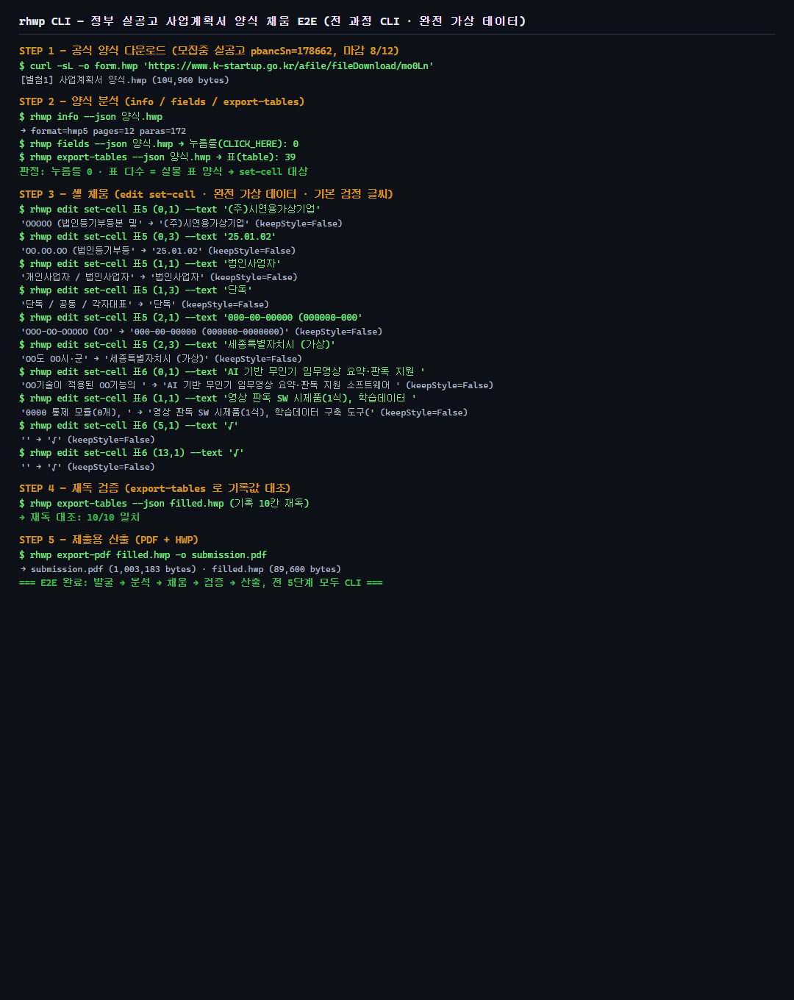
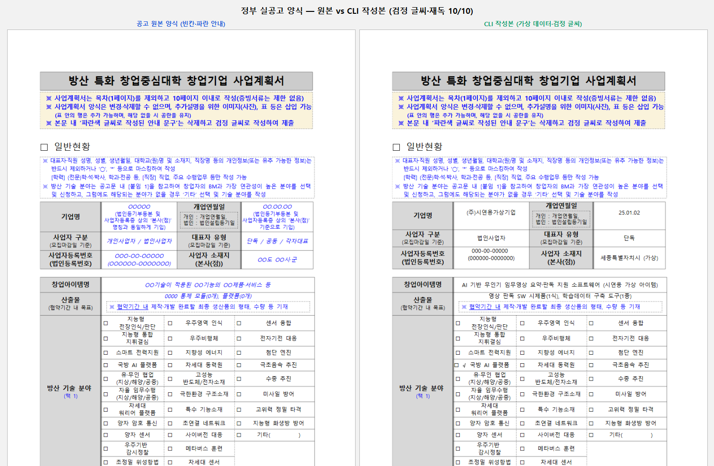
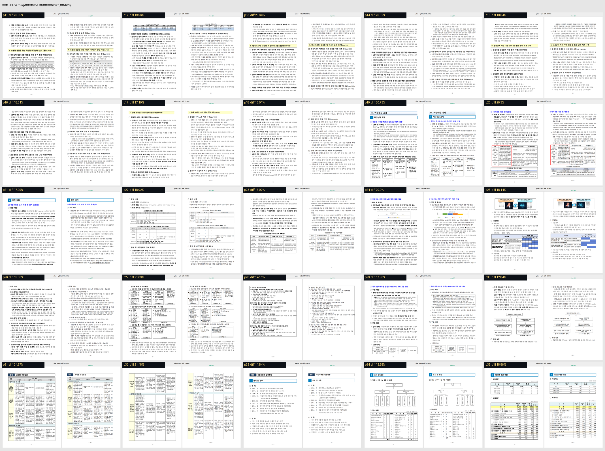
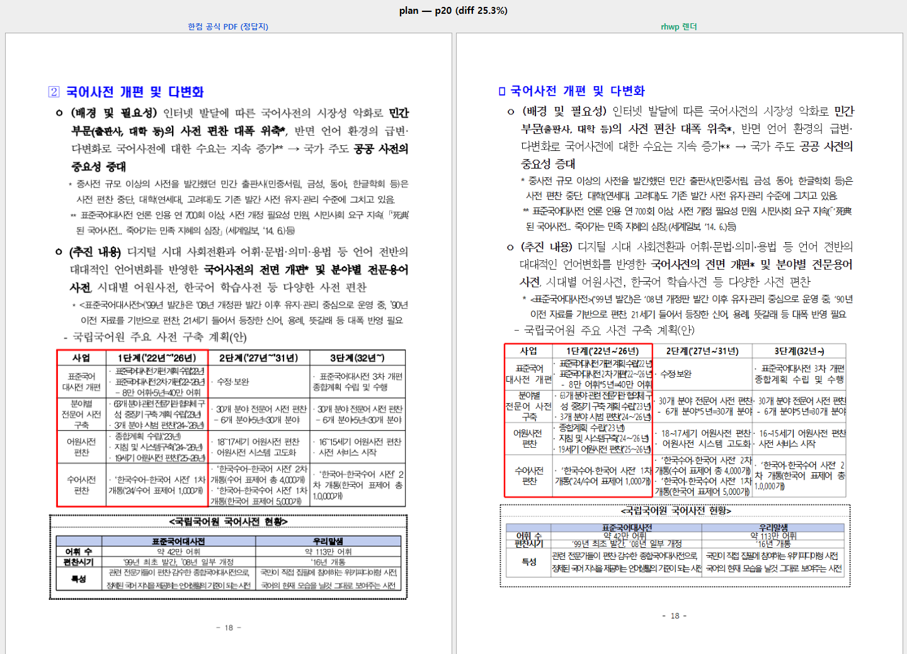
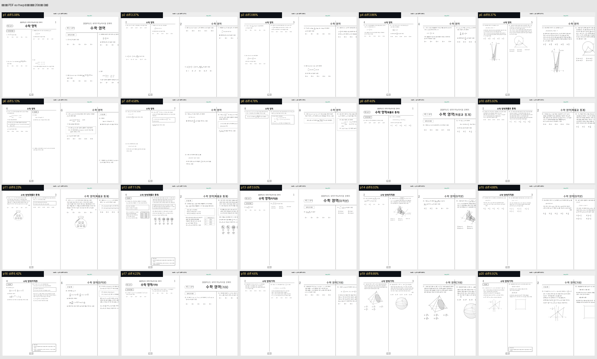
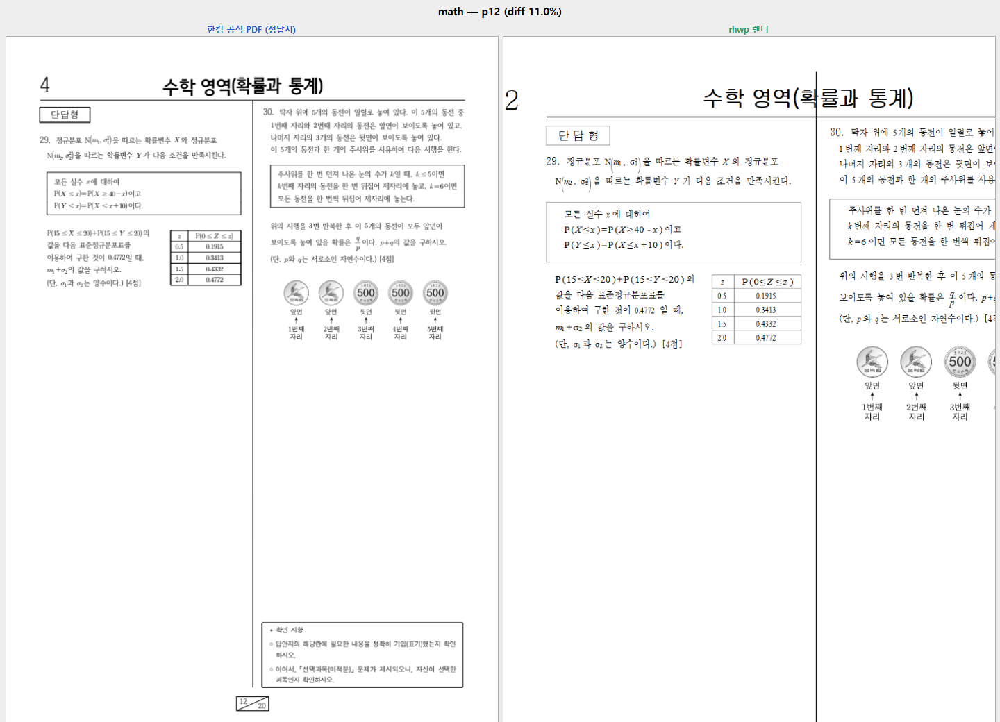
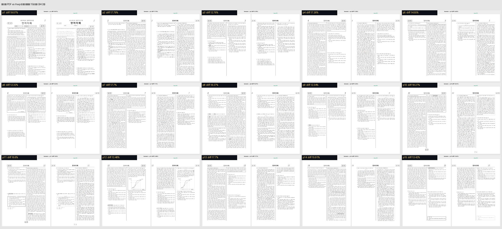
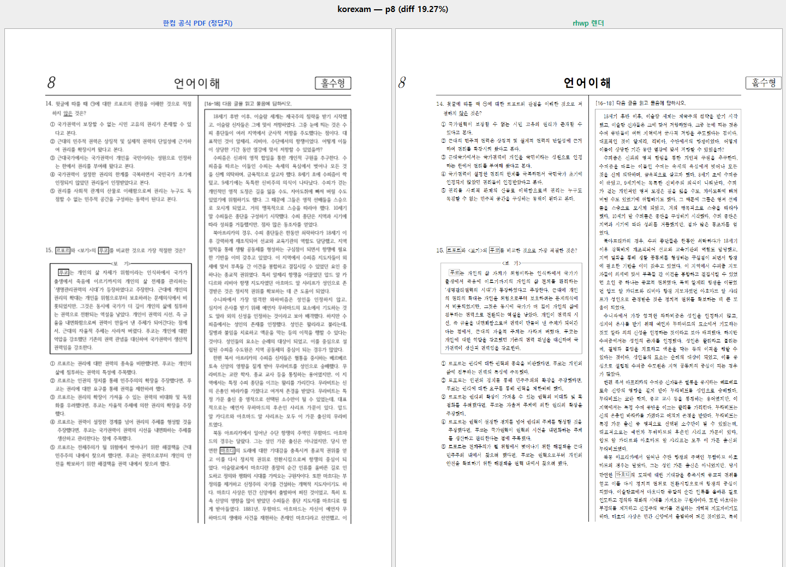
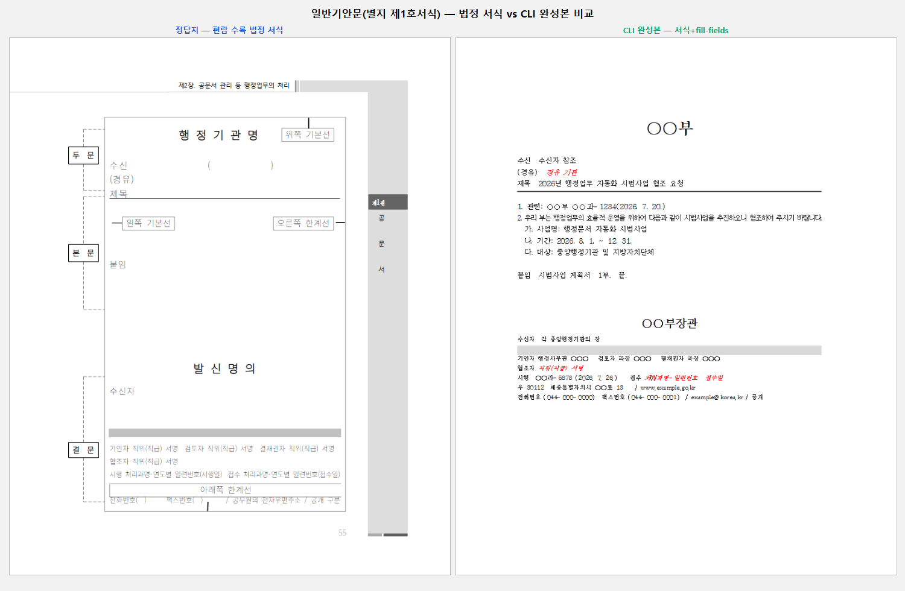

# rhwp CLI 문서 자동화 — 과정과 사진으로 보는 실증 갤러리

2026-07-26 하루 캠페인의 **과정 전체를 사진으로** 모은 통합 갤러리다. rhwp CLI 로
실제 정부 문서를 **읽고 · 채우고 · 검증하고 · 정답지(한컴 공식 PDF)와 대조**한 결과를
한 곳에서 본다. 각 절의 이미지는 좌=정답지(또는 원본), 우=rhwp 산출이다.

관련 PR(기능·수정): #3374(replace-text) · #3384(set-cell + K-Startup E2E + #3391) ·
#3376(법정 서식 자산) · #3390(정합 하네스) · #3371(예제집).

---

## 1. 정부 실공고 양식 채움 E2E (K-Startup) — 발굴→분석→채움→검증→산출

지금 모집 중인 실공고(2026 방산 특화 창업중심대학, 마감 8/12)의 공식 사업계획서
양식을 **완전 가상 데이터**로 채우는 전 과정. 전 단계가 CLI이고, 재독으로 기계 검증한다.
**실제 접수는 하지 않는다**(가상 데이터 허위신청 방지 + 로그인 불가) — "제출 직전
완성 파일"까지가 자동화 경계다.

### 과정 (5단계, 전부 CLI)

### 원본 양식 ↔ CLI 작성본 (값 정확 · 검정 글씨 · 배치 보존)

- 분석: `info`(12쪽) · `fields`=0 · `export-tables`=39 → 누름틀 없는 표 양식 판정
- 채움: `set-cell` 10칸, 기본 **검정 글씨**(#3391 — 공고 "검정 글씨 제출" 요건)
- 검증: `export-tables` 재독 **10/10 일치**
- 전체 로그: [kstartup/e2e_log.txt](kstartup/e2e_log.txt)

---

## 2. 정합 대조 — 한컴 공식 PDF(정답지) vs rhwp 렌더, 페이지 전수

`tools/fidelity_compare`(#3390)로 정답지와 rhwp 렌더를 페이지별 대조하고 픽셀 diff%
랭킹을 매긴다. 아래 몽타주는 **각 문서의 전 페이지를 한 장에** 담았다(셀 좌=정답지,
우=rhwp, 라벨=diff%). diff% 는 자간 미세차가 픽셀로 누적된 값이라 절대값이 아니라
**순위 + 사람 감사**용이다.

### 업무계획 35쪽 전수 (보고서 — 표·도해·강조)

최악 페이지 원본 크기 (p20, diff 25.3% — 여기서 **#3385**(PUA 원문자 tofu) 발견):

### 수학 시험지 20쪽 전수 (수식)

수식이 밀집한 최악 페이지(p12, diff 11.0%)에서도 배치가 정합한다:

### 수능 언어이해 15쪽 전수 (B4 · 2단 조판 · 지문 박스 · 원문자 선지)

가장 어려운 2단 밀집 페이지(p8, diff 19.27%):

랭킹 원본: [rank-plan.tsv](fidelity/rank-plan.tsv) · [rank-math.tsv](fidelity/rank-math.tsv) ·
[rank-korexam.tsv](fidelity/rank-korexam.tsv)

---

## 3. 법정 서식 생성 — 정답지(편람) vs CLI 완성본

편람의 법정 서식(별지 제1·2호서식)을 정답지로 삼아 표준 서식을 제작하고(#3376),
`fill-fields`/`set-cell` 로 채운 완성본을 정답지와 나란히 대조했다.

### 일반기안문(별지 제1호서식)

### 간이기안문(별지 제2호서식 — 결재란 표)

---

## 요약

| 축 | 대상 | 결과 |
|---|---|---|
| 실공고 E2E | K-Startup 방산특화 사업계획서 | 재독 10/10, 제출용 PDF 산출 |
| 정합 대조 | 업무계획 35 · 수학 20 · 수능 15쪽 | 전수 몽타주, 최악 페이지 감사 → #3385 |
| 법정 서식 | 일반·간이기안문 | 정답지와 배치·요소 일치 |

과정에서 발견한 결함은 전부 이슈·PR로: #3385(PUA tofu) · #3391(set-cell 파란글씨, 수정 완료) ·
#3382(SVG 제어문자) · #3383(edit HWPX 형식) · #3380(fill 안내문 동일값 유실).
