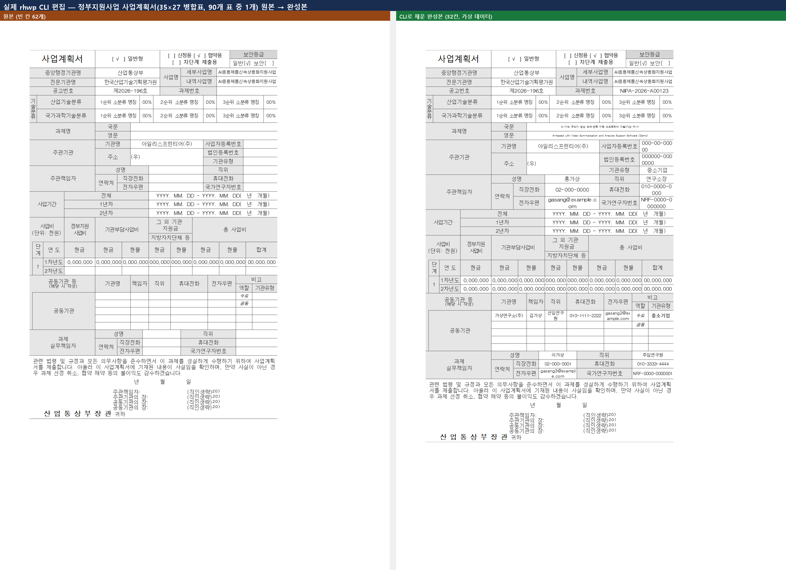

# 실제 CLI 편집 작동 사례 — 더 어려운 실문서 (정부지원사업 사업계획서)

> 여정: [버그 헌팅 playbook](../../manual/bug_hunting_playbook.md) 계열 — [복학원서 데모](../edit_demo_bokhak/README.md)보다 훨씬 복잡한 표 구조로 CLI 편집을 재검증.
> 대상: `samples/aift.hwp` — "AI 응용제품 신속 상용화 지원사업" 정부지원사업 공모 안내서(74쪽, 표 **90개**, 병합칸 **994개**).

## 왜 더 어려운가

[복학원서 데모](../edit_demo_bokhak/README.md)는 5×4 단순 표였다. 이번 대상은 실제 사업계획서 핵심 표가 **35행×27열, 셀 168개(병합 반영 전 순수 그리드 기준)** 로, 행/열 병합(`rowSpan`/`colSpan`)이 거의 모든 셀에 걸려 있는 정부지원사업 표준 서식이다. 좁은 구조용 칸과 넓은 입력용 칸이 촘촘히 섞여 있어, [복학원서 데모에서 겪은 "좁은 셀 함정"](../edit_demo_bokhak/README.md#정밀-검증)을 먼저 적용해 폭이 넓은(colSpan≥2) 칸만 골라 채웠다.

## 원본 대비 흐름



62개 빈칸 중 **32칸**을 `edit set-cell` 로 채웠다: 과제번호·과제명(국문/영문)·주관기관 등록번호 3종·주관책임자 인적사항 6칸·2차년도 사업비 8칸·공동기관 1행 6칸·과제 실무책임자 인적사항 6칸. 완전 가상 데이터(회사명·성명·번호 전부 임의값)이며 실제 제출은 하지 않는다.

## 재현

```bash
rhwp export-tables --json samples/aift.hwp   # 표 90개 중 표1이 메인 사업계획서(35x27)
# 표1 셀 덤프로 colSpan≥2인 빈 칸만 골라 채움(좁은 구조 칸 회피)
rhwp edit set-cell aift.hwp --table 1 --row 5 --col 19 --text "NIPA-2026-A00123" -o out.hwp --json
# … 총 32칸

rhwp export-tables --json out.hwp            # 재독 대조(기계 판정)
rhwp export-svg -p 1 out.hwp -o rendered      # 최종 확인
```

## 검증

- `export-tables` 재독: 대상 32칸 전부 값 반영, 표1 전체 채워진 셀 138개(기존 76 + 신규 32, 나머지는 문서 자체 라벨/예시 텍스트).
- 픽셀 대조: 변경 영역이 표 상단부(bbox y=263~1624)에만 국한, 그 아래 서명·법령 문구·"산업통상부장관 귀하" 구역은 **완전 무변경** — 건드리지 않은 영역은 정말 안 건드려졌음을 확인.
- 긴 값(이메일·법인등록번호 등)이 셀 폭을 넘으면 옆 칸을 침범하지 않고 **셀 안에서 자동 줄바꿈**됨을 육안 확인 — 이는 정상적인 넓은 셀(colSpan≥2)의 동작이며, 복학원서에서 겪은 좁은 셀(colSpan=1, 구조용) 침범 문제와는 다른 케이스다.

## 시도하지 않은 것 (정직하게 기록)

문서 하단 서명란("주관책임자: ___(직인생략)20)")도 실제 서명 시 채워야 할 빈칸으로 보이나, `search` 로 확인한 텍스트 패턴이 `"(직인생략)20)"` 처럼 모호하게 붙어 있어 정확한 삽입 위치를 확신할 수 없었다. 억지로 편집해 서식을 깨뜨리기보다, 이번 데모의 범위(사업계획서 핵심 정보 카드)로 한정했다.

## 관련

- 앞선 데모(단순 표): [복학원서 편집 데모](../edit_demo_bokhak/README.md)
- 명령 계약: [CLI 명령어 매뉴얼](../../manual/cli_commands.md) §edit set-cell
