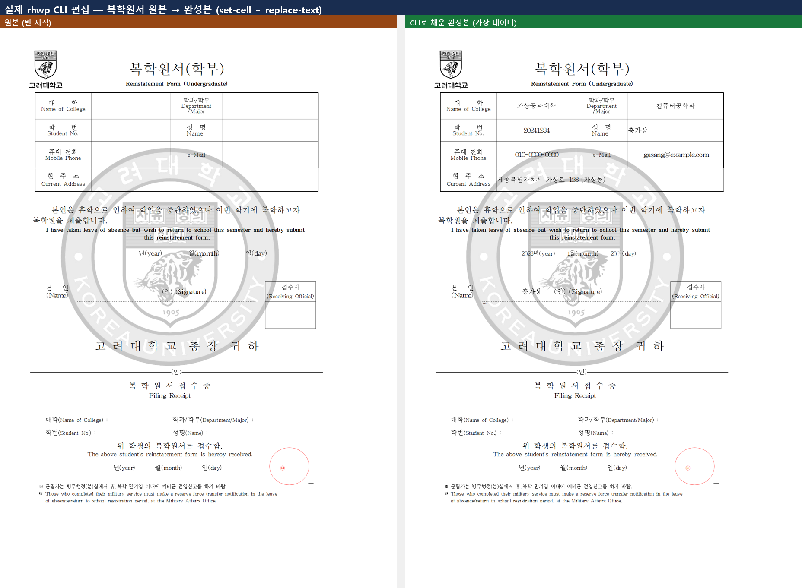
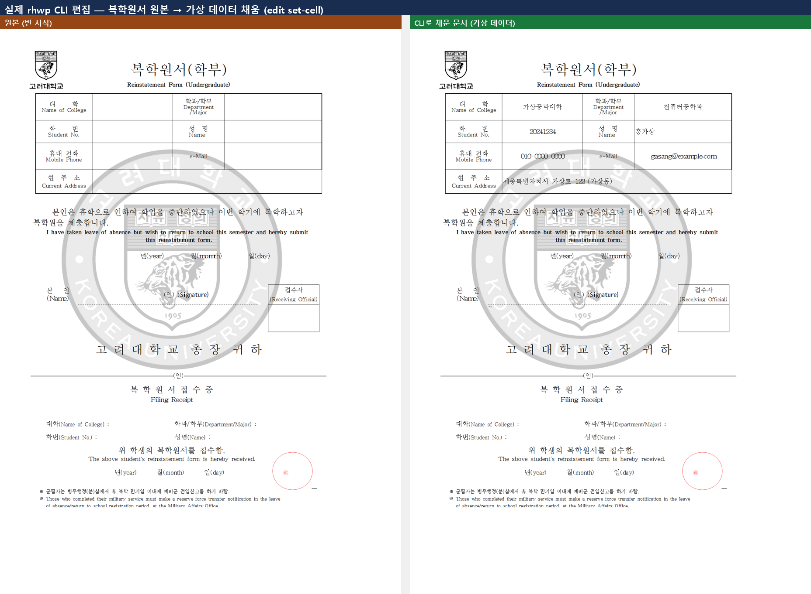
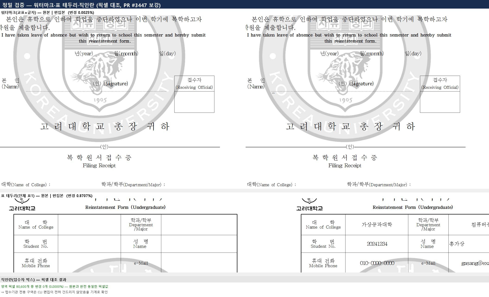
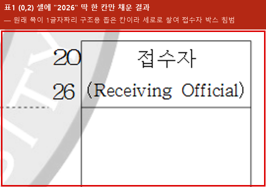

# 실제 CLI 편집 작동 사례 — 실물 대학 서식 채우기

> 여정: [버그 헌팅 playbook](../../manual/bug_hunting_playbook.md) 계열 — 실사례 여정을 CLI로 끝까지 실행.
> 대상: `samples/복학원서.hwp` (고려대학교 복학원서, 학부).

## 실제 사람 작업

대중이 HWP를 쓰는 가장 흔한 용도는 **문서 편집·서식 채우기**다. 이 데모는 그 용도를 CLI만으로 재현한다 — 실제 대학 서식을 열고, 표 격자 좌표로 빈칸을 찾아, 완전 가상 데이터로 채우고, 렌더해 결과를 확인한다.

## 원본 대비 최종 결과



- `set-cell`로 본문 첫 표(표 0)의 값 셀 **7개**(대학·학과·학번·성명·휴대전화·이메일·주소)를 채웠다.
- 하단의 본인 성명/서명 줄과 일자 줄은 표의 독립된 값 셀이 아니므로 `replace-text`로 채웠다.
- 워터마크(校印)·표 테두리·직인란·"복학원서 접수증" 구역은 보존했다. 접수자나 접수증 내용은 지원자가 채울 대상이 아니므로 건드리지 않았다.
- 학번 `20241234`, 이메일 `gasang@example.com` 등은 모두 임의의 가상 데이터이며 **실제 접수는 하지 않는다.**

## 1차 `set-cell` 결과와 한계



1차 결과는 위쪽 표는 채워지지만, 본문 하단의 본인 성명/서명과 일자는 빈칸으로 남는다. 이 두 위치는 `export-tables`로 얻은 표 0의 값 셀이 아니라 문단 텍스트에 포함된 공백과 라벨이다. 따라서 최종본은 아래처럼 `search`로 정확한 원문을 얻은 뒤 `replace-text`로 채운다.

## 재현

`rhwp`와 `jq`가 PATH에 있는 POSIX shell에서 아래 전체를 그대로 실행한다. 편집 대상은 반드시 `samples/복학원서.hwp`의 복사본이며, 원본 파일은 변경하지 않는다.

```bash
set -e

# 1) 구조 파악 및 작업본 생성
rhwp export-tables samples/복학원서.hwp --json > bokhak-tables.json
cp samples/복학원서.hwp bokhak-filled.hwp

# 2) 표 0의 안전한 값 셀 7개를 격자 좌표로 채움
#    각 JSON의 oldText가 ""인지 확인한다.
rhwp edit set-cell bokhak-filled.hwp --table 0 --row 1 --col 1 --text "가상공과대학" -o bokhak-filled.hwp --json
rhwp edit set-cell bokhak-filled.hwp --table 0 --row 1 --col 3 --text "컴퓨터공학과" -o bokhak-filled.hwp --json
rhwp edit set-cell bokhak-filled.hwp --table 0 --row 2 --col 1 --text "20241234" -o bokhak-filled.hwp --json
rhwp edit set-cell bokhak-filled.hwp --table 0 --row 2 --col 3 --text "홍가상" -o bokhak-filled.hwp --json
rhwp edit set-cell bokhak-filled.hwp --table 0 --row 3 --col 1 --text "010-0000-0000" -o bokhak-filled.hwp --json
rhwp edit set-cell bokhak-filled.hwp --table 0 --row 3 --col 3 --text "gasang@example.com" -o bokhak-filled.hwp --json
rhwp edit set-cell bokhak-filled.hwp --table 0 --row 4 --col 1 --text "세종특별자치시 가상로 123 (가상동)" -o bokhak-filled.hwp --json

# 3) 본인 성명/서명 줄은 PUA 문자(U+F012B)를 포함한 원문을 유지해 치환
signature_json="$(rhwp search bokhak-filled.hwp "Signature" --json)"
signature_text="$(printf '%s' "$signature_json" | jq -r '.matches[0].text')"
signature_filled="$(printf '%s' "$signature_json" | jq -r \
  '.matches[0].text | sub("^ +"; "홍가상                    ")')"
rhwp edit replace-text bokhak-filled.hwp \
  --find "$signature_text" --replace "$signature_filled" \
  -o bokhak-filled.hwp --json

# 4) 원본의 "momth" 오타를 고유 키로 삼아 신청 일자 줄만 치환
date_json="$(rhwp search bokhak-filled.hwp "momth" --json)"
date_text="$(printf '%s' "$date_json" | jq -r '.matches[0].text')"
date_filled="$(printf '%s' "$date_json" | jq -r \
  '.matches[0].text
   | sub("년\\(year\\)"; "2026년(year)")
   | sub("월\\(momth\\)"; "1월(momth)")
   | sub("일\\(day\\)"; "20일(day)")')"
rhwp edit replace-text bokhak-filled.hwp \
  --find "$date_text" --replace "$date_filled" \
  -o bokhak-filled.hwp --json

# 5) 재독과 렌더로 최종 확인
rhwp export-tables bokhak-filled.hwp --json > bokhak-filled-tables.json
rhwp export-svg bokhak-filled.hwp -o rendered
```

`set-cell` 각 결과의 `oldText` 값이 비어 있지 않거나, `replace-text` 결과의 `replacedCount`가 `1`이 아니면 산출물을 제출 대상으로 사용하지 않는다.

## 발견한 실수와 교정 (정직하게 남김)

첫 시도에서 표 2(접수증 구역)의 `(2,0)` 셀을 "빈칸"으로 오인해 `set-cell`로 덮어썼는데, 실제로는 **기존 법정 안내문구**("복학원서를 접수함", "군필자는 예비군 전입신고..." 등)가 들어있는 셀이었다. `set-cell` 결과 JSON의 `oldText`에 비지 않은 원문이 나타나 즉시 발견했고, 원본에서 다시 작업해 접수증 구역을 제외했다.

이건 CLI 버그가 아니라 **사용자(에이전트) 판단 오류**였지만, 실제로 서식을 다루는 에이전트가 마주치는 위험 그 자체를 보여준다 — `set-cell`이 매 호출마다 `oldText`를 돌려주는 계약 덕분에 훼손 여부를 즉시 기계로 확인할 수 있었다. 이 계약이 없었다면 조용히 법정 문구가 사라졌을 것이다.

## 정밀 검증 자료



1차 `set-cell` 결과를 원본과 픽셀 대조한 자료다. 표 영역의 차이는 새로 넣은 값이며, 접수자 직인란은 변경 픽셀 `0`(`0.0000%`)으로 원본과 동일하다. 워터마크 비교의 `0.0025%`는 안티앨리어싱 노이즈 수준이다.



표 1의 `(0,2)` 등은 눈으로는 빈칸이지만 폭이 1글자 수준인 구조용 셀이다. 값을 넣으면 글자가 세로로 쌓여 접수자 박스를 침범하므로, 위 재현 명령에서는 표 1과 접수증 표 2를 `set-cell` 대상에서 전부 제외했다.

## 관련

- 명령 계약: [CLI 명령어 매뉴얼](../../manual/cli_commands.md) §edit set-cell / edit replace-text
- 방법론: [버그 헌팅 playbook](../../manual/bug_hunting_playbook.md)
