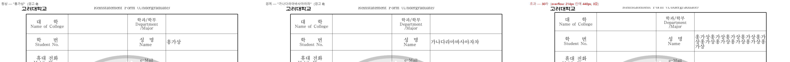

# 채운 값이 칸에 들어가는지 검사 — "사람이 쓴 것처럼 보이는가"

> 대상: `samples/복학원서.hwp` (고려대학교 복학원서, 학부).
> 앞선 사례: [복학원서 채우기](../edit_demo_bokhak/README.md),
> [보도자료](../edit_demo_hongbo/README.md), [규제영향분석서](../edit_demo_regulatory/README.md).

## 문제 — 도구가 "성공"이라 말한 문서를 사람은 제출할 수 없다

값을 **넣는 것**과 **제대로 넣는 것**은 다르다. 실물 서식의 좁은 `성명` 칸에 긴 값을 넣으면
텍스트가 칸을 넘쳐 표 경계를 벗어나고 행 높이가 어긋난다. 그런데 응답은 성공이다.

에이전트·스크립트는 **렌더 결과를 보지 않는다.** JSON 응답만 보고 다음 단계로 간다.
신호가 없으면 깨진 문서가 완성본으로 넘어가고, 반려는 사람이 받는다.

같은 문제를 다른 서식에서도 겪었다 — 보도자료의 `기관명` 칸에 긴 값을 넣으니 그 칸에 있던
기관 로고와 텍스트가 겹쳐 렌더됐고, `보도일시` 는 칸 폭을 넘어 잘렸다. 두 경우 모두
`filledCount` 는 정상이고 `notFound` 는 비어 있었다.

## 전/후



| 값 | 글자 수 | 렌더 결과 | 검사 결과 |
|---|---:|---|---|
| `홍가상` | 3 | 한 줄에 들어감 | 조용함 |
| `가나다라마바사아자차` | 10 | **한 줄에 들어감**(경계) | 조용함 |
| `홍가상`×10 | 30 | **3줄로 밀리고 칸을 벗어남** | `overflow` 보고 |

경계 사례(10자)가 중요하다. **과잉 경고는 신호를 죽인다** — 실제로 들어가는 값에는
아무 말도 하지 않아야 소비자가 경고를 믿는다.

## 검사 결과의 모양

```console
$ rhwp edit set-cell 복학원서.hwp --table 0 --row 2 --col 3 \
    --text "홍가상홍가상홍가상홍가상홍가상홍가상홍가상홍가상홍가상홍가상" \
    -o out.hwp --dry-run --json | jq -c '.overflow'
[{"target":"table0[2,3]","text":"홍가상홍가상…",
  "cellWidthPx":214.63,"textWidthPx":440.0,"lines":3}]
```

- **`--dry-run` 에서도 검사한다** — 파일을 만들기 전에 알아야 값을 고칠 수 있다.
- **채우기를 막지 않는다.** 여러 줄이 정상인 칸(주소·사유 등)도 있으므로 신호만 준다.
  판단은 소비자 몫이다 — 값을 줄이거나, 사람에게 확인을 요청하거나, 그대로 진행하거나.

## 왜 rhwp 만 할 수 있는가

"이 글자열이 이 칸에 맞는가"는 **조판 엔진이 있어야** 답할 수 있다. 텍스트만 다루는 도구는
칸 폭도 글자 폭도 모른다. rhwp 는 `Cell.width`(IR)와 글자 크기(`CharShape.base_size`)를
둘 다 갖고 있어 그 자리에서 잰다.

## 재현

```bash
set -e
cp samples/복학원서.hwp fit-work.hwp

# 들어가는 값 — 조용하다
rhwp edit set-cell fit-work.hwp --table 0 --row 2 --col 3 --text "홍가상" \
  -o /dev/null --dry-run --json | jq -c '.overflow'
# []

# 넘치는 값 — 폭과 줄 수를 알려준다
rhwp edit set-cell fit-work.hwp --table 0 --row 2 --col 3 \
  --text "홍가상홍가상홍가상홍가상홍가상홍가상홍가상홍가상홍가상홍가상" \
  -o /dev/null --dry-run --json | jq -c '.overflow'
```

## 측정 방식과 한계

- 칸 폭은 `Cell.width` 에서 안여백(`padding.left+right`)을 뺀 값이다.
- 글자 폭은 셀 첫 문단의 `CharShape.base_size` 기준으로 **한글 전각·ASCII 반각** 근사다.
  정밀 조판이 아니라 **넘침 여부 판정용**이다 — 자간·장평·혼합 서식은 반영하지 않는다.
- 그래서 경계에서 한두 글자 차이는 놓칠 수 있다. 명백한 초과를 잡는 것이 목적이다.
- 현재 `edit set-cell` 에만 적용한다. `edit fill-fields` 는 필드가 표 밖(본문 문단)에도
  있어 칸 폭 개념이 없는 경우가 있고, 지금 다른 PR(#3476)이 같은 함수를 고치고 있어
  충돌을 피하려 후속으로 미뤘다.
